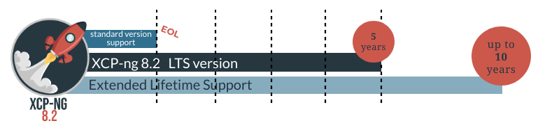

# Releases

There are two kinds of XCP-ng releases: standard releases and Long Term Support (LTS) releases.

## Standard Releases

*Latest: [XCP-ng 8.2](release-8-2.md)*

Using the standard release is relevant if:

* you want to enjoy the most recent features and enhancements
* you want to have the latest hardware support
* you want to enjoy more performances
* it's not a problem to do an upgrade twice a year or so

Standard releases are supported until the next release, plus a few months to give you some time to transition. Check the support dates [in the table below](#all-releases).

If you prefer to be more conservative, go for our [LTS release](#lts-releases).

:::tip
Right now, the latest standard release (8.2) is also the LTS release. When XCP-ng 8.3 will be released, it will become the latest standard release, and 8.2 will stay as the latest LTS.
:::

## LTS Releases

*Latest LTS: [XCP-ng 8.2](release-8-2.md)*

Using the Long Term Support version is relevant if:

* you want to be sure the system will stay stable
* you want to have all security fixes without doing major upgrades every year
* you want a predictable migration path on a longer timeframe
* you don't care about new features coming for the next years

LTS releases are supported for 5 years.

If you prefer to get the latest improvements, go for our [latest standard release](#standard-releases).

## All releases

| Version                   | Released   | Status               | Support until                                | Release notes                        |
| ---                       | ---        | ---                  | ---                                          | ---                                  |
| [8.2 LTS](release-8-2.md) | **8.2.0**:&nbsp;2020-11-18 **8.2.1**:&nbsp;2022-02-28 | Full support, LTS    | 2025-06-25                                   | [8.2 Release notes](release-8-2.md)  |
| [8.1](release-8-1.md)     | 2020-03-31 | EOL                  | 2021-03-31                                   | [8.1 Release notes](release-8-1.md)  |
| 8.0                       | 2019-07-25 | EOL                  | 2020-11-13                                   |                                      |
| 7.6                       | 2018-10-31 | EOL                  | 2020-03-30                                   |                                      |
| 7.5                       | 2018-08-10 | EOL                  | 2019-07-25                                   |                                      |
| 7.4                       | 2018-03-31 | EOL                  | 2018-10-31                                   |                                      |
