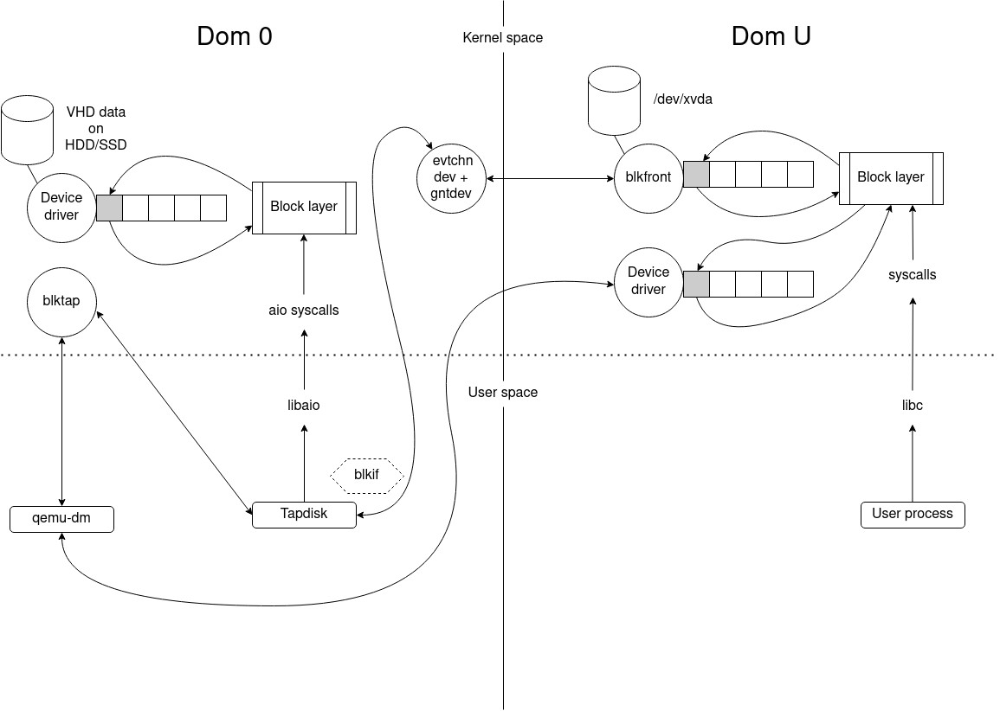

# Architecture

This page contains advanced info concerning XCP-ng modules.

## Virtual disks on HVMs and PV guests

### `qemu-dm` and `tapdisk` at startup

When a VM starts, whether it is a HVM or a PV guest, this last one is always started as a HVM. So during the boot process, the device of the VM is emulated. The process for mapping a virtual device from a host to a guest is called `qemu-dm`. There is one instance per disk like `tapdisk`, another process used to read/write in a VHD file the disk data. `qemu-dm` reads and writes to a `/dev/blktap/blktapX` host device, which is created by tapdisk and is managed by a driver in Dom 0: `blktap`.

For each read/write in the VM disk, requests pass through an emulated driver, then `qemu-dm` and finally they are sent to `blktap`; since `tapdisk` is the creator/manager of the `blktap` device, it handles requests by reading them through a shared ring. The requests are consumed by reading or writing in the VHD file representing the disk of the VM, the `libaio` is used to access/modify the physical blocks. Finally `tapdisk` responds to `qemu-dm` by writing responses in the same ring.

### tapdisk & PV guests

The process described above is used for HVMs and also for PV guests (at startup, PV drivers are not loaded).
After starting a PV guest, the emulated driver in the VM is replaced by `blkfront` (a PV driver) which allows to communicate directly with `tapdisk` using a protocol: `blkif`; `blktap` and `qemu-dm` then become useless to handle devices requests. Note that system calls are used with two drivers: `eventchn dev` and `gntdev` to map VM memory pages in the user space of the host. Thus a shared ring can be used to receive requests directly from `tapdisk` (so in the host user space) instead of using the kernel space.
