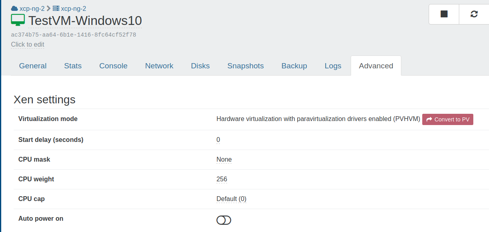

# Autostart VM on boot

How to start VM on host boot?

A VM can be started at XCP-ng boot itself, it's called **Auto power on**. We have two ways to configure it: using Xen Orchestra or via the CLI.

## 🛰️ With Xen Orchestra {#with-xen-orchestra}

In Xen Orchestra we can just enable a toggle in VM "Advanced" view, called **Auto power on**. Everything will be set accordingly.

## 🧑‍💻 With the CLI {#with-the-cli}

1. Determine the UUID of the pool for which we want to enable Auto Start. To do this, run the console command on the server:

<Terminal title="root@xcp-ng-host — With the CLI">{`
xe pool-list
uuid ( RO) : <VM_UUID>
`}</Terminal>

2. Allow autostart of virtual machines at the pool level with the found UUID command:
`# xe pool-param-set uuid=<VM_UUID> other-config:auto_poweron=true`

Now we enable autostart at the virtual machine level.
3. Execute the command to get the UUID of the virtual machine:

<Terminal title="root@xcp-ng-host — xe pool-list">{`
xe vm-list
    uuid ( RO)           : <VM_UUID>
    name-label ( RW)     : VM
    power-state ( RO)    : running
`}</Terminal>

4. Enable autostart for each virtual machine with the UUID found:
`# xe vm-param-set uuid=<VM_UUID> other-config:auto_poweron=true`

5. Checking the output
`# xe vm-param-list uuid=<VM_UUID> | grep other-config`

## 🔢 Start order and delays {#start-order-and-delays}

Autostart does not define a startup order. All VMs flagged for autostart are started when the
host boots, in a single bulk call that never reads the `order` parameter, so you cannot choose
which VM starts first.

They are started one after another rather than all at once, so a `start-delay` on one VM does
hold up the ones behind it. That spaces a boot out, but it does not sequence it, because which
VMs end up behind the delay is not something you control.

To define a startup order, use [vApps](../vms/vm-lifecycle.md#vapps) instead. Two VM parameters
apply when an appliance is started, and after an HA failover:

- `order` sets the relative order in which the appliance's VMs start, lower values first.
- `start-delay` specifies a delay in seconds. A call to start the VM does not return until the
  delay has elapsed, so in a sequential appliance start the next VM waits that much longer. The
  VM it is set on is already running by then. It is the call that waits, not the VM.

<Terminal title="root@xcp-ng-host — Start order and delays">{`
xe vm-param-set uuid=<VM_UUID> order=1
xe vm-param-set uuid=<VM_UUID> start-delay=30
`}</Terminal>

The parameter is `order`. `start-order` is rejected as an unknown field, and
`other-config:start_order` is accepted without doing anything at all, since `other-config`
holds arbitrary keys.

:::warning
An appliance is not started when the host boots. Nothing in the boot sequence calls
`appliance-start`, so grouping VMs into an appliance does not on its own bring them up after a
reboot. They also need `other-config:auto_poweron`, and once they have it they take the
autostart path above, which ignores `order`. Start an appliance with `xe appliance-start`, or
let HA restart it after a failover.
:::

:::note
`start-delay` has been reported to interfere with autostart: one user found a VM that would
not start at boot until the parameter was cleared
([forum thread](https://xcp-ng.org/forum/topic/12388)). A delayed start does hold up the VMs
queued behind it, which explains one coming up late, but not one that never comes up at all.
That part is unexplained. If a VM does not appear after a host reboot, checking its
`start-delay` value, and waiting to see whether it is merely queued behind another VM's delay,
are both worth doing.
:::
