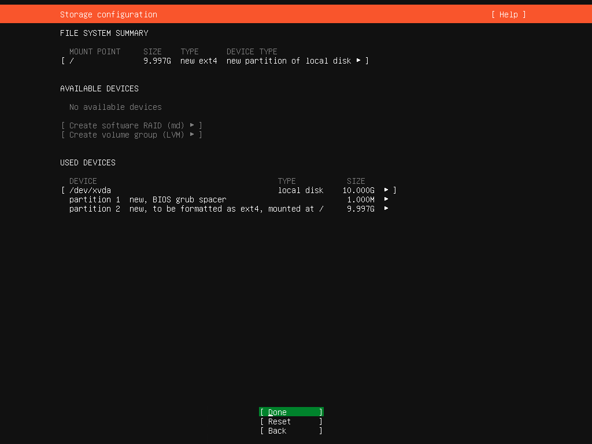
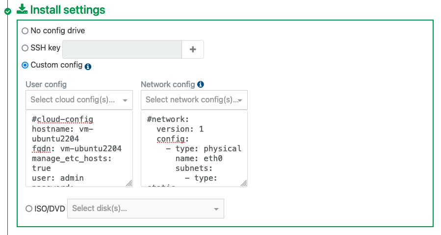

# Create and use custom XCP-NG templates: a guide for Ubuntu

How to create and use custom XCP-NG templates for Ubuntu?

[Xen Orchestra](https://xen-orchestra.com) offers free templates via the XOA Hub (for users of Xen Orchestra Virtual Appliance). However, if you don't find what you need and wish to create your own templates with support for [Cloud-init](https://cloud-init.io/), this post is for you. 

[Cloud-init](https://cloud-init.io/) is a tool used in cloud environments, developed to automate the configuration and initialization of virtual machines at first boot. It allows for various configurations to be applied to a virtual machine without manual intervention. Here is an overview of its main functions:

* network configuration (static or dynamic)
* SSH key management
* user configuration (with or without password)
* script execution
* filesystem mounting
* and system configuration (e.g., hostname)

This post explains in detail the steps to create templates based on Ubuntu. The same principles apply to other Linux distributions, provided they support [Cloud-init](https://cloud-init.io/). We will also discuss the use of templates and how to pass information to [Cloud-init](https://cloud-init.io/).

All experiments will be conducted using the graphical virtual machine manager [Xen Orchestra](https://xen-orchestra.com), except for the last part where we will use XO-CLI (Xen Orchestra CLI) to bypass the graphical interface.

## Prerequisites

* [XCP-NG](https://xcp-ng.org/)
* [Xen Orchestra](https://xen-orchestra.com) from the sources or Xen Orchestra virtual Appliance (XOA)
* [XO-CLI](https://www.npmjs.com/package/xo-cli) (for the last part of this post)
* [JQ](https://jqlang.github.io/jq/) (for the last part of this post)
* Ubuntu 22.04.04 Server LTS under ISO and OVA formats

## Create a new Virtual Machine

Two approaches for creating a virtual machine will be presented in this post:

* the first is to start from the ISO file of an Ubuntu distribution,
* the second is to use Cloud-ready distributions in OVA format.

At the end of this step, the result will be essentially the same, and both solutions can be used for creating the template.

### From an ISO file

* Download an ISO file of Ubuntu 22.04.04 LTS version: [https://ubuntu.com/download/server](https://ubuntu.com/download/server)

In order to access the ISO file during the virtual machine creation step, it needs to be placed in an ISO storage repository. There are several types available (Local, NFS, or SMB). For this post, the first type will be used. Feel free to browse through this [post](https://xcp-ng.org/blog/2022/05/05/how-to-create-a-local-iso-repository-in-xcp-ng/) to learn how to create a local ISO storage repository. In the following, I assume that there is a local ISO storage repository on the XCP-NG host.

* From the [Xen Orchestra](https://xen-orchestra.com) side menu, click on the **Import** option and choose the **Disk** sub-option.

* Select the ISO repository from the SR dropdown where the ISO file will be uploaded.

* Drag and drop or select the file *ubuntu-22.04.4-live-server-amd64.iso*, click on **Import**, and wait for the import to finish.

> You can also directly upload the ISO file to the server where the local ISO storage repository is located using the **scp** tool.

* From the [Xen Orchestra](https://xen-orchestra.com) side menu, click on the **New** option and choose the **VM** sub-option to create a new virtual machine.

* Select the Ubuntu Jammy Jellyfish 22.04 template (which is more of a loading profile than a template) and enter the following values for the parameters: custom-ubuntu22.04 for the name, 1 CPU, 4 GB of RAM, 10 GB of disk space, and choose the ISO file ubuntu-22.04.4-live-server-amd64.iso from the previously created local storage.

* During the Ubuntu installation steps, please ensure 1) to create only one partition to allow resizing later and 2) to install the OpenSSH server.



* Once the installation is complete, restart the system while removing the drive containing the ISO file.

* Connect via the console provided by [Xen Orchestra](https://xen-orchestra.com) or via SSH and update the repositories and the system.

```
$ sudo apt update 
$ sudo apt dist-upgrade
```

* Install the package *xe-guest-utilities-latest* to improve communication between the XCP-NG hypervisor and the virtual machine ([Guest tools](https://docs.xcp-ng.org/vms/#%EF%B8%8F-guest-tools)).

```
$ sudo apt install xe-guest-utilities
```

* Update the *cloud-init* package.

```
$ sudo apt install cloud-init
```

* Install the package *cloud-initramfs-growroot* to automatically resize the root partition of the disk upon virtual machine startup.

```
$ sudo apt install cloud-initramfs-growroot
```

* Configure the [Cloud-init](https://cloud-init.io/) data sources by selecting *NoCloud*, *ConfigDrive*, and *OpenStack*.

```
$ sudo dpkg-reconfigure cloud-init
```

* Delete the file */etc/cloud/cloud.cfg.d/99-installer.cfg* to reset certain default [Cloud-init](https://cloud-init.io/) configurations when starting a virtual machine.

```
$ sudo rm -f /etc/cloud/cloud.cfg.d/99-installer.cfg
```

* Delete the file */etc/cloud/cloud.cfg.d/subiquity-disable-cloudinit-networking.cfg* to allow modification of network settings.

```
$ sudo rm -f /etc/cloud/cloud.cfg.d/subiquity-disable-cloudinit-networking.cfg
```

* Delete the directory */var/lib/cloud/instance* which contains default settings related to the ongoing installation.

```
$ sudo rm -rf /var/lib/cloud/instance
```

* Delete the file */etc/netplan/00-installer-config.yaml* which is the current network configuration so that the new configuration can be applied after reboot.

```
$ sudo rm -f /etc/netplan/00-installer-config.yaml
```

* Before shutting down the virtual machine, you can install any additional repositories you want. Once this step is completed, you can shut down the virtual machine.

```
$ sudo shutdown now
```

The creation of the virtual image *custom-ubuntu22.04* from an ISO file is complete, and a template can now be created.

**Note:** for Ubuntu 24.04, you will need to delete the */etc/cloud/cloud-init.disabled* file, which disables Cloud-Init by default, and the */etc/netplan/50-cloud-init.yaml* file for network configuration.

### From a cloud image in OVA format

Canonical (the Ubuntu company) provides Ubuntu images that have been configured to run on cloud systems. The [website](https://cloud-images.ubuntu.com) provides all versions of Ubuntu. XCP-NG supports the open virtual machine format OVA used by VMWare and VirtualBox systems.

* Download an OVA file of [Ubuntu 22.04 version](https://cloud-images.ubuntu.com/jammy).

* From the [Xen Orchestra](https://xen-orchestra.com) side menu, click on the **Import** option and choose the **VM** sub-option.

* Drag and drop or select the file *jammy-server-cloudimg-amd64.ova* and if necessary, modify the parameters for creating the virtual machine by naming it *custom-cloud-ubuntu22.04*.

* Click on **Import** and wait for the import to finish.

The creation of the virtual image from a cloud image in OVA format is complete. A template can now be created.

## Template creation

The template creation step involves converting an existing virtual machine into the format used for templates. This step is irreversible in the sense that the virtual machine will no longer appear in the list of virtual machines in [Xen Orchestra](https://xen-orchestra.com).

* Select one of the two virtual machines created earlier (in this section, it's the virtual machine created from the ISO that was chosen) and click on the **Advanced** tab.

* Click on **Convert to template** and confirm the creation.

The template has been created and added to the list of existing templates. The created template is named after the virtual machine *custom-ubuntu22.04*.

## Using the template

Using the previously created template will allow you to rely on an existing virtual machine on which it will be possible to add configurations supported by Cloud-init. The [documentation](https://cloudinit.readthedocs.io/en/latest/index.html) for [Cloud-init](https://cloud-init.io/) regarding configurations is not user friendly. This [GitHub repository](https://github.com/number5/cloud-init/tree/main/doc/examples) associated with the official documentation makes it easier to understand the complexity of [Cloud-init](https://cloud-init.io/).

Two configurations are available: one that describes the content of *cloud-config* and one that describes the content of *network-config*. In the following, we provide examples of these configurations. I encourage readers to use these examples and the official documentation to tailor them to their needs. 

The following configuration allows you to change the hostname of the virtual machine and define a single user *admin* with an SSH key. Please note the presence of the password which is useful for accessing the virtual machine from the [Xen Orchestra](https://xen-orchestra.com) console.

```
#cloud-config
hostname: vm-ubuntu2204
fqdn: vm-ubuntu2204
manage_etc_hosts: true
user: admin
password: lemotdepasselepluscomplique
chpasswd: {expire: False}
ssh_pwauth: True
ssh_authorized_keys:
  - ssh-rsa YOUR_PUBLIC_SSH_KEY
```

The following configuration allows you to statically configure the IP of the virtual machine.

```
#network:
  version: 1
  config:
    - type: physical
      name: eth0
      subnets:
        - type: static
          address: 192.32.45.54/24
          gateway: 192.32.45.254
    - type: nameserver
      address:
        - 8.8.8.8
```

The following configuration allows you to dynamically configure the IP of the virtual machine (provided that DHCP is available).

```
#network:
  version: 1
  config:
  - type: physical
    name: eth0
    subnets:
      - type: dhcp
```

From these configurations and the template built earlier, a virtual machine will be created. Two methods are presented:

* the first using the graphical tool [Xen Orchestra](https://xen-orchestra.com),
* the second using the command-line tool called XO-CLI.

### From Xen Orchestra

* From the [Xen Orchestra](https://xen-orchestra.com) side menu, click on the **New** option and choose the **VM** sub-option to create a new virtual machine.

* Select the previously built template *custom-ubuntu22.04*. A specific configuration for [Cloud-init](https://cloud-init.io/) is displayed in the Install settings area. Select the *Custom Config* option and enter the previous configurations (to be adapted according to your settings) in *User config* and *Network config*.



* Also, modify the disk size to 20 GB.

* Click on the **Create** button to build the virtual machine.

* Connect to the virtual machine and verify that the hostname has been changed, that the disk size is 20 GB (df -h), and that the network is functioning properly.

Xen Orchestra offers the ability to insert variables such as the virtual machine name `{name}` or a virtual machine index `%`. However, the expressive power is limited to the graphical interface. For instance, it is not possible to build a series of virtual machines with complex values or from external data.

The solution using XO-CLI can address this issue, as command-line automation is made easier.

### From Xen Orchestra CLI

XO-CLI (Xen Orchestra CLI) is a command-line solution that allows for the administration of virtual machines. The tool can query either a REST API or a JSON-RPC API over WebSocket. The REST API is limited and only allows for simple operations, whereas the latter can handle all operations. It is noteworthy that communication via the JSON-RPC API over WebSocket is used between the graphical layer and the [Xen Orchestra](https://xen-orchestra.com) server.

* Execute the following command to authorize the connection of XO-CLI to [Xen Orchestra](https://xen-orchestra.com). Replace user@email.fr with an email recognized by [Xen Orchestra](https://xen-orchestra.com).

```
$ xo-cli --register http://URL_XEN_ORCHESTRA user@email.fr
```

In the following example, we will detail the creation of a virtual machine based on the template named *custom-ubuntu22.04*, the storage disk called *VS5 - LVM storage (RAID 0)*, and the network named *eth0 - Public VLAN*. We will need to use a function called `xo.getAllObjects` to retrieve the identifiers for the template, storage disk, and network.

```
$ TEMPLATE_ID=$(xo-cli xo.getAllObjects --json filter=json:'{"type":"VM-template", "name_label":"custom-ubuntu22.04"}' | jq -r '.[].id')
$ STORAGE_ID=$(xo-cli xo.getAllObjects --json filter=json:'{"type":"SR", "name_label":"VS5 - LVM storage (RAID 0)"}' | jq '.[].id')
$ NETWORK_ID=$(xo-cli xo.getAllObjects --json filter=json:'{"type":"network", "name_label":"eth0 - Public VLAN"}' | jq '.[].id')
```

The `vm.create` function allows for the creation of a virtual machine.

```
$ xo-cli vm.create name_label='my-custom-ubuntu22.04' name_description='Virtual machine based on custom template' template=$TEMPLATE_ID existingDisks=json:'{"0": { "size":21474836480, "$SR":'$STORAGE_ID' } }' CPUs=json:2 memory=json:4294967296 coresPerSocket=json:1 VIFs='json:[{"network":'$NETWORK_ID'}]' cloudConfig="#cloud-config
hostname: vm-ubuntu2204
fqdn: vm-ubuntu2204
manage_etc_hosts: true
user: admin
password: lemotdepasselepluscomplique
chpasswd: {expire: False}
ssh_pwauth: True
ssh_authorized_keys:
  - ssh-rsa YOUR_PUBLIC_SSH_KEY
" networkConfig="#network:
  version: 1
  config:
    - type: physical
      name: eth0
      subnets:
        - type: static
          address: 192.32.45.54/24
          gateway: 192.32.45.254
    - type: nameserver
      address:
        - 8.8.8.8
"
```

Note that it is possible to use a programming language to call the JSON-RPC API over WebSocket. This [post](https://mickael-baron.fr/blog/2021/05/28/xo-server-websocket-jsonrcp) provides more details on how to use either Python or Java.

## Conclusion

This post has detailed the creation of templates based on the Ubuntu distribution. These described steps can also be applied to other Linux distributions, such as Debian. Regarding the creation of Linux virtual machines from a template using [Cloud-init](https://cloud-init.io/), there are still many configurations to explore. The [Cloud-init](https://cloud-init.io/) documentation, despite its complexity, allows you to express all the constraints to initialize virtual machines tailored to your needs.

All actions performed with the [Xen Orchestra](https://xen-orchestra.com) UI tool can also be executed using the XO-CLI command-line tool. Thus, it is possible to automate the creation of Cloud image templates and virtual machines based on these templates within a CI/CD tool.

**Note:** the original post is available on the author's website, Mickael Baron: [https://mickael-baron.fr/blog/2024/06/07/create-use-custom-xcpng-templates-ubuntu](https://mickael-baron.fr/blog/2024/06/07/create-use-custom-xcpng-templates-ubuntu).