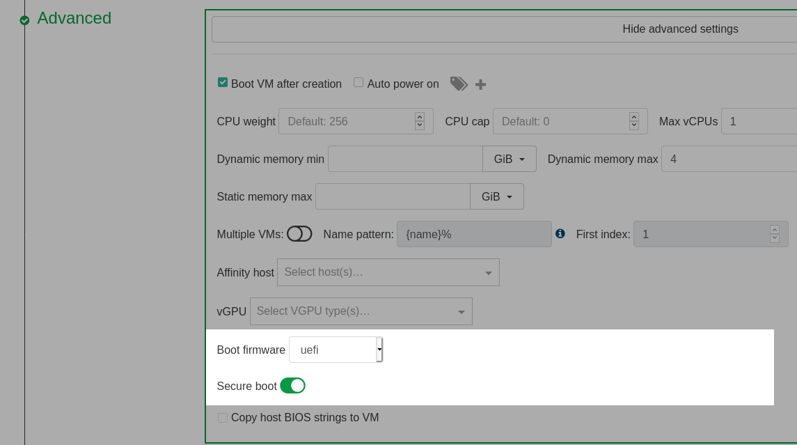
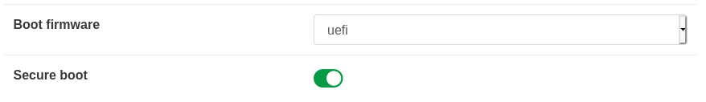
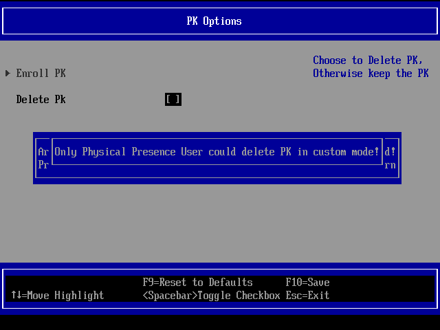

# Guest UEFI Secure Boot

How to configure UEFI Secure boot?

Enabling UEFI Secure Boot for guests ensures that XCP-ng VMs will only execute trusted binaries at boot. In practice, these are the binaries released by the operating system (OS) team for the OS running in the VM (Microsoft Windows, Debian, RHEL, Alpine, etc.).

## Requirements

* XCP-ng 8.2, fully up to date (>= 8.2.1).
* UEFI Secure Boot Certificates installed on the pool (this is detailed below).
* A UEFI guest VM.
* For Windows, ensure the VM has at least 2 vCPUs.

:::warning
Until we can re-sign XCP-ng's PV drivers for Windows, you will need the PV drivers from Citrix before enabling Secure Boot for a Windows VM. See [Setup Secure Boot for Windows VMs](#setup-secure-boot-for-windows-vms).
:::

Note: it's not necessary that the XCP-ng host boots in UEFI mode.

## How XCP-ng Manages the Certificates

:::tip
To understand UEFI Secure Boot variables (`PK`, `KEK`, `db` and `dbx`), please read James Bottomley's article [The Meaning of all the UEFI Keys](https://blog.hansenpartnership.com/the-meaning-of-all-the-uefi-keys/).

In a few words:
* `PK`: a single X509 key, the Platform Key.
* `KEK`: one or more X509 or RSA2048 keys, the Key Exchange Key.
* `db`: the Signature Database, a list of keys, signatures or hashes. They are used to validate signed EFI binaries and loadable roms.
* `dbx`: the Forbidden Signatures Database or Revocation List, a list of keys, signatures or hashes. They are used to reject binaries or loadable roms even if they were validated using the Signature Database (`db`).

In this guide, we often refer to those 4 UEFI variables as **the Secure Boot certificates**, or simply **the certificates**.
:::

The certificates are stored at several levels:
* **pool** level (in the XAPI database),
* host **disk** (it basically mirrors the certificates in the XAPI database),
* **VM** level (in the VM's UEFI variables).

To install or modify the certificates on the **pool**, use the `secureboot-certs` command line utility. See [Configure the Pool](#configure-the-pool). Once `secureboot-certs` is called, the XAPI DB entry for the pool is populated with a base64-encoded tarball of the UEFI certificates. Note: on XCP-ng 8.2.x, at this stage, *the certificates are still not installed on disk*: they only exist in the XAPI DB*. See "Host disk certificates synchronisation" below.

Host disk certificate synchronization:
- On XCP-ng 8.2.x, the certificates are updated on the host's **disk** (in `/var/lib/uefistored/`) each time a UEFI VM starts on the host, if needed.
- On any more recent release (8.3 or above), the disk certificates are synced from XAPI directly when `secureboot-certs install` is run, and again at every XAPI startup afterwards if needed.

When a UEFI VM starts:
- For each UEFI variable among `PK`, `KEK`, `db` and `dbx`: if it's not defined yet at the **VM** level, `uefistored` reads the corresponding file from the host's **disk** and populates the VM's NVRAM store with it. **/!\ If a UEFI variable is already defined at the VM level, then it is not modified by XCP-ng anymore, even if its value differs from the file on the host's disk.** Only the guest operating system or an admin may update it (see [Change the Certificates Already Installed on a VM](#change-the-certificates-already-installed-on-a-vm)). Unless you [remove it from the VM](#remove-certs-from-a-vm) before the boot, in which case `uefistored` will read the needed file(s) from disk again and populate the VM's NVRAM store again.
- Based on the certificates present and the state of the VM's `platform:secureboot` parameter, `uefistored` sets the Secure Boot state, on or off.

## Configure the Pool

The whole security of Secure Boot is based on signed certificates. So the first thing we need to do before enabling UEFI Secure Boot for guest VMs, is to install them using the `secureboot-certs` script on one host of the pool. This tool downloads, formats, and installs UEFI certificates for the `PK`, `KEK`, `db`, and `dbx` certificates in the XCP-ng pool.

To download and install XCP-ng's default certificates, see [Install the Default UEFI Certificates](#install-the-default-uefi-certificates).

For custom certificates (advanced use), see [Install Custom UEFI Certificates](#install-custom-uefi-certificates)

### Install the Default UEFI Certificates

`secureboot-certs` supports installing a default set of certificates across the pool.

Except the `PK` which is already present somewhere on the host's disk, all certificates are downloaded from official sources (`microsoft.com` and `uefi.org`).

The default certificates are sourced (or generated) as follows:

| Certificate |                                                   Source                                                          |  CLI Arg  |
|-------------|-------------------------------------------------------------------------------------------------------------------|-----------|
| PK          |  `/usr/share/uefistored/PK.auth` (present on XCP-ng hosts, coming from the `uefistored` RPM)                      | `default` |
| KEK         |  [Microsoft Corporation UEFI KEK CA 2011](https://www.microsoft.com/pkiops/certs/MicCorKEKCA2011_2011-06-24.crt)  | `default` |
| db          |  [Microsoft Corporation UEFI CA 2011](https://www.microsoft.com/pkiops/certs/MicCorUEFCA2011_2011-06-27.crt) and [Microsoft Windows Production PCA 2011](https://www.microsoft.com/pkiops/certs/MicWinProPCA2011_2011-10-19.crt) | `default` |
| dbx         |  [UEFI Revocation List](https://uefi.org/sites/default/files/resources/dbxupdate_x64.bin)                         | `latest`  |

To install these certificates from the CLI:

```
# Download and install PK/KEK/db/dbx certificates
secureboot-certs install default default default latest
```

This can be shortened to:
```
secureboot-certs install
```

If `secureboot-certs` fails to download the certificates from Microsoft due to microsoft.com deciding to forbid downloads from the user agent declared by the script, you may try to download with a different user agent (for example your current browser's user agent):

```
secureboot-certs install --user-agent="Mozilla/5.0 My custom user agent"
```

If this still fails, check the next section which explains how to install them manually.

### Install the Default UEFI Certificates Manually

* Using your web browser, download the certificates listed in the table above (`KEK`, CA and PCA which will allow us to build `db`, and `dbx`).
* Transfer the files to your master host.
  ```
  scp Mic*.crt dbxupdate_x64.bin root@ip_of_server:
  ```
* Build `db.auth`:
  * SSH to the server as root
  * convert the files from DER format to PEM:
    ```
    openssl x509 -in MicCorUEFCA2011_2011-06-27.crt -inform DER -outform PEM -out ms_ca.crt
    openssl x509 -in MicWinProPCA2011_2011-10-19.crt -inform DER -outform PEM -out ms_pca.crt
    ```
  * bundle these files into `db.auth`:
    ```
    /opt/xensource/libexec/create-auth db db.auth ms_ca.crt ms_pca.crt
    ```
* Install the certificates:
  ```
  secureboot-certs install default MicCorKEKCA2011_2011-06-24.crt db.auth dbxupdate_x64.bin
  ```

### Install Custom UEFI Certificates

:::tip
Advanced use, not needed by most users.
:::

`secureboot-certs` also supports installing your own custom certificates. The certs may be in the following formats:

* DER-encoded certificate
* PEM-encoded certificate
* An auth file (can be created with `/opt/xensource/libexec/create-auth`).

For example, to install a custom PK you may do the following:

```
# Enroll it, along with the default certificates, with secureboot-certs
secureboot-certs install PK.cer default default latest
```

The same procedure may be used to install custom KEK, db, or dbx certs.

To use multiple certificates in one variable (that is, have multiple certificates stored as a single KEK, db, or dbx), the certs must be packaged together into a .auth file, see [Use two or more certificates for a Secure Boot variable](#use-two-or-more-certificates-for-a-secure-boot-variable). Note that multiple certificates in the PK is not supported. If an auth file with multiple certs is loaded as the PK, only the first one found will be used.

Note that the virtual firmware (uefistored + OVMF), as is allowed by the specification, does not mandate that these default certificates be signed by their parent (i.e., the KEK doesn't need to be signed by PK) if they're installed via `secureboot-certs`. This verification *does* occur, however, when trying to enroll new certificates from inside the guest after boot. This is designed to give the host administrator full control over the certificates from the control domain.

If necessary for your use case you may omit the `dbx` entirely. Note that this basically **renders secure boot useless** from a security perspective, as any binary signed with a revoked certificate will still pass Secure Boot checks! This may be done by using the following command:

```
# Download and install PK/KEK/db certificates, omit the dbx
secureboot-certs install default default default none
```

For help with the tool's install functionality, call `secureboot-certs install -h`.

## Enable Secure Boot for a Guest VM

### Enable Secure Boot at VM creation

During VM creation in Xen Orchestra, go to the *Advanced* section and select **uefi** as the **Boot firmware**. This will display a **Secure boot** toggle that can be clicked to enable Secure Boot.



### Enable Secure Boot for an Existing UEFI VM

#### Prerequisite: make sure the VM is booting in UEFI mode
Warning: it is not recommended changing an existing VM's firmware type from BIOS to UEFI.

#### Clear the certificates from the VM (optional)

Before enabling Secure Boot for an existing VM, you may want to [clear the certificates from the VM](#remove-certificates-from-a-vm) so that it gets the latest ones known from the pool at the next boot.

#### Enable Secure Boot for an Existing UEFI VM in XO

1. Shutdown the VM if it is not already shutdown.

2. Go to the *Advanced* tab of the VM and click the **Secure boot** toggle
to enable Secure Boot.



#### Enable Secure Boot for an Existing UEFI VM using `xe`

1. Shutdown the VM using the [shutdown](../appendix/cli_reference.md#vm-shutdown) command if it is not already shut down.

2. In the XCP-ng CLI, set the platform Secure Boot mode to `true`:

```
# Enable Secure Boot for the VM
xe vm-param-set uuid=<vm-uuid> platform:secureboot=true
```

### Setup Secure Boot for Windows VMs

Windows VMs do not require extra installation packages because the Windows Loader and kernel are signed by the keys already installed by the `secureboot-certs` script. Enabling Secure Boot for the VM in XCP-ng enables Secure Boot in the VM UEFI firmware.

:::warning
If your VMs have any unsigned drivers, they will fail to load after enabling Secure Boot.
:::

:::warning Currently, only the PV drivers from Citrix work with Secure Boot.

Enabling Secure Boot on a Windows VM that has XCP-ng drivers will render the VM unbootable.

The key that signed XCP-ng drivers has expired and we are still in the process of getting a new one from Microsoft... Which is taking longer than expected (process started in August 2021).
:::

### Setup Secure Boot for Linux VMs

**In theory** (read why it's in theory in the *Boothole and fallouts* box below), the installers for mainstream Linux distributions (debian, RHEL, etc.) should install properly signed bootloaders and binaries, and should be installable in SB mode directly. Some other Linux distributions may require special packages for Secure Boot to function. Check that the distribution does support Secure Boot and follow the distribution's documentation to install any required Secure Boot software (e.g., shim) *before* enabling Secure Boot for the VM in XCP-ng.

:::warning
If the VM has any unsigned kernel modules, they will fail to load after enabling Secure Boot. Furthermore, the distribution will likely restrict other kernel features that are seen as loop holes in Secure Boot (kexec, /dev/mem, etc…). Please read the Secure Boot documentation from the distribution.
:::

:::tip Boothole and fallouts

2020 and 2021 have been complicated years for Secure Boot on Linux, due to major security flaws in `grub` ("Boothole" and its fallouts). Thus **all certificates that allowed Linux distributions to boot in SB mode have been revoked, twice**, and new ones have (or had) to be issued.

Consequences:
* Any installer that is not recent enough will fail to boot in Secure Boot mode if the most recent revocation list (`dbx`) is used (which is highly recommended if security is your objective).
* Distributions using the revoked certificates require updates before SB can be enabled (and possibly manual changes?).
* Depending on when you read this, **there may not be a solution yet for your distribution**.

Also see [VMs that won't boot due to a revoked certificate](#vms-that-won-t-boot-due-to-a-revoked-certificate).
:::

## Disable Secure Boot for a Guest VM

### Disable Secure Boot for a Guest VM using XO

Navigate to the *Advanced* tab and use the **Secure boot** toggle to disable Secure Boot. Reboot the VM and Secure Boot will be disabled.

### Disable Secure Boot for a Guest VM using `xe`

In the XCP-ng CLI:

```
# Disable Secure Boot for the VM
xe vm-param-set uuid=<vm-uuid> platform:secureboot=false
```

Reboot the VM and Secure Boot will be disabled.

## Secure Boot and revoked certificates

### Revocation database updates

When there are security concerns related to some of the certificates involved in binary signing, they are revoked. That is, they are added to the `dbx` certificate revocation database.

On actual hardware, this `dbx` update would be propagated to you through a firmware update, or be coming from your OS itself. For example, Microsoft updates the `dbx` database of the computer as part of its [KB4535680](https://support.microsoft.com/en-us/topic/kb4535680-security-update-for-secure-boot-dbx-january-12-2021-f08c6b00-a850-e595-6147-d0c32ead81e2) security update.

In a virtualization environment like XCP-ng, **we recommend that you use the latest `dbx` and update it regularly**.
* Follow the [installation instructions](#configure-the-pool) again to update the certificates at the pool level.
  * Any new VM will use the updated certificate databases the first time it starts.
  * Existing VMs won't be affected (unless they've never been booted after the first time you installed certificates to the pool).
* Either let the OS update the dbx in your existing VMs (Windows [does that](https://support.microsoft.com/en-us/topic/kb4535680-security-update-for-secure-boot-dbx-january-12-2021-f08c6b00-a850-e595-6147-d0c32ead81e2) and we are not aware of other OSes that do it), [clear the VM certificates](#remove-certificates-from-a-vm) so that it gets the latest ones known from the pool at the next boot, or [update manually](#change-the-certificates-already-installed-on-a-vm).

### VMs that won't boot due to a revoked certificate

Installed OSes and installation media that were previously perfectly bootable in Secure Boot mode may become unbootable after the certificate that signed their binaries is revoked.

This is what happened in 2021 to **the certificates used by all Linux distributions that support Secure Boot**, due to major security flaws in `grub`.

You are likely to have issues related to this in one of the following situations:
* You try to install a new (Linux) VM with an installation media whose binaries have been revoked.
* You try to enable Secure Boot on an existing (Linux) VM that was not enforcing Secure Boot previously, and this VM has signed binaries that have been revoked.
* You manually updated the dbx on an existing (Linux) VM.

Despite this, we still recommend that you always install the latest revocation database (`dbx`) on your pools. Not doing so lowers the security of Secure Boot, as any malicious binary signed with a revoked certificate would pass Secure Boot checks.

***If you can't boot an installation media***:
* Check whether their exists an updated installer signed with a valid certificate. If yes, use it.
* Else go to "It still can't boot" below.

***If you can't boot an existing VM***:
* Disable Secure Boot, update the OS, follow any instructions from the OS provider related to the update of the signed binaries, power off, re-enable Secure Boot, try to boot.
* Else go to "It still can't boot" below.

***It still can't boot***:
  * either disable Secure Boot for the VM, as its binaries are not secure anymore anyway. This can be temporary until an update brings properly signed binaries.
  * or [install](#change-the-certificates-already-installed-on-a-vm) an older `dbx` to the VM, [downloaded from the archive of prior versions of `dbx` files](https://uefi.org/revocationlistfile/archive). Let us stress again that this exposes the VM to risk, and therefore, we recommend that before choosing an archived `dbx` users evaluate the vulnerabilities that their guest system will be exposed to by omitting the most recent revocations. Above all, downgrading the `dbx` must not give you a dangerous false sense of security.

## Certificate Management

### View Certificates Already Installed on System

To view the default certificates that are available pool-wide:

```
secureboot-certs report
```

To view the certificates already installed into a VM's firmware:

```
varstore-ls <vm-uuid>
```

and then to see the full cert:

```
varstore-get <vm-uuid> <guid> <name> | hexdump -Cv
```

The GUID and name for varstore-get are the values returned by `varstore-ls`.

### Change the Certificates Already Installed in a Pool

To change the certificates in a pool, simply call `secureboot-certs install` in the same ways as described in [Configure the Pool](#configure-the-pool).

The new certificates will be used for new VMs, but will *not* be automatically propagated to existing VMs. If you want an existing VM to use the new certificates, either [clear the VM certificates](#remove-certificates-from-a-vm) so that it gets the latest ones known from the pool at the next boot, or [update manually](#change-the-certificates-already-installed-on-a-vm).

### Remove Certificates from the Pool

To remove the installed certs in the pool:

```
secureboot-certs clear
```

:::tip
Note that this does not remove the certs from the VMs. On XCP-ng 8.2.x it doesn't remove them from host disk either.
- On XCP-ng 8.2.x: to remove them from disk, remove the ".auth" files for the certs you'd like to remove, on every host (found in `/var/lib/uefistored/`).
- On XCP-ng 8.3 and later, host disk certificates will be removed by the clear command.
- In order to clear the certs from the VMs it is required to use `varstore-rm`. See [Remove Certificates from a VM](#remove-certificates-from-a-vm).
:::

### Change the Certificates Already Installed on a VM

:::tip
If you came here with the idea to update the VM certificates with certificates from the pool, then go to [Remove Certificates from a VM](#remove-certificates-from-a-vm) instead.
:::

A VM will usually have its own copy of the UEFI certificates (unless it never booted on a host that has certificates installed). To verify this, execute:

```
varstore-ls <vm-uuid>
```

If the relevant certs are installed, their names will be in the output (i.e., `PK`, `KEK`, `db`, or `dbx`).

To update an individual certificate in the VM's NVRAM store:
* Create or download an X509 certificate, or a `.auth` certificate list file.
* If you are starting with an X509 certificate, use `/opt/xensource/libexec/create-auth` to convert it into a `.auth` file.
* Shutdown the VM
* Use varstore-set to load the .auth file into a VM. The attributes arg must be set to 0x27.
   ```
   varstore-set <vm-uuid> <guid> <name> 0x27 path/to/file.auth
   ```
   Where name is one of `PK`, `KEK`, `db` and `dbx`.
   The GUIDs for each variable are:
   ```
   8be4df61-93ca-11d2-aa0d-00e098032b8c PK
   8be4df61-93ca-11d2-aa0d-00e098032b8c KEK
   d719b2cb-3d3a-4596-a3bc-dad00e67656f db
   d719b2cb-3d3a-4596-a3bc-dad00e67656f dbx
   ```

### Remove Certificates from a VM
In order to clear the VM's certificates, shutdown the VM and execute `varstore-sb-state <vm-uuid> setup`.

:::tip
`varstore-sb-state <vm-uuid> setup` wipes previously installed Secure Boot certificates at the VM level (if there were any). Upon boot, they will be replaced by the certificates found on the host's disk or in the pool's XAPI database, if any are present, as described in [How XCP-ng Manages the Certificates](#how-xcp-ng-manages-the-certificates)
:::

If you prefer to remove a specific certificate, use `varstore-rm <vm-uuid> <guid> <name>`.

For example, to remove the `dbx` from a VM.

```
varstore-rm <vm-uuid> d719b2cb-3d3a-4596-a3bc-dad00e67656f dbx
```

Note that the GUID may be found by using `varstore-ls <vm-uuid>`.

:::tip
Any certificate removed from the VM but still present in the pool configuration or on the host's disk at `/var/lib/uefistored/` will be automatically added back the next time the VM starts (unless another certificate it depends on was manually removed from `/var/lib/uefistored/`).
:::

## Misc

### Secure Boot and the UEFI Firmware Menu in the Guest

Disabling *and* enabling Secure Boot from the UEFI firmware menu inside the guest VM is explicitly disallowed on XCP-ng so as to ensure that guest users can not tamper with the Secure Boot policy set by the host administrator. This differs from enabling Secure Boot on physical hardware because that is typically done through the UEFI menu. On XCP-ng, instead, that privilege is given only to host administrators through the `uefistored` daemon and `varstored-tools` package.

Changes to the UEFI secure boot state in the UEFI menu will be ignored in favor of the host administrator's configuration. For example, deselecting **Attempt Secure Boot** will not disable Secure Boot on the next boot, although it would do so on a physical platform.

If disabling Secure Boot by removing keys via Custom Mode is attempted in the UEFI firmware menu, an error will display stating **Only Physical Presence User could delete NAME_OF_KEY in custom mode!** For example, if attempting to remove the **PK**:



### Check whether a VM runs on UEFI firmware

In Xen Orchestra, this can be checked in the VM's *Advanced* tab.

From command line, use:
```
xe vm-param-get uuid=<vm-uuid> param-name=HVM-boot-params param-key=firmware
```

### Check UEFI Secure Boot status from inside the VM

Enabling Secure Boot for a VM means that it will either boot an appropriately signed bootloader and OS kernel, or not boot at all if the Secure Boot checks didn't pass.

You may still want to verify, from inside a booted VM, whether Secure Boot was enforced or not.

On Linux VMs, you can either:
* run `dmesg -i secureboot`, which works on many distributions (not all) and should give you a line that looks like `secureboot: Secure boot enabled`
* or, if `mokutil` is installed, run `mokutil --sb-state`, which should output `SecureBoot enabled`
* or directly extract the information from the UEFI variables:
  ```
  # read the last byte of the SecureBoot variable and display it in hex format
  tail -c1 /sys/firmware/efi/efivars/SecureBoot-8be4df61-93ca-11d2-aa0d-00e098032b8c | xxd -p
  ```
  The result should be either `01` (enabled) or `00` (disabled)

On Windows VMs, you can either:
* run `msinfo32` and check the value of `System Summary` / `Secure Boot State` (expected: `On`)
* or, from PowerShell as admin, run `Confirm-SecureBootUEFI` (expected: `True`)

### Use two or more certificates for a Secure Boot variable

To create a Secure Boot variable (PK, KEK, db, or dbx) with multiple certificates, it is required to use the `create-auth` tool to bundle the certificates into a single .auth file.

From command line, to create a KEK with certifcates `cert1.crt` and `cert2.crt`:
```
/opt/xensource/libexec/create-auth KEK KEK.auth cert1.crt cert2.crt
```

To create the same auth as above, but also sign it with a custom key:
```
/opt/xensource/libexec/create-auth -c signer.crt -k signer.key KEK KEK.auth cert1.crt cert2.crt
```

After creating the auth file, use secureboot-certs to install it with the rest of your certs:

```
# Install custom KEK, download and install public PK/db/dbx certificates
secureboot-certs install default KEK.auth default latest
```

This may be done with any PK, KEK, db, or dbx.
