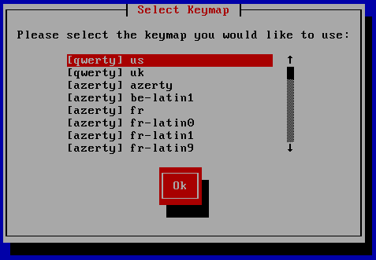
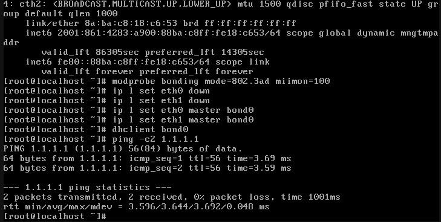
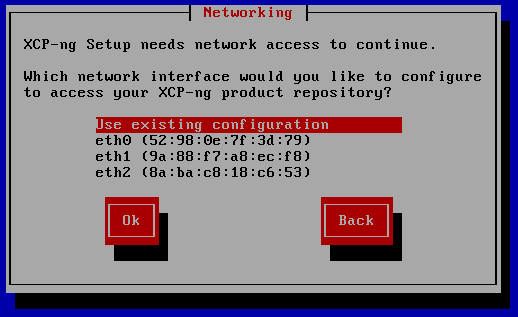
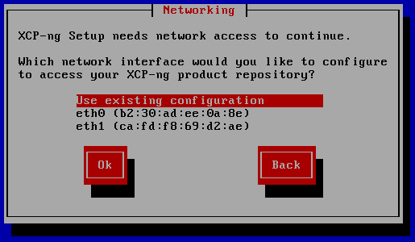
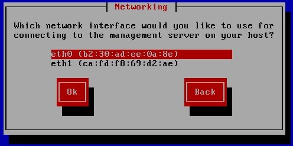

# Using LACP to Net Install or Upgrade XCP-ng

## Foreword

:::warning
- This guide is specifically for environments using LACP-only networks, without LACP fallback. It assumes you do not want to reconfigure your switches.
- The recommended approach is to enable "LACP fallback" (or an equivalent feature) on your switch. This way you can simply use a single interface during installation or upgrade.
- If you’re performing a new installation on an LACP-only network, be aware that your host will lose network connectivity after booting. You’ll need physical access or IPMI access to configure the network properly afterward. Xen Orchestra won’t be able to assist with bond creation at this stage.
- For upgrades, your existing configuration will remain intact after the upgrade is done.
:::

Our installer does not support LACP. This guide explains how to bypass this limitation, but please read all the instructions carefully before proceeding, as there are important caveats.
When using LACP, your switch needs to be configured for it. If you cannot or prefer not to reconfigure your switch, you won’t be able to use the single-interface option provided by the installer.
For other bonding methods (active-backup, balance-lsb), the switch does not need to be aware of the bond, and you can simply use one of the interfaces that will be part of the bond.

## When does the installer need network?

A working network configuration is only necessary in the following scenarios:

- New installation from net install ISO.
- Upgrading supporting hosts, even from a full ISO, as they need to contact the master host during the ugprade.
- Upgrading all hosts from net install ISO.

Network access is not required for:

- A new installation from the full ISO.
- Upgrading the master host from the full ISO.

## Installation or Upgrade steps

:::info
During an upgrade, the installer will not detect your existing bond configuration. In XCP-ng, network settings are managed by XAPI and applied to Open vSwitch, but the installation process operates independently of these components.
:::

1. Boot from your installation media. You'll reach the **Select Keymap** screen, at this stage, the network interfaces still have their temporary names, such as `side-XXXX-ethY`

:::warning
Do not attempt to configure the bond yet. Doing so would mislead the installer into thinking you have no network interfaces, which would block the installation or upgrade process.
:::



2. Select your keymap, and proceed to the next screen: **Welcome to XCP-ng Setup**
3. You can now switch to the second terminal. To do this, use `alt+F2` or `alt+right`.
4. Use `ip link` to make sure that the interfaces are named `ethX`. If that's the case, you can move on to the next steps.
5. Now we can configure a bond using standard linux tools.

```bash
modprobe bonding mode=802.3ad miimon=100 # automatically creates bond0 in 8.3 installer
ip link set eth0 down
ip link set eth1 down
ip link set eth0 master bond0
ip link set eth1 master bond0
```

6. Configure an IP address. There are two ways to do this:

- Via DHCP:

```bash
dhclient bond0
```

- Manually assigning a static IP:

```bash
ip addr add aaa.bbb.ccc.ddd/NN dev bond0
ip route add default via aaa.bbb.ccc.1
ip link set bond0 up
```

For example:\


### Upgrading a supporting host

1. Follow the standard installation procedure. When you reach the networking configuration step, you’ll see an option labeled **Use existing configuration**. Select this option and complete your upgrade.



2. Reboot your host.

You're all done! Your host will automatically restore its previous bond configuration after the reboot.

### New net install

During a network installation, you’ll encounter 2 steps related to network configuration:

- The first step configures the network so the installer can access the installation repository.
- The second step sets up your host’s network configuration after the installation is complete.

1. During the first step, you can pick the **Use existing configuration** option, so the installer can reach the repository and move on to the next steps.



2. During the second step, the **Use existing configuration** option won’t be available. Instead, you’ll need to select one of the interfaces provided by the installer. While you can still configure the hostname and other basic network settings, you won’t be able to set up your bond at this stage.



3. Proceed with the installation.
4. Reboot your host.

:::tip
The first boot can take a while. Give the host enough time for everything to start up before proceeding to the next steps.
:::

- If you used DHCP, `xsconsole` will likely display **No network configured**.
- If you used a static IP, it will show the configuration, but only on the `ethX` interface you selected.

At this point, you’ll need to create your bond and set it as the management interface.

:::info
`xe` commands now feature improved tab completion. Use it to avoid running `*-list` commands when searching for UUIDs and retyping them manually.
:::

1. Create a new network named `bond0`. For example:

```bash
xe network-create name-label="bond0"
```

2. Create the bond using the `network-uuid` that command just returned:

```bash
xe bond-create mode=lacp network-uuid=<network_uuid> pif-uuids=<pif_uuid#1>,<pif-uuid#2>
```

3. Set the previously created bond as your management interface:

```bash
xe pif-reconfigure-ip uuid=<bond_pif_uuid> netmask=255.255.255.0 gateway=192.168.1.1 IP=192.168.1.5 mode=static
xe host-management-reconfigure pif-uuid=<bond_pif_uuid>
```

You're all set!
