# Updating Windows PV drivers automatically with Group Policy

This page provides step-by-step instructions for deploying Windows PV drivers using Group Policy Objects (GPO).

:::warning
Always create backups and snapshots before updating Windows PV drivers.

We recommend testing updates with a small host group before applying them to all machines.

This procedure is only recommended if you're sure all VMs are using drivers from the same vendor (e.g. without mixing XCP-ng and XenServer drivers).
:::

To contextualize the update process, we will test it on a VM vulnerable to XSA-468, using Xen Orchestra's new Windows PV vulnerability warning feature.

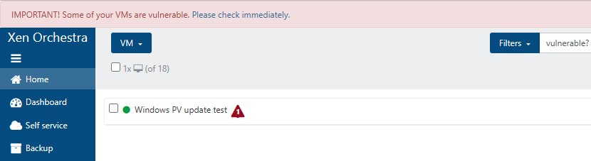

## Setting up automatic installation

Create a new GPO in your desired OU and edit it:

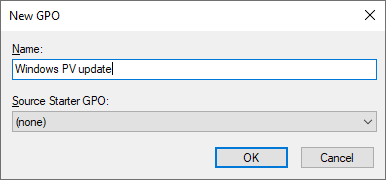
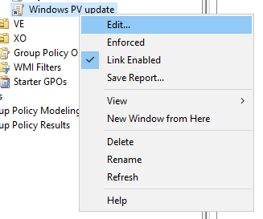

In **Computer Configuration** → **Policies** → **Software Settings** → **Software Installation**, add a new package:

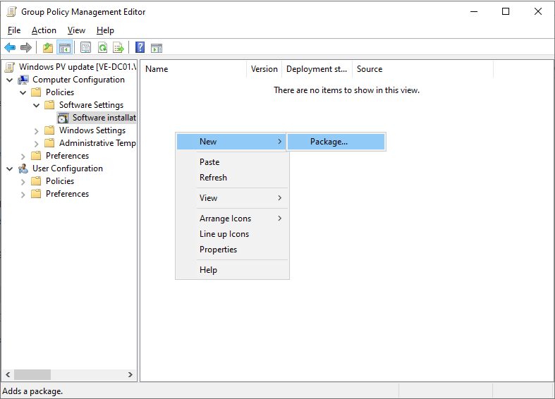

Select the installation MSI you want to install and click **OK**:

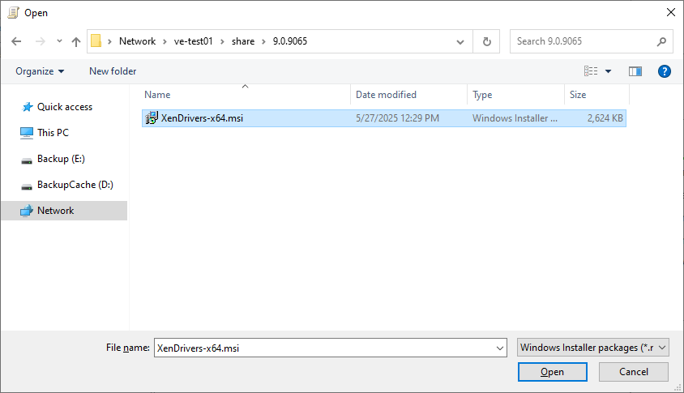

:::warning
The MSI package must be located on a network share accessible to all machines.
:::

In **Select deployment method**, select **Assigned**. You can change this later.

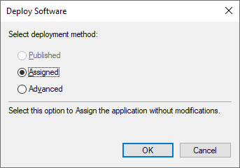

The targeted VMs will now pick up and install the driver package you selected.

## Setting up automatic reboot

The Windows PV drivers require multiple reboots to be installed or updated.
In this section, we will set up the Autoreboot feature of Windows PV drivers.
This feature automatically reboots the VM multiple times until the driver installation is complete.

:::warning
The autoreboot feature will restart your VM without warning.
You can delete the autoreboot settings once your update campaign is complete.
:::

Come back to the GPO you created and navigate to **Computer Configuration** → **Preferences** → **Windows Settings** → **Registry**.
Create a new registry item:

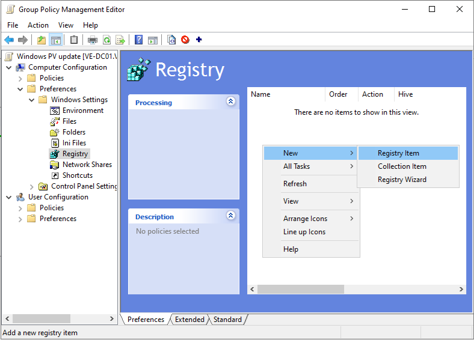

Specify the following settings:

- **Action**: Replace
- **Hive**: `HKEY_LOCAL_MACHINE`
- **Key Path**: `SYSTEM\CurrentControlSet\Services\xenbus_monitor\Parameters`
- **Value name**: `Autoreboot`
- **Value type**: `REG_DWORD`
- **Base**: Decimal
- **Value data**: 3 (The number of automatic reboots you want to allow)

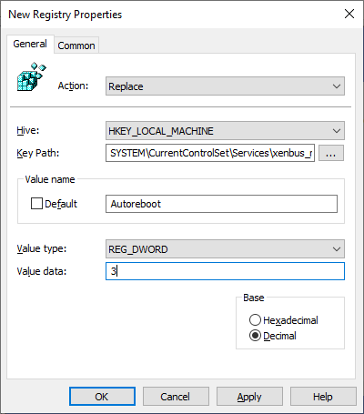

Click **OK** to save the changes.

## Observing the installation process

You'll need to reboot your VMs to apply the updates.
After reboot, the VMs will pick up on your new GPO and install the linked driver package.

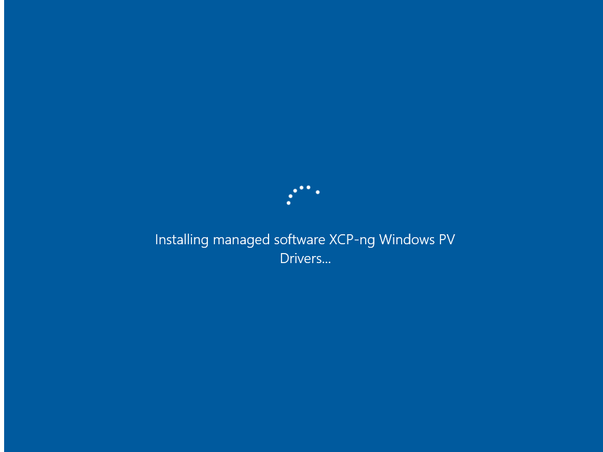

The VM will restart several times as the new drivers are installed.

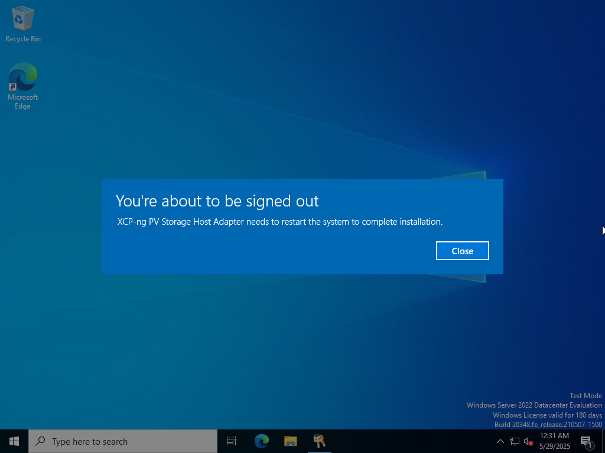

Once the update finishes, you should no longer see the vulnerability warning in Xen Orchestra.

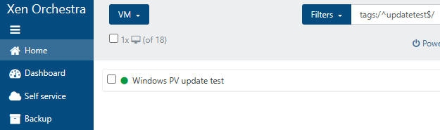

## Useful links

- If you want to remove existing Xen drivers, refer to the [XenClean guide](/vms/#fully-removing-xen-pv-drivers-with-xenclean).
- Refer to the [XenBootFix guide](/troubleshooting/windows-pv-tools/#windows-fails-to-boot-hanging-at-boot-or-bsod-with-stop-code-inaccessible_boot_device) if you encounter VM boot issues after the update.

## Appendix: Blocking vulnerable Xen drivers with Application Control for Windows

:::warning
**Risk of BSOD**: Incorrect application of App Control rules can prevent the system from booting.
While the policy provided in this guide is safe even if enforced, be sure to test your rules in audit mode and carefully review the event logs before applying them in enforced mode, especially if you modify the policy.
:::

Application Control for Windows (also known under various names: Windows Defender Application Control (WDAC), Device Guard, SIPolicy, CIPolicy etc.) is a powerful Windows feature that blocks binaries from executing.
It can be used to totally block vulnerable drivers and prevent their abuse (as done in "bring-your-own-vulnerable-driver" attacks).
App Control policies support signing to deter tampering, and can integrate with Measured Boot to prove enforcement.

In this section, we provide instructions for installing an App Control policy for blocking XenIface drivers vulnerable to XSA-468.
The provided policy is compatible with Windows 10 version 1903 or later and Windows Server 2022 or later.

### Installing rules in audit mode

Download [xsa468.xml](https://github.com/xcp-ng/win-pv-drivers/raw/refs/heads/xcp-ng-9.1/extras/xsa468.xml) then use the following command to convert it to a binary policy file:

```
ConvertFrom-CIPolicy -XmlFilePath .\xsa468.xml -BinaryFilePath '.\{1A785F78-1622-4A2E-8866-34A6F87CF9F7}.cip'
```

:::tip
The binary policy file name follows the format `{PolicyID}.cip`.
:::

Copy the policy to `C:\Windows\System32\CodeIntegrity\CIPolicies\Active`.
Afterwards, use the [RefreshPolicy.exe](https://www.microsoft.com/en-us/download/details.aspx?id=102925) tool or `citool -r` (Windows 11 22H2 or Windows Server 2025 and later) to apply the new policy.
The new policy takes effect immediately.

:::tip
For details on how to deploy App Control policies to multiple machines, check the [Microsoft documentation](https://learn.microsoft.com/en-us/windows/security/application-security/application-control/app-control-for-business/deployment/appcontrol-deployment-guide).
:::

### Reviewing audit logs

The above policy is provided in audit mode.
Instead of blocking drivers, the policy will create events in the Windows event log every time a blocked driver is loaded.
You should review the policy and make sure it's working as expected before enforcement.

Look for **Event 3076** in the `Microsoft-Windows-CodeIntegrity/Operational` log to look for blocked drivers.
Make sure that no unintended drivers were targeted by your policy.

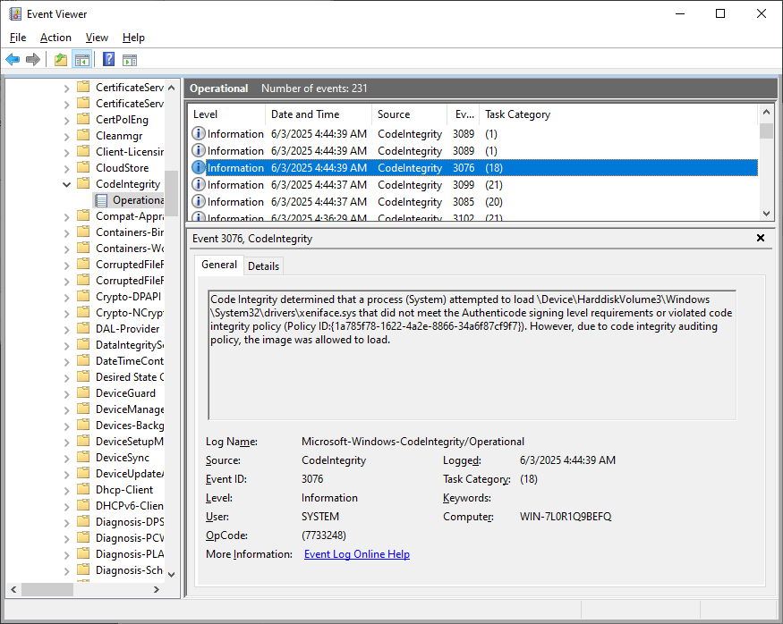

### Enforcement

Once you're ready to fully apply the policy, remove the Audit rule option, bump the rule version and recompile the policy:

```
Set-RuleOption -FilePath .\xsa468.xml -Option 3 -Delete
Set-CIPolicyVersion -FilePath .\xsa468.xml -Version 10.0.1.0
ConvertFrom-CIPolicy -XmlFilePath .\xsa468.xml -BinaryFilePath '.\{1A785F78-1622-4A2E-8866-34A6F87CF9F7}.cip'
```

:::tip
You must increase the rule version number (`VersionEx`) using `Set-CIPolicyVersion` each time you update your policy.
Otherwise, policy refresh will not work.
:::

Install the policy to `C:\Windows\System32\CodeIntegrity\CIPolicies\Active` then use RefreshPolicy.exe or `citool -r` to apply the new policy.
The update takes effect immediately, but you may have to reboot to unload the currently-loaded blocked drivers.

Look for Event 3077 to confirm that the vulnerable drivers were blocked from loading.

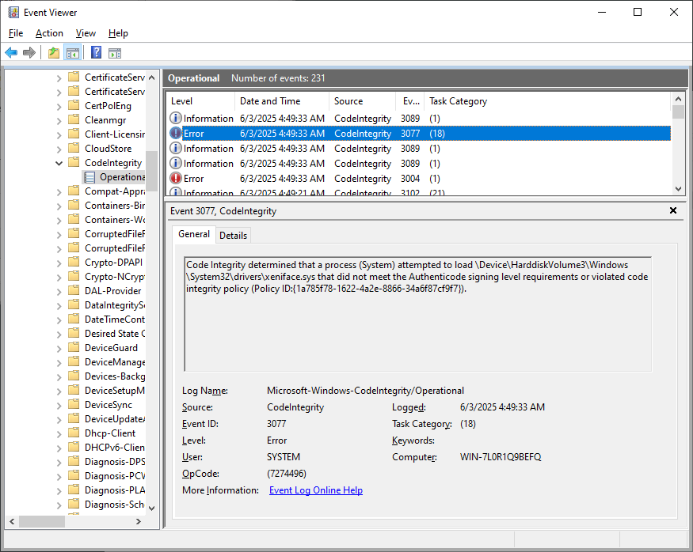

Devices using a blocked driver will also show a Code 39 error in Device Manager.

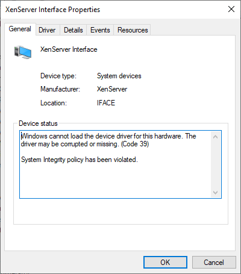
