# Updating Windows PV drivers automatically with Group Policy

This page provides step-by-step instructions for deploying XCP-ng Windows guest tools using Group Policy Objects (GPO).
We provide an example of a staged rollout process for deploying first to a small set of VMs, then to the rest of the OU.

:::note
This procedure only supports XCP-ng Windows guest tools.
:::

## Setting up automatic installation

Create a new GPO and link it to your desired Active Directory organizational unit (OU):

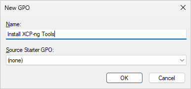
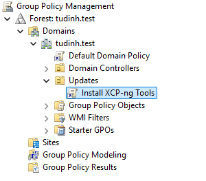

To prevent the GPO from taking immediate effect, temporarily disable its link:

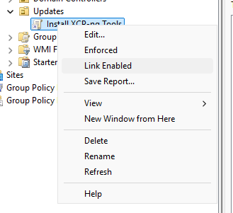

In **Computer Configuration** → **Policies** → **Software Settings** → **Software Installation**, add a new package:

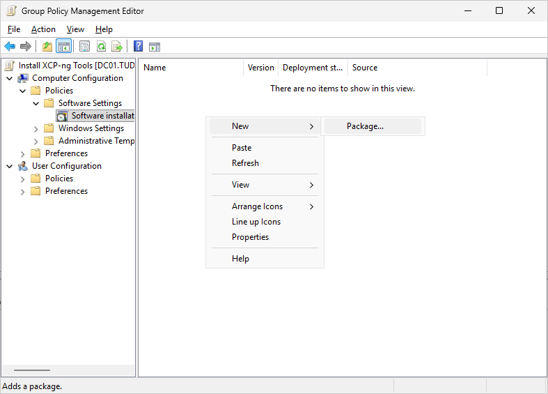

Select the installation MSI you want to install and click **OK**.
Here, we store the XCP-ng Windows Guest Tools on a shared folder under a DFS namespace:

:::tip
- Once the installer path has been set, it cannot be changed.
- The installer must be stored on a network share with a stable location, reachable by all VMs.
  Setting up a network share is outside of this document's scope.
- To upgrade your guest tools to a newer version, do not replace the existing shared files.
  Instead, create a new shared package and use the Upgrades tab to replace the old one.
:::

In the **Deploy Software** dialog → **Select deployment method**, select **Assigned**. You can change this later.

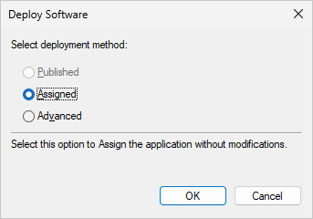

The GPO is now configured. You can now close the GPO editor window.

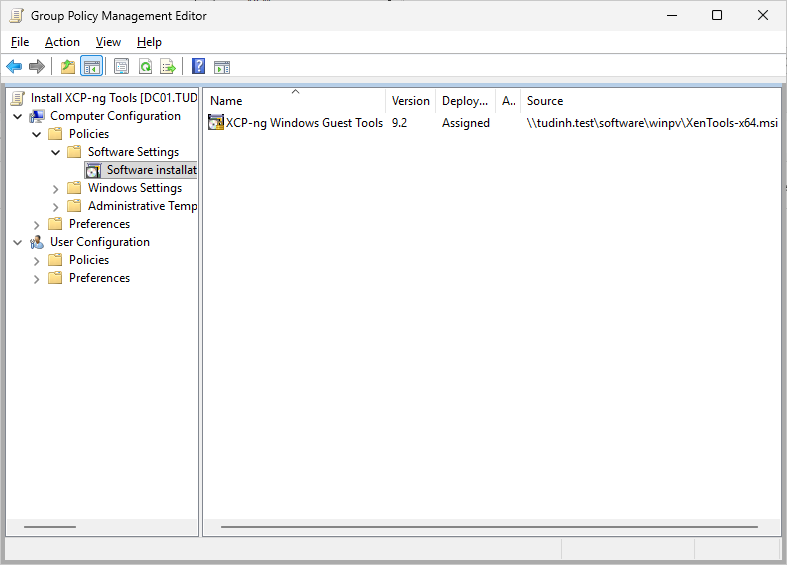

## Staged rollout using GPO security filtering

In this section, we describe the procedure for staged rollouts of guest tools.
Using staged rollout, we can limit a tools deployment to a small group of VMs, then distribute it widely once the update looks good.

At this point, the GPO's link remains disabled, and no VM will apply it yet.

Create a security group for the first wave of VMs. In this example, we create a group named **Updates - Narrow distribution**:

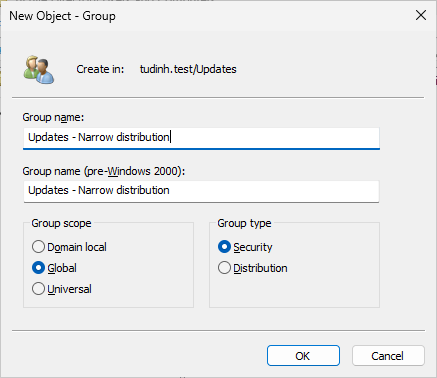

Add the computer objects of the VMs you want to update first to this group:

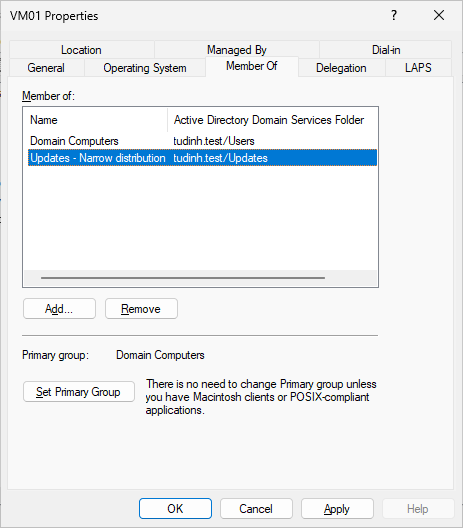

In the GPO's **Scope** tab, under **Security Filtering**, remove **Authenticated Users**. Accept the warning:

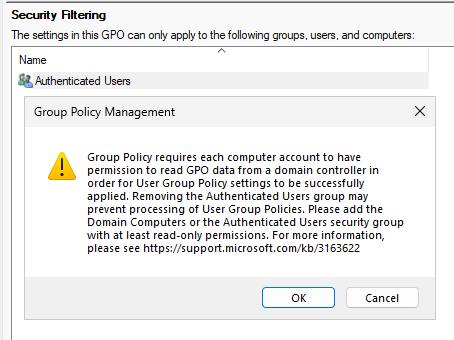

Add the **Updates - Narrow distribution** group to **Security Filtering**:

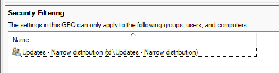

Enable the GPO link:

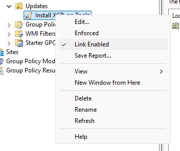

Your GPO is now ready and enabled.
Targeted VMs will now pick up and install the driver package you selected on reboot.

## Observing the installation process

You'll need to reboot your VMs to apply the updates.
After reboot, the VMs will pick up on your new GPO and install the linked driver package.

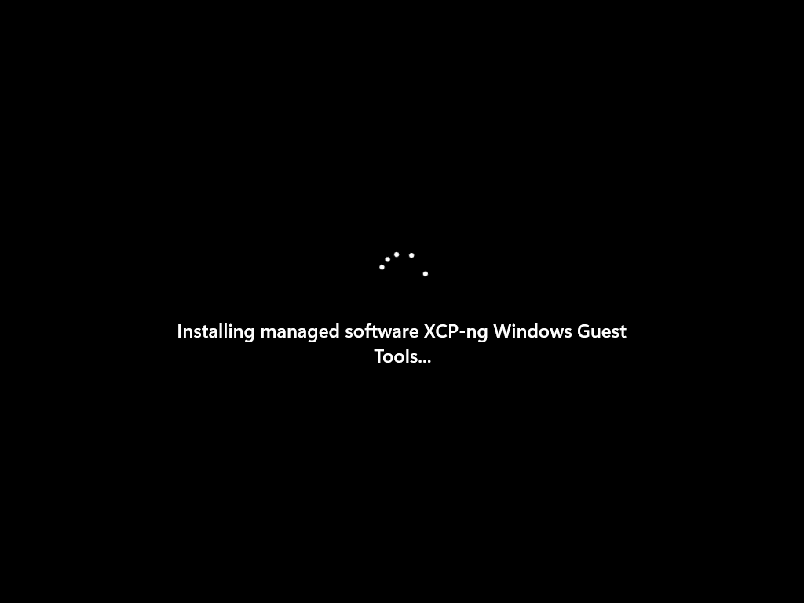

The VM will restart automatically after installing.

Once the update finishes, verify that the installation succeeded.

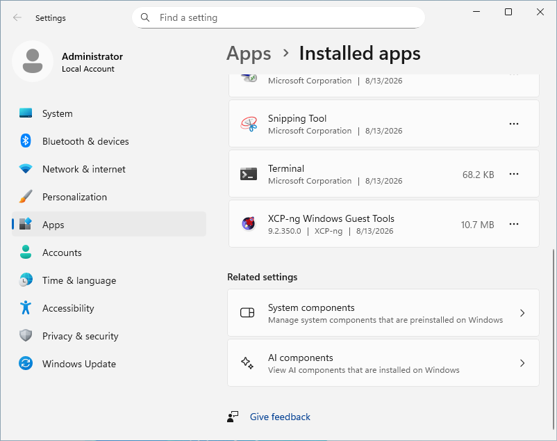

## Enabling wide distribution

When you are ready to deploy to all computers in the OU, add **Authenticated Users** back to **Security Filtering**:

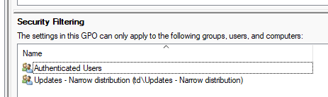

## Useful links

- If you want to remove existing Xen drivers, refer to the [XenClean guide](/vms/#fully-removing-xen-pv-drivers-with-xenclean).
- If you encounter VM boot issues after the update, refer to the [XenBootFix guide](/troubleshooting/windows-pv-tools/#windows-fails-to-boot-hangs-inaccessible_boot_device).
