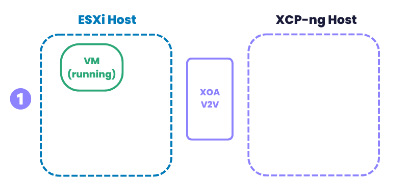
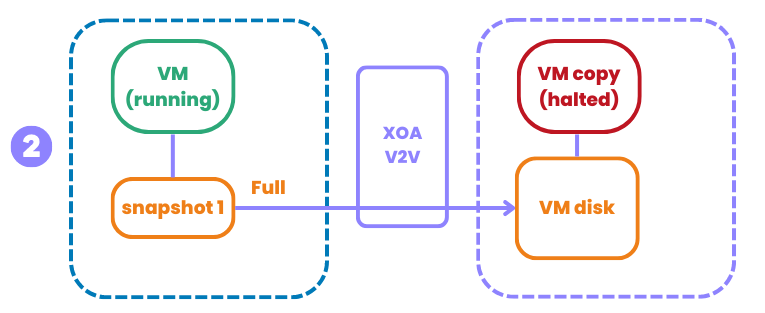
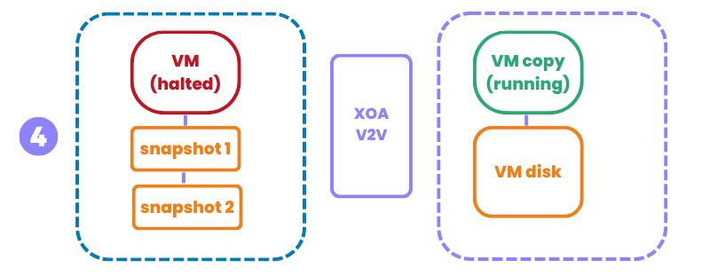
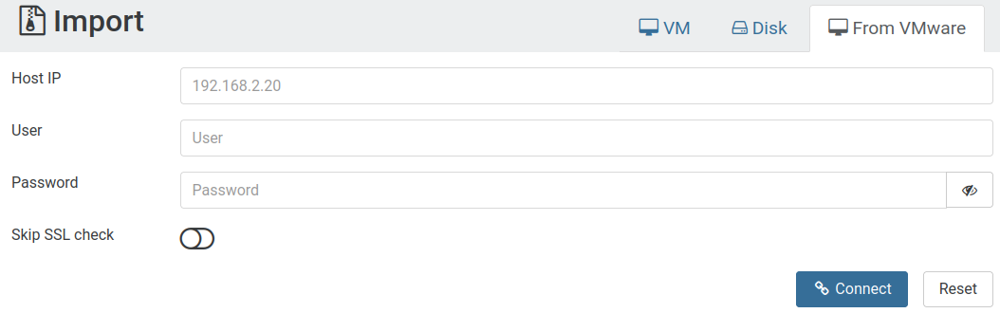
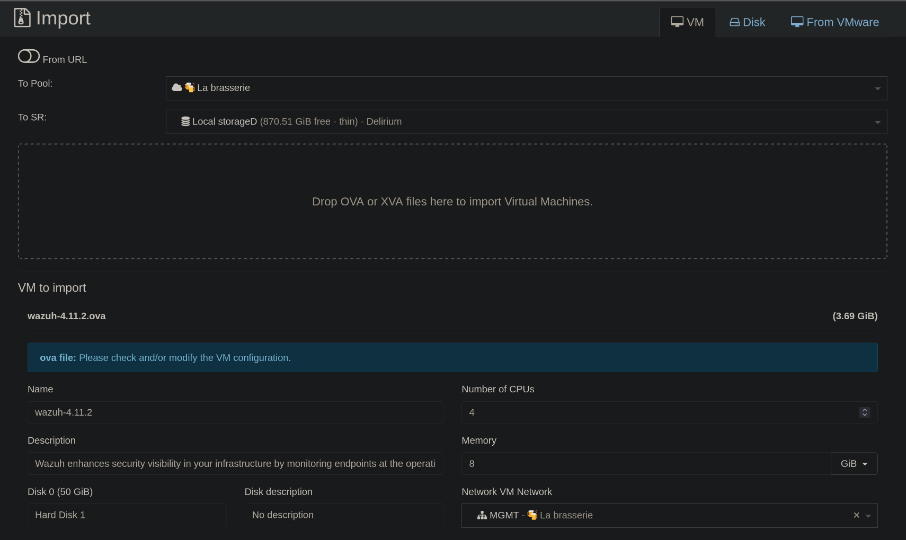
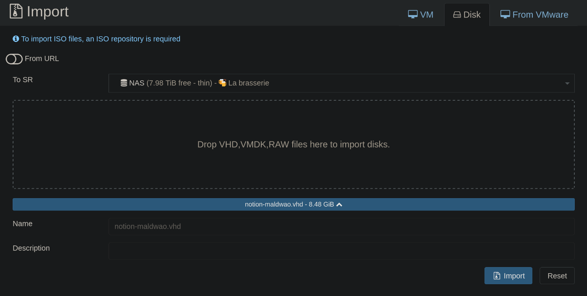

# Migrate to XCP-ng

How to migrate from VMware, KVM, etc. to XCP-ng.

This documentation will help you to make a migration to XCP-ng, from any most common other virtualization platform (VMware, KVM, etc.)

## 📋 Prerequisites

Before migrating your VMs, make sure to check the following:

### Uninstall Existing Guest Tools

To avoid conflicts with XCP-ng guest tools, uninstall any existing VM tools (such as VMware Tools or QEMU Guest Agent) from the VM.

### Install Xen Drivers

On some systems (especially RHEL-based and SLES distributions) Xen drivers are not installed by default. Migrating a VM without these drivers can prevent the OS from detecting disks and network interfaces.

Before shutting down the VM, install the drivers with:

```
dracut --add-drivers "xen-blkfront xen-netfront" --force
```

### Install XCP-ng Guest Tools After Migration

Guest tools are essential for proper VM operation (especially on Windows). Be sure to install the XCP-ng guest tools after the migration.

See the [guest tools documentation](../vms/vms.md#%EF%B8%8F-guest-tools) for more details.

## 🇽 From XenServer

We got a dedicated section on [how to migrate from XenServer to XCP-ng](../../installation/upgrade#-upgrade-from-xenserver).

## 🍋 From Citrix Hypervisor

We got a dedicated section on [how to migrate from Citrix Hypervisor to XCP-ng](../../installation/upgrade#-upgrade-from-xenserver).

## 🐼 From Xen on Linux

If you are running Xen on your usual distro (Debian, Ubuntu…), you are using `xl` to manage your VMs, and also plain text configuration files. You can migrate to an existing XCP-ng host thanks to [the `xen2xcp` script](https://github.com/xcp-ng/xen2xcp).

Check [the README](https://github.com/xcp-ng/xen2xcp/blob/master/README.md) for usage instructions.

## 🇻 From VMware

:::warning
Migrating from VMware to XCP-ng is not just a technical operation on one VM, it's a process. How long the migration takes depends on various factors, such as:

- **Number of VMs**  Make sure to know the size of your infrastructure before starting a migration. To migrate hundreds or thousands of VMs, you may want automate the export/import steps with a script.
- **Hardware performance and compatibility**: It's important to take into account the performance of your hardware. SSD or HDD? Network hardware performance? RAM and CPU availability? All these elements will have an impact on your migration.
:::

### XO V2V

Xen Orchestra introduces "V2V," or "VMware to Vates", a streamlined tool for migrating from VMware to the Vates Stack, encompassing XCP-ng and Xen Orchestra (XO). Seamlessly integrated into Xen Orchestra, this tool utilizes the "warm migration" feature for efficient transitions. The process initiates with exporting an initial snapshot of the VMware-based VM, which, despite being time-consuming, occurs without disrupting the VM's operation, ensuring transparency.

Once this comprehensive replication completes, the VM is shut down, and only the newly modified data blocks since the snapshot are exported. The VM is then activated on the XCP-ng platform, significantly minimizing downtime, a crucial benefit for large VMs. Furthermore, the migration process is largely automated, allowing for hands-off monitoring and execution. This entire procedure is fully automated for user convenience and efficiency.

:::tip
This method doesn't require any direct access to the VMware storage, only an HTTP access to the ESXi API. This is pretty powerful, allowing you to migrate everything remotely from one Xen Orchestra.
:::

#### How it works

The initial situation: a running VM on ESXi on the left, your Xen Orchestra in the middle, and your Vates XCP-ng host on the right:



The initial sync: the empty VM is created on XCP-ng, and after a snapshot, the content is transferred from VMware side to the new VM disk on XCP-ng. This takes time, but your original VM is up all along (no service interruption):



After the initial sync, the original VM is shutdown, another snapshot is done and only the diff is sent to the VM on XCP-ng side. Since it's a small amount of data, the downtime will be minimal:


After the transfer, the VM on XCP-ng side is started:



This process is fully automated, without any human intervention after it starts on step 1.

#### From the XO UI

In your Xen Orchestra UI, go to the main menu on the left, on **Import** click **From VMware**:



After giving the vCenter credentials, click **Connect** and go to the next step:


On this screen, you will basically select which VM to replicate, and to which pool, storage and network. When it's done, just click on "Import" and there you go!

#### From the CLI

You can also use the command-line interface (CLI) to migrate your VM. 

To do this:

1. Gather all the information needed to contact the VMware side :
    - IP
    - Credentials
    - SSL check or not
    - The ID of the VM and the ID of the VM
2. On the XCP-ng side, provide the following information:
    - SR
    - Network

3. Run this command with `xo-cli`:

`xo-cli vm.importFromEsxi host=<VSPHERE_IP> user=<VSPHERE_USER> password=<VSHPERE_PWD> sslVerify=<true|false> vm=<VSPHERE_VM_ID> sr=<SR_UUID> network=<NETWORK_UUID>`

Now, you can see the transfer progress in the **Task** view of the Xen Orchestra UI. As soon it's done, you can boot the VM directly!

### Local migration (same host)

:::tip
This method is helpful if you just install XCP-ng on an extra/dedicated drive on the same hardware, removing the need for a new server to migrate.
:::

In this case, you'll mount your local VMware storage into XCP-ng and use `qemu-img` to convert the VMDK files to VHDs directly in your own XCP-ng Storage Repository (SR). If you go from local storage to local storage, it's a very fast way to migrate even large disks.

:::warning
This method use external packages to install in XCP-ng directly (the Dom0), and you should remove them just after you did the migration. Those commands must be executed on the Dom0 itself.
:::

#### Install Qemu-img and vmfs tools

```
yum install qemu-img --enablerepo=base,updates
wget https://forensics.cert.org/centos/cert/7/x86_64/vmfs6-tools-0.2.1-1.el7.x86_64.rpm
yum localinstall vmfs6-tools-0.2.1-1.el7.x86_64.rpm
```

#### Mount the VMware storage repository

```
vmfs6-fuse /path/to/vmware/disk /mnt
```

#### Convert a VMDK file to a VHD

For example, on a file-based SR (local ext or NFS):

```
qemu-img convert -f vmdk -O vpc myVMwaredisk.vmdk /run/sr-mount/<SR UUID>/`uuidgen`.vhd
```

#### Rescan the SR

You need to rescan the SR where you new VHD file is, so it can be detected. It will appear in the disk list, without a name or description though. Attach it to any VM you created before (eg without booting it first), and boot.

## 🇭 From Hyper-V

There's two options, both requiring to export your Hyper-V VM disk in VHD format.

### Export the VM disk

**If the server can be taken offline:** Shut down the VM and create a VHD file from the existing VHDX.  
  This process leaves the original disk file unchanged, allowing you to restart the VM in Hyper-V if needed. Ensure sufficient disk space is available for both the original VM and the new VHD file.

**If the server must remain online:** Export the VM and then convert the VHDX to a VHD file.  
  Note that the original VM will continue running and may be updated during the migration process. Ensure enough disk space is available for the original VM, the exported VM, and the new VHD file.

1. Prepare the VHD for export.  
  Before exporting, remove all the Hyper-V tools from the VM to ensure compatibility.

2. (Optional). Shut down the VM in Hyper-V.  
  To shut down the VM, run this command in PowerShell:
  ```powershell
  STOP-VM -Name <VM name>
  ```

3. Identify the VM disk to be exported.  
  To identify the VM disk, run this command:
  ```powershell
  Get-VMHardDiskDrive -VMName <VM name>
  ```

4. Make sure the VM disk has the correct format.   
  - Use a **dynamic disk** format, as the **static format is not compatible with XCP-ng**.
  - If the disk is in the **VHDX** format, convert it to the **VHD** format. 
  To convert the disk from VHDX to VHD, run this command:  

  ```powershell
  Convert-VHD -Path <source path> -DestinationPath <destination path> -VHDType Dynamic
  ```

Then [import your VHD](../../installation/migrate-to-xcp-ng/#import-the-vhd)

### Alternative: direct VHD copy

:::warning
This method is a bit more dangerous: if you don't respect the VHD name format, the SR will be blocked and giving warnings. Naming is crucial to avoid problems.
:::

It's possible to directly send the VHDs to an existing XCP-ng SR. However, you MUST respect some pre-requisites:
* to use a dynamic disk VHD format
* the VHD **MUST be named correctly** (see below)

#### VHD naming

The **ONLY** working format is `<UUID>.vhd`, eg `e4e573d8-6272-43ae-b969-255717e518aa.vhd`. You can generate a UUID by simply using the command `uuidgen`.

#### Steps

1. Rename the dynamic VHD disk to the format `<UUID>.vhd`
2. Copy it to the destination SR (any file type is supported: local, NFS…)
3. Scan the SR

:::note
As soon you did scan the SR, the new disk is visible in the SR/disk view. Don't forget to add a name and a description to be able to identify it in the future. Indeed, any disk imported this way won't have any metadata, so it's up to you to fill it.
:::

4. Create a VM with the appropriate template, **without any disk in it**
5. Attach the previously imported disk (VM/Disk/Attach an existing disk)
6. Boot the VM
7. Install the tools

:::note
If you lost ability to extend migrated volume (opening journal failed: -2) You need to move disk to another storage, VM should be ON during moving process. This issue can occur when vhd files was directly copied to storage folder.
:::

## 🇰 From KVM (Libvirt, Proxmox and other)

First, shut down the virtual machine. If you don’t already have the `qemu-img` command available, you can install it by installing the `qemu-utils` package on your computer or server.

Next, convert the QCOW2 disk to a VHD format using the following command:

```
qemu-img convert -O vpc disk.qcow2 `uuidgen`.vhd
```

Then [import your VHD](../../installation/migrate-to-xcp-ng/#import-the-vhd)

## 🔄 Alternatives 

### OVA

You can also export an OVA from your hypervisor (VirtualBox, VMWare...) and import an OVA into Xen Orchestra.

An OVA is a big, single file using the standard Open Virtualization Format. The OVA contains an XML describing the metadata (VM name, description, etc.) and your disks in the VMDK format.

:::tip
To skip Windows activation if the system was already activated, collect info about the network cards used in the Windows VM (ipconfig /all) and use the same MAC address(es) when creating interfaces in XCP-ng.
:::



:::warning

- **Downtime**: The OVA can only be exported while the VM is off (except if you export a clone, but all blocks written after the clone won't be on the imported VM. If you can sync after, it's fine!). This can take a while, and your VMs won't be reachable until it's fully exported AND imported on destination.
- **Storage**: You need an intermediary storage where you can export then import the OVA file. If your VMs are small, it's OK.
- **Manual process**: Even if it's simple to do, it can be cumbersome if you have a lot of VMs to migrate.
:::


:::note
OVA import method will miss the information if the VM is running BIOS or UEFI mode. Double check your settings on your original system, and then enable (or not) UEFI on XCP-ng side for the destination VM. You can do so in VM advanced tab in Xen Orchestra.
:::

### CloneZilla

Clonezilla is a free and open-source disk imaging and cloning tool used for system backups, recovery, and deployment.

1. Insert a CloneZilla live CD in your existing VM, and boot on it. In the meantime, you also have a VM on the destination with the right metadata (same name and disks), which you'll also boot with CloneZilla.

2. From the VM console, you can tell the source VM running CloneZilla to send all the blocks to the destination VM, also running CloneZilla. 

3. As soon it's done, you can safely shut down the original VM and boot the copy on destination!

:::warning
- **Downtime**: Even if the downtime will be reduced compared to using OVA, you still need to run the export/import process while the VM is off.
- **Setup time**: Not complex, but various operations are needed until you can start the replication for one VM. If you have a lot of VMs, this can take some effort.
:::

## 📥 Import the VHD 

### With Xen Orchestra

In the left menu, go for "Import" then "Disk". Select the destination SR, and then add your VHD file into it. Depending on the VHD file size, it might take some time. The upload progress can be tracked in another XO tab, in the "Task" menu.



When the disk is imported, you can:

- Create a VM with the appropriate template, **without any disk in it**
- Attach the previously imported disk (VM/Disk/Attach an existing disk)
- Boot the VM
- Install the tools

### Via the CLI

You can transfer the VHD file directly to your XCP-ng storage repository (SR) using SCP:

```
scp thegenerateduuid.vhd ip.xcp-ng.server:/run/sr-mount/uuid-of-your-SR
```

:::warning
The name of your VHD MUST BE a uuid (e.g. `44ad36fc-e9f1-4d74-9090-2d9bffddbee2.vhd`).

You can generate one with the command `uuidgen` on Linux.
:::

You need to rescan the SR where you new VHD file is, so it can be detected. It will appear in the disk list, without a name or description though. You can use `xe sr-scan` or use the scan button on the storage in Xen Orchestra.

In Xen Orchestra, create a new VM without a disk, and make sure to uncheck the "Boot VM after creation" option under advanced settings. Then, go to the "Disks" tab, click on "Attach disk", select the VHD you just uploaded, and attach it.


## 🛠️ Troubleshooting

### My imported VM is not booting 

- Check if the Boot firmware (in advanced setting) is on the correct type (BIOS or UEFI)
- Check if the boot disk is the first in the VM disk tab
- Check [here](../../installation/migrate-to-xcp-ng/#error-dracut-initqueue227-warning-devmapperol-root-does-not-exist-or-no-bootable-device)

### Error "dracut-initqueue[227]: Warning: /dev/mapper/ol-root does not exist" (or no bootable device)

This error means Xen driver are not present in the kernel (see [here](../../installation/migrate-to-xcp-ng/#install-xen-drivers))

You can boot an live CD, and mount root and boot partition
```
mount <root device> /mnt/
mount <boot device> /mnt/boot/

for x in sys proc run dev tmp; do mount --bind /$x /mnt/$x; done
```
Check your fstab to see the exact layout of your partition !
If you have LVM partition, you can enable them with `vgchange -ay`

Chroot in your mounted partition 
```
chroot /mnt
```
Find your initrd files (if you have several file, use the more recent version), usualy in /boot or /boot/efi
Then add the xen drivers:
```
dracut --kver <version> -f /boot/initrd<version> --add-drivers "xen-blkfront xen-netfront" --force
```
Exit the chroot, unmount all your partition, and you can reboot, or detach the disk if you used your XO
You VM should be booting now !