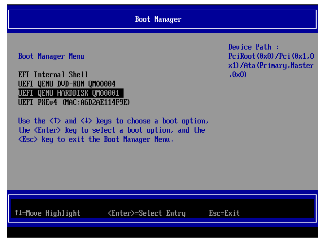

# Migrate to XCP-ng

Learn how to migrate from other virtualization platforms like VMware, KVM, and more to XCP-ng.

This guide provides step-by-step instructions for migrating your virtual machines (VMs) from popular platforms to XCP-ng.

:::note
The OVA import method doesn't retain information about whether the VM uses BIOS or UEFI mode. Ensure you verify your VM's boot mode on the source platform and enable or disable UEFI accordingly on the XCP-ng side. You can adjust this setting in the **Advanced** tab of the VM configuration in Xen Orchestra.
:::

## 🇽 From XenServer

We provide a dedicated guide on [migrating from XenServer to XCP-ng](../../installation/upgrade#upgrade-from-xenserver).

## 🍋 From Citrix Hypervisor

Follow our detailed instructions for [migrating from Citrix Hypervisor to XCP-ng](../../installation/upgrade#upgrade-from-xenserver).

## 🐼 From Xen on Linux

If you're running Xen on a Linux distribution (e.g., Debian, Ubuntu) using `xl` and plain text configuration files, you can migrate to an XCP-ng host using the [xen2xcp script](https://github.com/xcp-ng/xen2xcp).

Refer to the [README](https://github.com/xcp-ng/xen2xcp/blob/master/README.md) for detailed usage instructions.

## 📦 From Virtualbox

Export your VirtualBox VM as an OVA file, then use Xen Orchestra to import it. If you encounter boot issues, check the [VMware migration](#from-vmware) section for troubleshooting tips.

## 🇻 From VMware

### XO V2V Migration

Xen Orchestra offers a "V2V" (VMware-to-Vates) tool for seamless migration from VMware to the XCP-ng platform. This method uses a **warm migration** process, ensuring minimal downtime. The process initiates with exporting an initial snapshot of the VMware-based VM, which, despite being time-consuming, occurs without disrupting the VM's operation, ensuring transparency.

Once this comprehensive replication completes, the VM is shut down, and only the newly modified data blocks since the snapshot are exported. The VM is then activated on the XCP-ng platform, significantly minimizing downtime, a crucial benefit for large VMs. Furthermore, the migration process is largely automated, allowing for hands-off monitoring and execution. This entire procedure is fully automated for user convenience and efficiency.

You can read more in our [official VMware to XCP-ng migration guide](https://xcp-ng.org/blog/2022/10/19/migrate-from-vmware-to-xcp-ng/).

:::tip
This method doesn't require any direct access to the VMware storage, only an HTTP access to the ESXi API. This is pretty powerful, allowing you to migrate everything remotely from one Xen Orchestra.
:::

#### How it works

The initial situation: a running VM on ESXi on the left, your Xen Orchestra in the middle, and your Vates XCP-ng host on the right:


1. A snapshot of the VMware VM is exported while the VM remains operational, ensuring no service interruption.


2. After the initial transfer, the source VM is shut down, and only the changes since the snapshot are exported to XCP-ng. Since it's a small amount of data, the downtime will be minimal:


3. The VM is then started on XCP-ng.


#### From the XO UI

In your Xen Orchestra UI, go into the main menu in the left, on the "Import" then "From VMware" option:


After giving the vCenter credentials, you can click on "Connect" and go to the next step:


On this screen, you will basically select which VM to replicate, and to which pool, storage and network. When it's done, just click on "Import" and there you go!

### OVA Import Method

An alternative to V2V is exporting a VMware VM as an OVA file and importing it into Xen Orchestra.

:::tip
To avoid Windows reactivation issues:
- Before migration, gather network configuration details (e.g., `ipconfig /all` on the source system).
- Reuse the same MAC address for the VM network interface on XCP-ng.
:::

For Linux VMs, you may encounter a boot error such as:

`dracut-initqueue[227]: Warning: /dev/mapper/ol-root does not exist`

To resolve this:

1. Install Xen drivers before exporting the VM from VMware:
   ```bash
   dracut --add-drivers "xen-blkfront xen-netfront" --force

[See here](https://unix.stackexchange.com/questions/278385/boot-problem-in-linux/496037#496037) for more details. 

2. Import the VM into XCP-ng.

3. Remove VMware tools and install the [Xen guest tools](../../vms).

### Local Migration on the Same Host

:::tip
This method is helpful if you just install XCP-ng on an extra/dedicated drive on the same hardware, removing the need for a new server to migrate.
:::

In this case, you'll mount your local VMware storage into XCP-ng and use `qemu-img` to convert the VMDK files to VHDs directly in your own XCP-ng Storage Repository (SR). If you go from local storage to local storage, it's a very fast way to migrate even large disks.

:::warning
This method requires external packages to be installed temporarily on XCP-ng's Dom0. Remove them after completing the migration. Those commands must be executed on the Dom0 itself.
:::

#### 1. Install Qemu-img and vmfs-tools

```
yum install qemu-img --enablerepo=base,updates
wget https://forensics.cert.org/centos/cert/7/x86_64/vmfs6-tools-0.2.1-1.el7.x86_64.rpm
yum localinstall vmfs6-tools-0.2.1-1.el7.x86_64.rpm
```

#### 2. Mount the VMware storage repository

```
vmfs6-fuse /path/to/vmware/disk /mnt
```

#### 3. Convert a VMDK file to a VHD

For example, on a file-based storage repository (local ext or NFS):

```
qemu-img convert -f vmdk -O vpc myVMwaredisk.vmdk /run/sr-mount/<SR UUID>/`uuidgen`.vhd
```

#### 4. Rescan the SR

Rescan the SR to detect the new disk. It will appear in the disk list, without a name or a description. Attach it to a VM, then boot.

## 🇭 From Hyper-V

There's two options, both requiring to export your Hyper-V VM disk in VHD format.

### Exporting the VM disk

:::warning
When exporting in VHD, **always**: 

* use a **dynamic disk** VHD format and not **static**, which doesn't work in XCP-ng.
* name your VHD using the pattern `<UUID>.vhd`, as the disk type depends on the file extension.
* remove all the Hyper-V tools before exporting the disks.
:::

1. Shut down the VM in Hyper-V.
2. (Optional). If your VM disk is in the VHDX format, convert it to the VHD format.  
To do this, run the following PowerShell command:  

```powershell
Convert-VHD -Path <source path> -DestinationPath <destination path> -VHDType Dynamic
```

### Import the VHD in Xen Orchestra

3. In the left menu, go for **Import**, then **Disk**. 
4. Select the destination storage repository and add your VHD file to it.  
It might take some time, depending on the VHD file size. You can track the import progress from another XO tab, using the **Task** menu.

Once the disk import is complete, you can:

3. Create a VM with the appropriate template, **without any disk in it**
4. Attach the previously imported disk (VM/Disk/Attach an existing disk)
5. Boot the VM
6. Install the tools

### Alternative: direct VHD copy

:::warning
This method is a bit more dangerous: if you don't respect the VHD name format, the SR will be blocked and giving warnings. Naming is crucial to avoid problems.
:::

You can send the VHDs to an existing XCP-ng SR directly. However, you **MUST** respect the following prerequisites:
* use a dynamic disk VHD format
* name the VHD correctly (see below)

#### VHD naming

The only working format is `<UUID>.vhd`, eg `e4e573d8-6272-43ae-b969-255717e518aa.vhd`. Use the command `uuidgen` to generate a UUID.

#### Steps

1. Rename the dynamic VHD disk to the `<UUID>.vhd` format.
2. Copy the VHD disk to the destination storage repository (any file type is supported: local, NFS…).
3. Scan the storage repository.

:::note
Once you scan the SR, the new disk is visible in the SR/disk view.  
Make sure to add a name and a description, so you can to identify your disk in the future. Disks imported following this  method have no metadata, so you will have to provide it.
:::

4. Create a VM with the appropriate template, **without any disk in it**.
5. Attach the previously imported disk (VM/Disk/Attach an existing disk).
6. Boot the VM.
7. Install the tools.

:::note
If you can no longer extend a migrated volume (`opening journal failed: -2`), move the disk to another storage.  
The VM should be running during the moving process. This issue can occur when VHD files are directly to a storage folder directly.
:::

## 🇰 From KVM (Libvirt)

Convert your KVM QCOW2 images to VHD using `qemu-img`, then import them into XCP-ng. You can find more details on [our forum thread](https://xcp-ng.org/forum/topic/1465/migrating-from-kvm-to-xcp-ng).


_Due the fact I have only server here, I have setup a "buffer" machine on my desktop to backup and convert the VM image file._

* Install the dracut packages : `yum install dracut-config-generic dracut-network`

  `dracut --add-drivers xen-blkfront -f /boot/initramfs-$(uname -r).img $(uname -r)`

  If your VMs are in BIOS mode :

  `dracut --regenerate-all -f && grub2-mkconfig -o /boot/grub2/grub.cfg`

  If your VMs are in UEFI mode (OVMF Tianocore):

  `dracut --regenerate-all -f && grub2-mkconfig -o /boot/efi/EFI/<your distribution>/grub.cfg`

* Shut down the VM

* Use `rsync` to copy the VM files to the "buffer" machine, using the  `--sparse` flag.

* Convert the QCOW2 to VHD using QEMU-IMG :

  `qemu-img convert -O vpc myvm.qcow2 myvm.vhd`

* Use `rsync` to copy the converted files (VHD) to your XCP-ng host.

* After the rsync operation, the VHD files are not valid for the XAPI. Run the commands below to repair them:

  `vhd-util repair -n myvm.vhd`

  `vhd-util check -n myvm.vhd` should return `myvm.vhd is valid`

* For each VM, create a VDI on Xen Orchestra with the virtual size of your VHD + 1GB (i.e the virtual size of myvm is 21GB, so I create a VDI with a size of 22GB).

* Get the UUID of the VDI (on Xen Orchestra or CLI) and use the CLI on the XCP-ng host to import the VHD content into the VDI :

  `xe vdi-import filename=myvm.vhd format=vhd --progress uuid=<VDI UUID>`

* Once the import is done, create a virtual machine using XO or XCP-ng Center. Delete the VM disk that was created, and attach your newly created VDI to the VM. Make sure to set the VM boot mode to UEFI if your VMs were in UEFI mode.

* Boot the VM and find a way to access the virtual UEFI of the VM. Here, I type the ESC, F9, F10, F11, and F12 keys like crazy. Select **Boot Manager** and you should see this window :




* Select `UEFI QEMU HARDDISK`. The screen should be black for a few seconds, then you should see the GRUB bootloader. Let the machine work for a few minutes and you should finally see the prompt 👍

* Install Guest Tools and reboot. The reboot shouldn't take long, you don't have to redo step 13, the OS seems to have repaired the boot sequence by itself.

Done!
