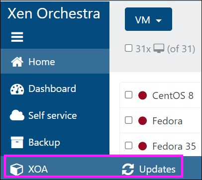
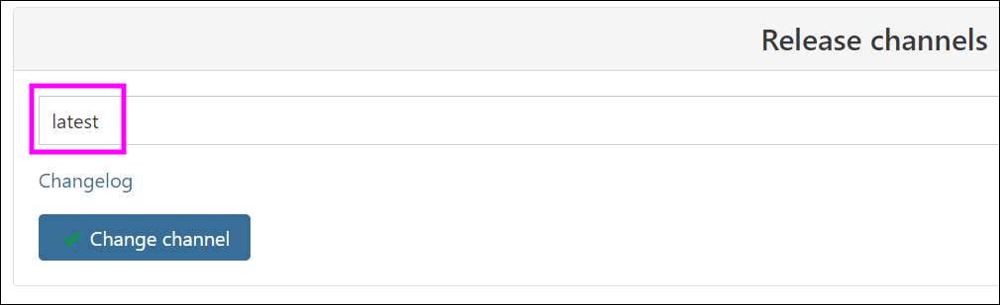

# Migrate to XCP-ng

How to migrate from VMware, KVM, etc. to XCP-ng.

This documentation will help you to make a migration to XCP-ng, from any most common other virtualization platform (VMware, KVM, etc.)

:::note
OVA import method will miss the information if the VM is running BIOS or UEFI mode. Double check your settings on your original system, and then enable (or not) UEFI on XCP-ng side for the destination VM. You can do so in VM advanced tab in Xen Orchestra.
:::

## 🇽 From XenServer

We got a dedicated section on [how to migrate from XenServer to XCP-ng](../../installation/upgrade#-upgrade-from-xenserver).

## 🍋 From Citrix Hypervisor

We got a dedicated section on [how to migrate from Citrix Hypervisor to XCP-ng](../../installation/upgrade#-upgrade-from-xenserver).

## 🐼 From Xen on Linux

If you are running Xen on your usual distro (Debian, Ubuntu…), you are using `xl` to manage your VMs, and also plain text configuration files. You can migrate to an existing XCP-ng host thanks to [the `xen2xcp` script](https://github.com/xcp-ng/xen2xcp).

Check [the README](https://github.com/xcp-ng/xen2xcp/blob/master/README.md) for usage instructions.

## 📦 From Virtualbox

Export your VM in OVA format, and use Xen Orchestra to import it. If you have an issue on VM boot, check the [VMware](#-from-vmware) section.

## 🇻 From VMware

:::warning

**Disk Size Limitations** 

Disks larger than 2TB - 8MB cannot be migrated automatically. You will need to create the VM in Xen Orchestra with multiple disks and use the OS capabilities to build them into a joined disk of the required size. Then, migrate the disk content using your preferred tool (e.g., Clonezilla, Robocopy, Rsync).

**Warm migration prerequisites** 

Warm migration (as explained below in the [XO V2V](#xo-v2v) section) involves migrating all content up to the last snapshot, then stopping the VM and migrating the snapshot content. This method requires that the VM has at least one snapshot and that the account used has permission to stop the VM.

**Migration time**

Migrating from VMware to XCP-ng is not just a technical operation on one VM, it's a process. How long the migration takes depends on various factors, such as:

- **Number of VMs:**  Make sure to know the size of your infrastructure before starting a migration. To migrate hundreds or thousands of VMs, you may want automate the export/import steps with a script.
- **Hardware performance and compatibility:** It's important to take into account the performance of your hardware. SSD or HDD? Network hardware performance? RAM and CPU availability? All these elements will have an impact on your migration.
- **Network:** The network used to write data onto XCP-ng is the "default backup network", if configured.
:::

:::tip
**Before Starting**

Remove the VMware drivers before starting the migration.
:::

### XO V2V

Xen Orchestra introduces "V2V", or "VMware to Vates", a streamlined tool for migrating from VMware to the Vates Stack, which includes XCP-ng and Xen Orchestra (XO). 

This tool is seamlessly integrated into Xen Orchestra and leverages the "warm migration" feature for efficient transitions. The process begins by exporting an initial snapshot of the VMware-based VM. Although this step can be time-consuming, it occurs without disrupting the VM's operation, ensuring transparency.

Once this comprehensive replication is complete, the VM is shut down, and only the newly modified data blocks since the snapshot are exported. The VM is then activated on the XCP-ng platform, significantly minimizing downtime—a crucial benefit for large VMs.  Furthermore, the migration process is largely automated, allowing for hands-off monitoring and execution. This entire procedure is fully automated for user convenience and efficiency.

:::tip
This method doesn't require any direct access to the VMware storage, only an HTTP access to the ESXi API. This is pretty powerful, allowing you to migrate everything remotely from one Xen Orchestra instance.
:::

#### How it works

The initial situation: a running VM on ESXi on the left, your Xen Orchestra in the middle, and your Vates XCP-ng host on the right:


The initial sync: the empty VM is created on XCP-ng, and after a snapshot, the content is transferred from VMware side to the new VM disk on XCP-ng. This takes time, but your original VM is up all along (no service interruption):


After the initial sync, the original VM is shutdown, another snapshot is done and only the diff is sent to the VM on XCP-ng side. Since it's a small amount of data, the downtime will be minimal:


After the transfer, the VM on XCP-ng side is started:


This process is fully automated, without any human intervention after it starts on step 1.

#### Storage types
:::warning

- **Raw disks:** Raw disks are not supported.
- **VSAN:** 
    - When migrating from a VSAN, make sure your remote has enough storage capacity to accommodate the largest VM you plan to import. The VM will be stopped before migration begins, and the process may be slow.
    - In this case, the network path is: VSAN → vSphere → Host running XOA → Remote → Host running XOA → Host with target storage → Target storage
- **VMFS datastores:** 
    - Warm migration is reported to work in most cases with VMFS5. If it doesn't work, try migrating the VM while it is stopped.
    - In this case, the network path is: VMFS storage → ESXi → Host running XOA → Host with target storage → Target storage
- **NFS datastores:** When migrating from NFSdatastores (such as NFSDatastoreEsxi):\
    - Create a corresponding NFS remote in Xen Orchestra named `[VmWare] NFSDatastoreEsxi`. If not, it will fall back to the VMFS process.
    - Warm migration is reported to work in all cases.
    - In this case, the network path is: NFS remote → Host running XOA → Host with target storage → Target storage
:::

#### From the XO UI

In your Xen Orchestra UI, go to the main menu on the left, on **Import** click **From VMware**:


After giving the vCenter credentials, click **Connect** and go to the next step:


On this screen, you will basically select which VM to replicate, and to which pool, storage and network. When it's done, just click on "Import" and there you go!

#### From the CLI

You can also use the command-line interface (CLI) to migrate your VM. 

To do this:

1. Gather all the information needed to contact the VMware side :
    - IP
    - Credentials
    - SSL check or not
    - The ID of the VM and the ID of the VM
2. On the XCP-ng side, provide the following information:
    - SR
    - Network

3. Run this command with `xo-cli`:

`xo-cli vm.importFromEsxi host=<VSPHERE_IP> user=<VSPHERE_USER> password=<VSHPERE_PWD> sslVerify=<true|false> vm=<VSPHERE_VM_ID> sr=<SR_UUID> network=<NETWORK_UUID>`

Now, you can see the transfer progress in the **Task** view of the Xen Orchestra UI. As soon it's done, you can boot the VM directly!

#### Troubleshooting

Here is a comprehensive checklist of steps to take when encountering issues during VMware migration:

##### General Checks

**XOA Version**

1. Make sure you can go to this screen in XOA:



2. Check your version of XOA. You should be usng the `latest` channel:



If you were not using the `latest` channel previously:
    1. Switch to that channel.
    2. Update your VM.

:::tip
- **Backup method:** The migration will use the default backup migration. Check if the XOA VM can access it.
- **Task timeout:** Note that XAPI tasks are limited to 24 hours by default. To increase that limitation, refer to the **24h task timeout** section of [this page](/management/manage-locally/api#24h-task-timeout).
:::

From this point onward, the process varies depending on the type of datastore you're using.

##### VMFS 5 (Mostly up to VMware 6.5)

For VMFS 5, **you can perform a warm migration** (the VM doesn't need to be shut down before migration). 

Here's what you need to check:

1. Uninstall VMware tools before migration.
2. Make sure no ISO files are mounted to the VM.
3. Remove any unnecessary snapshots before migration, as they are take lots of resources to handle.
4. You must have at least one snapshot to perform a warm migration.
    - Take a new snapshot and check the **stop VM** option. This will stop the VM before migrating the last snapshot.
    - If you don't check the toggle **stop the VM** on a running VM, it will only migrate data before the last snapshot.
    - Without any snapshots, nothing will be migrated.

##### VMFS 6 (6.7 and newer)

For VMFS 6, **the VM needs to be shut down**. Follow these steps:

1. Uninstall VMware tools before migration.
2. Remove all snapshots attached to the VM.
3. Ensure no ISO files are mounted to the VM.
4. Shut down the VM.
5. Take a fresh snapshot.
6. Start the migration process.

##### vSAN

For VMs residing on a vSAN:

:::tip

Snapshots are not used, so it doesn't matter if there are any.

:::

1. Uninstall VMware Tools before starting the migration.
2. Make sure that no ISO files are mounted to the VM.
3. The VM **must** be powered off.
4. Connect directly to vSphere via its IP address.
5. If the V2V tool successfully detects that the VM is on a vSAN store, it should prompt you to select an XOA remote (see **Settings → Remotes**) to store a temporary VMDK export.
6. If it does not prompt you to select an XOA remote before import, it has not detected your vSAN properly. 
\
In that case, please open a support ticket with details of the issue.

##### NFS Datastore

For VMs residing on an NFS datastore, **you can perform a warm migration** (the VM doesn't need to be shut down before migration). 

Here's what you need to check:

1. Set up an NFS backup remote in XOA under **Settings → Remotes** that connects to the NFS datastore. Name it `[VMWARE]datastorename`, where `datastorename` is the exact name of the datastore on the VMware side.
2. Uninstall VMware tools before migration.
3. Make sure no ISO files are mounted to the VM.
4. Remove any unnecessary snapshots before migration, as they are take lots of resources to handle.
5. You must have at least one snapshot to perform a warm migration. Take a new snapshot and check the toggle **stop VM** option. This will stop the VM before migrating the last snapshot.
6. If you don't check the **stop the VM** option on a running VM, it will only migrate data up to the point of the last snapshot.\
Nothing will be migrated if there is no snapshot.

### OVA

You can export an OVA from VMware and import an OVA into Xen Orchestra.

An OVA is a large, single file that uses the standard Open Virtualization Format. It contains an XML file describing the metadata (such as VM name and description) and your disks in VMDK format.

:::tip
- Before starting the migration, make sure to stop the VM on the VMware side.
- To skip Windows activation if the system was already activated, gather information about the network cards used in the Windows VM (using `ipconfig /all`) and use the same MAC address(es) when creating interfaces in XCP-ng.

:::

:::warning

- **Downtime**: The OVA can only be exported while the VM is off (except if you export a clone, but all blocks written after the clone won't be on the imported VM. If you can sync after, it's fine!). This can take a while, and your VMs won't be reachable until it's fully exported AND imported on destination.
- **Storage**: You need an intermediary storage where you can export then import the OVA file. If your VMs are small, it's OK.
- **Manual process**: Even if it's simple to do, it can be cumbersome if you have a lot of VMs to migrate.
:::

Importing a VMware Linux VM, you may encounter an error similar to this on boot:

`dracut-initqueue[227]: Warning: /dev/mapper/ol-root does not exist`

The fix for this is installing some xen drivers *before* exporting the VM from VMware:

`dracut --add-drivers "xen-blkfront xen-netfront" --force`

[See here](https://unix.stackexchange.com/questions/278385/boot-problem-in-linux/496037#496037) for more details. Once the imported VM is properly booted, remove any VMware related tooling and be sure to install [Xen guest tools](../../vms).

### VMDK

You can also export Virtual Machine Disks (VMDK). VMDK is a file format that describes containers for virtual hard disk drives to be used in virtual machines like VMware Workstation. 

There are two methods to export VMDKs:

#### Method 1: Export without conversion

1. Stop the VM on the VMware side.
2. Export each disk as a VMDK file.
3. Create a diskless VM in Xen Orchestra.
4. Import the disks using the **Import → Disk** menu in Xen Orchestra.
5. Attach the disks to the VM and start it.

#### Method 2: Export with conversion

:::warning

Snapshot migration is slow due to the huge differences between VMDK and VHD file formats. Limit the number of snapshots to the minimum.

:::

1. Stop the VM on the VMware side.
2. Export each disk as a VMDK file.
3. Convert the VMDK files to the VHD format, using the command: `qemu-img convert -f vmdk -O vpc source.vmdk destination.vhd`.
4. Create a diskless VM in Xen Orchestra.
5. Import the disks using the **Import → Disk** menu in XO.
6. Attach the disk to the VM and start it.

### CloneZilla

An alternative to using OVA. 

1. Insert a CloneZilla live CD in your existing VMware VM, and boot on it. In the meantime, you also have a VM on the destination with the right metadata (same name and disks), which you'll also boot with CloneZilla.

2. From the VM console, you can tell the source VM running CloneZilla to send all the blocks to the destination VM, also running CloneZilla. 

3. As soon it's done, you can safely shut down the original VM and boot the copy on destination!

:::warning
- **Downtime**: Even if the downtime will be reduced compared to using OVA, you still need to run the export/import process while the VM is off.
- **Setup time**: Not complex, but various operations are needed until you can start the replication for one VM. If you have a lot of VMs, this can take some effort.
:::

### Local migration (same host)

:::warning
This method uses the `vmfs6-tools` package, which is provided as-is, is very old and has no upstream support. Please consider other options first.
:::

:::tip
This method is helpful if you just install XCP-ng on an extra/dedicated drive on the same hardware, removing the need for a new server to migrate.
:::

In this case, you'll mount your local VMware storage into XCP-ng and use `qemu-img` to convert the VMDK files to VHDs directly in your own XCP-ng Storage Repository (SR). If you go from local storage to local storage, it's a very fast way to migrate even large disks.

:::warning
This method use external packages to install in XCP-ng directly (the Dom0), and you should remove them just after you did the migration. Those commands must be executed on the Dom0 itself.
:::

#### Install Qemu-img and vmfs tools

```
yum install qemu-img --enablerepo=base,updates
wget https://forensics.cert.org/centos/cert/7/x86_64/vmfs6-tools-0.2.1-1.el7.x86_64.rpm
yum localinstall vmfs6-tools-0.2.1-1.el7.x86_64.rpm
```

#### Mount the VMware storage repository

```
vmfs6-fuse /path/to/vmware/disk /mnt
```

#### Convert a VMDK file to a VHD

For example, on a file-based SR (local ext or NFS):

```
qemu-img convert -f vmdk -O vpc myVMwaredisk.vmdk /run/sr-mount/<SR UUID>/`uuidgen`.vhd
```

#### Rescan the SR

You need to rescan the SR where you new VHD file is, so it can be detected. It will appear in the disk list, without a name or description though. Attach it to any VM you created before (eg without booting it first), and boot.

## 🇭 From Hyper-V

There's two options, both requiring to export your Hyper-V VM disk in VHD format.

### Export the VM disk

**If the server can be taken offline:** Shut down the VM and create a VHD file from the existing VHDX.  
  This process leaves the original disk file unchanged, allowing you to restart the VM in Hyper-V if needed. Ensure sufficient disk space is available for both the original VM and the new VHD file.

**If the server must remain online:** Export the VM and then convert the VHDX to a VHD file.  
  Note that the original VM will continue running and may be updated during the migration process. Ensure enough disk space is available for the original VM, the exported VM, and the new VHD file.

1. Prepare the VHD for export.  
  Before exporting, remove all the Hyper-V tools from the VM to ensure compatibility.

2. (Optional). Shut down the VM in Hyper-V.  
  To shut down the VM, run this command in PowerShell:
  ```powershell
  STOP-VM -Name <VM name>
  ```

3. Identify the VM disk to be exported.  
  To identify the VM disk, run this command:
  ```powershell
  Get-VMHardDiskDrive -VMName <VM name>
  ```

4. Make sure the VM disk has the correct format.   
  - Use a **dynamic disk** format, as the **static format is not compatible with XCP-ng**.
  - If the disk is in the **VHDX** format, convert it to the **VHD** format. 
  To convert the disk from VHDX to VHD, run this command:  

  ```powershell
  Convert-VHD -Path <source path> -DestinationPath <destination path> -VHDType Dynamic
  ```

### Import the VHD in Xen Orchestra

In the left menu, go for "Import" then "Disk". Select the destination SR, and then add your VHD file into it. Depending on the VHD file size, it might take some time. The upload progress can be tracked in another XO tab, in the "Task" menu.

When the disk is imported, you can:

4. Create a VM with the appropriate template, **without any disk in it**
5. Attach the previously imported disk (VM/Disk/Attach an existing disk)
6. Boot the VM
7. Install the tools

### Alternative: direct VHD copy

:::warning
This method is a bit more dangerous: if you don't respect the VHD name format, the SR will be blocked and giving warnings. Naming is crucial to avoid problems.
:::

It's possible to directly send the VHDs to an existing XCP-ng SR. However, you MUST respect some pre-requisites:
* to use a dynamic disk VHD format
* the VHD **MUST be named correctly** (see below)

#### VHD naming

The **ONLY** working format is `<UUID>.vhd`, eg `e4e573d8-6272-43ae-b969-255717e518aa.vhd`. You can generate a UUID by simply using the command `uuidgen`.

#### Steps

1. Rename the dynamic VHD disk to the format `<UUID>.vhd`
2. Copy it to the destination SR (any file type is supported: local, NFS…)
3. Scan the SR

:::note
As soon you did scan the SR, the new disk is visible in the SR/disk view. Don't forget to add a name and a description to be able to identify it in the future. Indeed, any disk imported this way won't have any metadata, so it's up to you to fill it.
:::

4. Create a VM with the appropriate template, **without any disk in it**
5. Attach the previously imported disk (VM/Disk/Attach an existing disk)
6. Boot the VM
7. Install the tools

:::note
If you lost ability to extend migrated volume (opening journal failed: -2) You need to move disk to another storage, VM should be ON during moving process. This issue can occur when vhd files was directly copied to storage folder.
:::

## 🇰 From KVM (Libvirt)

Related forum thread: [https://xcp-ng.org/forum/topic/1465/migrating-from-kvm-to-xcp-ng](https://xcp-ng.org/forum/topic/1465/migrating-from-kvm-to-xcp-ng)

_Due the fact I have only server here, I have setup a "buffer" machine on my desktop to backup and convert the VM image file._

* Install the dracut packages : yum install dracut-config-generic dracut-network

  `dracut --add-drivers xen-blkfront -f /boot/initramfs-$(uname -r).img $(uname -r)`

  If your VMs are in BIOS mode :

  `dracut --regenerate-all -f && grub2-mkconfig -o /boot/grub2/grub.cfg`

  If your VMs are in UEFI mode (OVMF Tianocore) :

  `dracut --regenerate-all -f && grub2-mkconfig -o /boot/efi/EFI/<your distribution>/grub.cfg`

* Shutdown the VM

* Use rsync to copy VM files to the "buffer" machine using `--sparse` flag.

* Convert the QCOW2 to VHD using QEMU-IMG :

  `qemu-img convert -O vpc myvm.qcow2 myvm.vhd`

* Use rsync to copy the converted files (VHD) to your XCP-ng host.

* After the rsync operation, the VHD are not valid for the XAPI, so repair them :

   `vhd-util repair -n myvm.vhd`

    `vhd-util check -n myvm.vhd` should return `myvm.vhd is valid`

* For each VM, create a VDI on Xen Orchestra with the virtual size of your VHD + 1GB (i.e the virtual size of myvm is 21GB, so I create a VDI with a size of 22GB).

* Get the UUID of the VDI (on Xen Orchestra or CLI) and use the CLI on the XCP-ng host to import the VHD content into the VDI :

  `xe vdi-import filename=myvm.vhd format=vhd --progress uuid=<VDI UUID>`

* Once the import is done, create a virtual machine using XO or XCP-ng Center, delete the VM disk that has been created and attach your newly created VDI to the VM. Don't forget to set the VM boot mode to UEFI if your VMs was in UEFI mode.

* Boot the VM and find a way to enter in the virtual UEFI of the VM. Here, I type the Escape and F9,F10,F11,F12 keys like crazy. Select Boot Manager, you should see this window :


* Select `UEFI QEMU HARDDISK`, the screen should be black for seconds and you should see the GRUB. Let the machine worked for minutes and you should see the prompt finally 👍

* Install Guest Tools and reboot. The reboot shouldn't take long, you don't have to redo step 13, the OS seems to have repair the boot sequence by itself.

Done !
