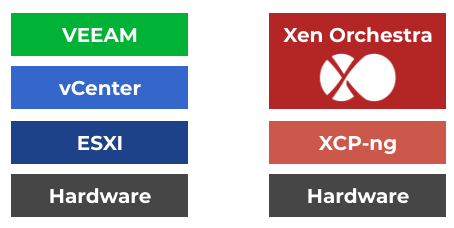

# XCP-ng documentation

XCP-ng is a high performance enterprise level virtualization platform with a rich ecosystem, that can be integrated in an entire stack to do management and backup for it (see [Xen Orchestra](management/#xen-orchestra) section for that).

Originally based on [XenServer](https://xenserver.org/), it's the result of massive cooperation between individuals and companies, to deliver a product without limits. No restrictions on features and every bit available on GitHub!

Visit the main website to learn more: [https://xcp-ng.org](https://xcp-ng.org)

## Overview

The main goal of XCP-ng is to be a fully integrated and dedicated virtualization platform, without requiring any deep Linux or system knowledge. It's meant to be managed in a centralized manner via [Xen Orchestra](management/#xen-orchestra), regardless the fact you have only one host or thousand of them.

## Concepts

There's few concepts to grasp in order to get a clear picture about what is XCP-ng.

### Turnkey appliance

XCP-ng is distrubuted as an ISO file you can [download here](installation#download-and-create-media) and [install](installation) on the hardware of your choice (see our [hardware support](installation/hardware) section for more details). It's meant to be an appliance, already pre-configured to run any kind of virtual machine you need without any preparation.

### General design

Xen Hypervisor is the core engine of XCP-ng, and the overall design is like this:

### Compared to VMware

In terms of general architecture, XCP-ng and Xen Orchestra are relatively close. See for yourself:

## Introducing XCP-ng in video

:::tip
Those videos are made independently by *Lawrence Systems / PC Pickup*, thanks for bringing quality content like this!
[YouTube channel](https://www.youtube.com/channel/UCHkYOD-3fZbuGhwsADBd9ZQ)
:::

Here is some content explaining XCP-ng in detail:

<iframe width="560" height="315" src="https://www.youtube.com/embed/hh1QADop_IY" frameborder="0" allow="accelerometer; autoplay; encrypted-media; gyroscope; picture-in-picture" allowfullscreen></iframe>

About the project itself, please see the [project page](Project).

### More video comparing XCP-ng to other products

#### vs VMware

<iframe width="560" height="315" src="https://www.youtube.com/embed/wrLue-ENMJc" frameborder="0" allow="accelerometer; autoplay; encrypted-media; gyroscope; picture-in-picture" allowfullscreen></iframe>

#### vs Proxmox

<iframe width="560" height="315" src="https://www.youtube.com/embed/5IinFgGAsRs" frameborder="0" allow="accelerometer; autoplay; encrypted-media; gyroscope; picture-in-picture" allowfullscreen></iframe>

#### vs Xen vs XenServer vs KVM vs Proxmox

<iframe width="560" height="315" src="https://www.youtube.com/embed/yulfCYmliX8" frameborder="0" allow="accelerometer; autoplay; encrypted-media; gyroscope; picture-in-picture" allowfullscreen></iframe>

:::tip
No flamewar! There are no miracle solutions, but only solutions adapted to your usage. We truly respect all other virtualization platforms!
:::
