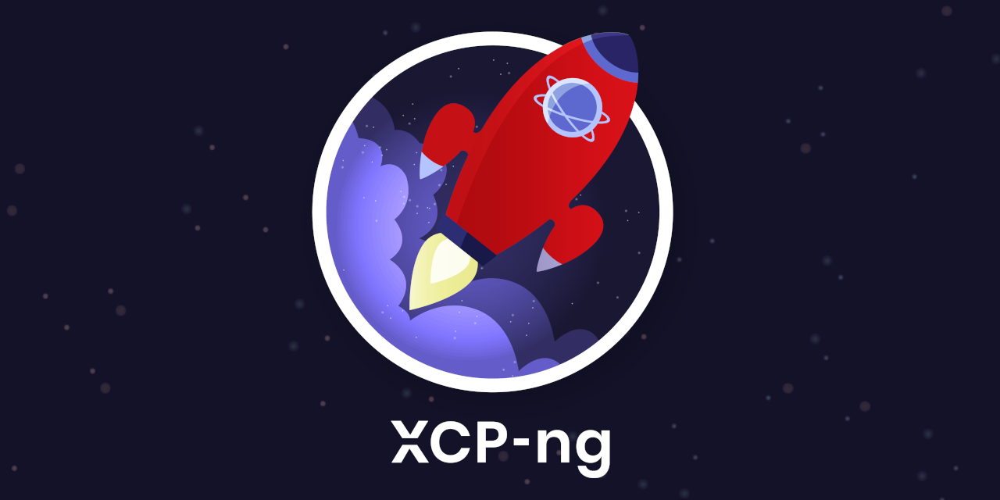
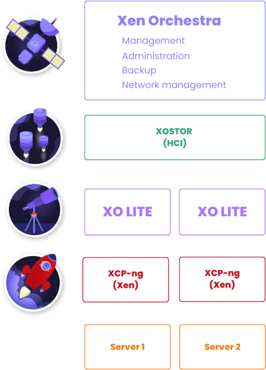
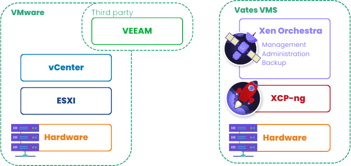

# Introduction

XCP-ng is a high performance enterprise level virtualization platform with a rich ecosystem, that can be integrated in an entire stack to do management and backup for it (see [Xen Orchestra](management/manage-at-scale/xo-web-ui) section for that). XCP-ng stands for *Xen Cloud Platform - next generation*: it is the modern successor to XCP, initially created as an Open Source version of Citrix XenServer back in 2010.

XCP-ng is, by default, a [secure platform](project/security) to run any kind of virtualization workload, while being managed by a [central administration console](management/manage-at-scale/xo-web-ui), integrated with an API and CLI but also compatible with Packer, Terraform and Ansible.

Visit the [main website](https://xcp-ng.org) to learn more. Latest updates are published on [our blog](https://xcp-ng.org/blog), don't miss any announcement there!

:::tip
Discover the growing network around XCP-ng and Xen Orchestra, collectively known as the [Vates Stack](https://vates.tech). Visit the [ecosystem page](https://docs.vates.tech/compatible-solutions/xcp-ng-ecosystem) at the Vates VMS documentation to explore our current partnerships and certification opportunities. Interested in joining? We’d love to [hear from you](https://vates.tech/contact)!
:::

## Where to start {#where-to-start}

<CardGrid>
<LinkCard title="Install XCP-ng" href="/installation/install-xcp-ng/">Download the ISO and install your first host.</LinkCard>
<LinkCard title="Getting started journey" href="https://docs.vates.tech/getting-started/dl-install-xcpng">The guided path on the Vates docs: install, deploy Xen Orchestra, first VMs.</LinkCard>
<LinkCard title="Migrate from VMware" href="/installation/migrate-to-xcp-ng/">V2V from VMware, and imports from Hyper-V, KVM, VirtualBox...</LinkCard>
<LinkCard title="Create and manage VMs" href="/vms/vm-lifecycle/">Templates, clones, snapshots, migration, import/export.</LinkCard>
<LinkCard title="Hosts and pools operations" href="/management/hosts-pools/">Pools, maintenance mode, passwords, NTP, pool-wide settings.</LinkCard>
<LinkCard title="Updates" href="/management/updates/">Keep your hosts patched, with Rolling Pool Updates at scale.</LinkCard>
<LinkCard title="Backup" href="/management/backup/">VM backup with Xen Orchestra, DR, pool metadata.</LinkCard>
<LinkCard title="Troubleshooting" href="/troubleshooting/">The 3-step guide, common problems, log files.</LinkCard>
</CardGrid>

## Which documentation for what? {#which-documentation}

Three documentation sets work together. Knowing which one to open saves time:

<CardGrid>
<LinkCard title="XCP-ng documentation (you are here)" href="/">The platform itself: installation, hosts and pools, storage, networking, VMs, troubleshooting, and the project internals.</LinkCard>
<LinkCard title="Xen Orchestra documentation" href="https://docs.xen-orchestra.com/">The management plane: XO installation, backup jobs, users and ACLs, load balancing, REST API.</LinkCard>
<LinkCard title="Vates VMS documentation" href="https://docs.vates.tech/">The product level: getting started journeys, editions and pricing, hardware compatibility list, support, security advisories.</LinkCard>
</CardGrid>

As a rule of thumb: if it happens **on a host or pool**, it's documented here; if you do it **from Xen Orchestra**, it's in the XO docs; if it's about **the offer around the software** (trial, licenses, support, certified hardware), it's on the Vates docs.

## General design {#general-design}

XCP-ng contains multiple components, built around the Xen Hypervisor. It's meant to run on top of bare-metal machines.

<Schema label="XCP-ng · what runs where" legend={[["#8e83fe", "XCP-ng / Xen"], ["#56c288", "your workloads"]]} maxWidth="840px">
<svg viewBox="0 0 640 330" role="img" aria-label="XCP-ng layers: hardware at the bottom, the Xen hypervisor above it, and on top the dom0 control domain running the XAPI toolstack next to the guest VMs, which run your apps on their own OS with the XCP-ng VM tools">
  <g fill="rgba(255,255,255,0.04)" stroke="rgba(255,255,255,0.28)">
    <rect x="20" y="20" width="280" height="170" rx="8"/>
    <rect x="330" y="20" width="140" height="170" rx="8"/>
    <rect x="480" y="20" width="140" height="170" rx="8"/>
    <rect x="20" y="274" width="600" height="44" rx="8"/>
  </g>
  <rect x="20" y="216" width="600" height="44" rx="8" fill="rgba(142,131,254,0.14)" stroke="#8e83fe" strokeOpacity="0.85"/>
  <text x="36" y="46" fontSize="14.5" fill="#c6d2e1">dom0 <tspan fontSize="11" fill="#7a8699">· control domain</tspan></text>
  <rect x="36" y="60" width="248" height="34" rx="5" fill="rgba(142,131,254,0.14)" stroke="#8e83fe" strokeOpacity="0.85"/>
  <text x="160" y="82" fontSize="13" fill="#8e83fe" textAnchor="middle">XAPI toolstack</text>
  <g fill="rgba(255,255,255,0.06)" stroke="rgba(255,255,255,0.28)">
    <rect x="36" y="106" width="118" height="34" rx="5"/>
    <rect x="166" y="106" width="118" height="34" rx="5"/>
    <rect x="36" y="150" width="248" height="28" rx="5"/>
  </g>
  <text x="95" y="127" fontSize="11.5" fill="#7a8699" textAnchor="middle">device drivers</text>
  <text x="225" y="127" fontSize="11.5" fill="#7a8699" textAnchor="middle">QEMU</text>
  <text x="160" y="168" fontSize="11" fill="#7a8699" textAnchor="middle">I/O backends for the guests</text>
  <text x="400" y="46" fontSize="14.5" fill="#c6d2e1" textAnchor="middle">guest VM</text>
  <text x="550" y="46" fontSize="14.5" fill="#c6d2e1" textAnchor="middle">guest VM</text>
  <g fill="rgba(86,194,136,0.14)" stroke="#56c288" strokeOpacity="0.8">
    <rect x="346" y="60" width="108" height="50" rx="5"/>
    <rect x="496" y="60" width="108" height="50" rx="5"/>
  </g>
  <g fill="rgba(255,255,255,0.06)" stroke="rgba(255,255,255,0.28)">
    <rect x="346" y="122" width="108" height="56" rx="5"/>
    <rect x="496" y="122" width="108" height="56" rx="5"/>
  </g>
  <g fontSize="12" fill="#56c288" textAnchor="middle">
    <text x="400" y="90">your apps</text>
    <text x="550" y="90">your apps</text>
  </g>
  <g fontSize="12" fill="#7a8699" textAnchor="middle">
    <text x="400" y="146">guest OS</text>
    <text x="550" y="146">guest OS</text>
    <text x="400" y="164" fontSize="10">+ XCP-ng VM tools</text>
    <text x="550" y="164" fontSize="10">+ XCP-ng VM tools</text>
  </g>
  <g stroke="#7a8699" strokeWidth="1.5">
    <line x1="160" y1="190" x2="160" y2="216"/>
    <line x1="400" y1="190" x2="400" y2="216"/>
    <line x1="550" y1="190" x2="550" y2="216"/>
    <line x1="320" y1="260" x2="320" y2="274"/>
  </g>
  <text x="36" y="243" fontSize="15" fill="#8e83fe">Xen hypervisor</text>
  <text x="604" y="243" fontSize="11" fill="#7a8699" textAnchor="end">type-1 · boots directly on the metal</text>
  <text x="36" y="301" fontSize="15" fill="#c6d2e1">Hardware</text>
  <g fill="rgba(255,255,255,0.06)" stroke="rgba(255,255,255,0.28)">
    <rect x="360" y="285" width="44" height="22" rx="4"/>
    <rect x="412" y="285" width="44" height="22" rx="4"/>
    <rect x="464" y="285" width="44" height="22" rx="4"/>
    <rect x="516" y="285" width="44" height="22" rx="4"/>
    <rect x="568" y="285" width="44" height="22" rx="4"/>
  </g>
  <g fontSize="11" fill="#7a8699" textAnchor="middle">
    <text x="382" y="299">CPU</text>
    <text x="434" y="299">RAM</text>
    <text x="486" y="299">disks</text>
    <text x="538" y="299">NICs</text>
    <text x="590" y="299">GPU</text>
  </g>
</svg>
</Schema>

## Stack overview {#stack-overview}

The main goal of XCP-ng is to be a fully integrated and dedicated virtualization platform, without requiring any deep Linux or system knowledge. It's meant to be managed in a centralized manner via [Xen Orchestra](management/#manage-at-scale), whether you have only one host or thousands of them. Backup is also included inside Xen Orchestra.

## Concepts {#concepts}

There are a few concepts to grasp in order to get a clear picture about what XCP-ng is.

### Turnkey appliance

XCP-ng is distributed as an ISO file you can [download here](installation/install-xcp-ng#download-and-create-media) and [install](installation/install-xcp-ng) on the hardware of your choice (see our [hardware support](installation/hardware) section for more details). It's meant to be an appliance, already pre-configured to run any kind of virtual machine you need without any preparation.

### Compared to VMware

In terms of general architecture, XCP-ng and Xen Orchestra are relatively close. See for yourself:

### Managing XCP-ng

Now you have your hosts running, the next step is to manage them. You have various options to do so, choose the one that fits best! See the dedicated [management section](management).

#### Host API architecture

All XCP-ng clients are communicating with the pool master, through the Xen API ([XAPI](management/manage-locally/api.md)). You only need to open a connection to the master, even if there are multiple hosts.

Some clients are stateless (only running when you open or use them) and others are stateful (running in a daemon, often in a dedicated VM). For very basic management tasks, stateless clients are fine. However, for more advanced features, you need stateful clients. The default choice is to use Xen Orchestra, but a list of solutions is available in our [management section](management).

### Backup

Xen Orchestra is a complete and agentless backup solution for your VMs running on XCP-ng. Please read the dedicated [backup section](management/backup) to get more details.

## Community videos on XCP-ng {#community-videos-on-xcp-ng}

:::note
Those videos are made by 3rd parties. However, for example, Tom from Lawrence Systems is providing a lot of content on XCP-ng and Xen Orchestra. Check his [YouTube channel](https://www.youtube.com/channel/UCHkYOD-3fZbuGhwsADBd9ZQ).
:::

Tom's video explaining what is XCP-ng:

<iframe width="560" height="315" src="https://www.youtube.com/embed/CEUFHudLO1g?si=EEM0Xi3inNpsYDeK" title="YouTube video player" frameborder="0" allow="accelerometer; autoplay; clipboard-write; encrypted-media; gyroscope; picture-in-picture; web-share" allowfullscreen></iframe>

A quick intro by Raid Owl:

<iframe width="560" height="315" src="https://www.youtube.com/embed/kguTbVBqmuw?si=bWze86s07ZDkLzlU" title="YouTube video player" frameborder="0" allow="accelerometer; autoplay; clipboard-write; encrypted-media; gyroscope; picture-in-picture; web-share" allowfullscreen></iframe>

## Project and community {#project-and-community}

XCP-ng is a community-driven Open Source project, backed by [Vates](https://vates.tech). Everything about the project itself (roadmap, contributing, development process, security handling) lives in the [project pages](/category/project).

* Latest news: [xcp-ng.org/blog](https://xcp-ng.org/blog)
* Community forum: [xcp-ng.org/forum](https://xcp-ng.org/forum)
* YouTube channel: [@Vates_tech](https://www.youtube.com/@Vates_tech)
