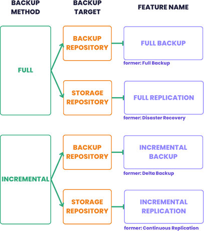

# Backup

It's really important to backup your VMs. You have multiple options, but only Xen Orchestra is both **advanced, agentless, fully Open Source and officially supported** (tested for all XCP-ng releases).

## 🛰️ Xen Orchestra

Xen Orchestra is the most advanced backup solution and 100% integrated with XCP-ng. There is many different backup options:

* Automated rolling snapshots
* Full Backup
* Full Replication
* Incremental Backup
* Incremental Replication
* Mirror backup
* XO Metadata backup
* XCP-ng Metadata backup
* Cloud enabled XO Metadata backup

And they come with different features:
* NFS, SMB, S3 compatible backup repositories
* Encryption
* Compression
* File level restore
* NBD-enabled for extra backup speed
* Rate limiting
* XO Proxy (backup remote sites without any VPN requirement)

All options are explained in the [official documentation](https://xen-orchestra.com/docs/). Xen Orchestra is [available as a turnkey virtual appliance](https://xen-orchestra.com), called XOA which [you can deploy in a minute](https://vates.tech/deploy).

Alternatively, you can install and build it yourself [from the GitHub repository](https://github.com/vatesfr/xen-orchestra/).

## 🛣️ 3rd party solutions

There's 3rd party solutions officially compatible with XCP-ng to make VM backups. Please check our [ecosystem](https://docs.vates.tech/ecosystems/xcp-ng-ecosystem#-vm-backup) page on the backup section.

:::tip
Some popular backup solutions (like [VEEAM](https://www.veeam.com/)) can be used with agents inside your VMs, while Xen Orchestra deals with VM backup.
:::

However, you'll lose the tight integration you have between XCP-ng and Xen Orchestra, both bundled of the [Vates Stack](https://vates.tech).