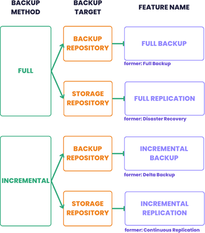

# Backup

It's really important to backup your VMs. You have multiple options, but only Xen Orchestra is both **advanced, agentless, fully Open Source and officially supported** (tested for all XCP-ng releases).

## :artificial_satellite: Xen Orchestra {#xen-orchestra}

Xen Orchestra is the most advanced backup solution and 100% integrated with XCP-ng. There is many different backup options:

* Automated rolling snapshots
* Full Backup
* Full Replication
* Incremental Backup
* Incremental Replication
* Mirror backup
* XO Metadata backup
* XCP-ng Metadata backup
* Cloud enabled XO Metadata backup

And they come with different features:
* NFS, SMB, S3 compatible backup repositories
* Encryption
* Compression
* File level restore
* NBD-enabled for extra backup speed (requires [an NBD-enabled network](../networking/networking.md#nbd-backup-network))
* Rate limiting
* XO Proxy (backup remote sites without any VPN requirement)

All options are explained in the [official documentation](https://xen-orchestra.com/docs/). Xen Orchestra is [available as a turnkey virtual appliance](https://xen-orchestra.com), called XOA which [you can deploy in a minute](https://vates.tech/deploy).

Alternatively, you can install and build it yourself [from the GitHub repository](https://github.com/vatesfr/xen-orchestra/).

## :motorway: 3rd party solutions {#3rd-party-solutions}

There's 3rd party solutions officially compatible with XCP-ng to make VM backups. Please check our [ecosystem](https://docs.vates.tech/compatible-solutions/xcp-ng-ecosystem#vm-backup) page on the backup section.

:::tip
Some popular backup solutions (like [VEEAM](https://www.veeam.com/)) can be used with agents inside your VMs, while Xen Orchestra deals with VM backup.
:::

However, you'll lose the tight integration you have between XCP-ng and Xen Orchestra, both bundled of the [Vates Stack](https://vates.tech).

## :ambulance: Disaster recovery {#disaster-recovery}

Disaster recovery (replicating VMs to a secondary site/pool and restarting them there when the primary is lost) is handled by Xen Orchestra: **Continuous Replication** keeps standby copies of your VMs on another pool's storage, ready to start; **Disaster Recovery** backup jobs do the same from backup files. See the [XO backup documentation](https://docs.xen-orchestra.com/xo5/backups) for the full picture (RPO, failover, failback).

What a DR plan needs on the XCP-ng side, whatever the tooling:

* **Replicated VMs**: continuous replication of the critical VMs to a pool that doesn't share the primary's failure domain (site, storage, power).
* **Replicated configuration**: pool metadata backup (below) and the XO config backup, restorable at the secondary site.
* **Network mapping**: know in advance which networks/VLANs the recovered VMs plug into at the secondary site.
* **A management plane that survives**: run Xen Orchestra (or be able to redeploy it from its config backup) outside the primary failure domain.
* **Tests**: a failover you never exercised is a hypothesis, not a plan. XO can start replicated VMs on an isolated network for testing.

## :toolbox: Host and pool configuration backup {#host-and-pool-configuration-backup}

Besides VM data, the platform itself has state worth saving: the pool metadata (all your XAPI objects: VM configurations, SRs, networks...).

### With Xen Orchestra (recommended)

Use an **XCP-ng Metadata backup** job in Xen Orchestra: it saves the pool metadata of the pools you select, on a schedule, to your backup repositories, with retention. Restoring it brings a reinstalled pool coordinator back to its full configuration. Details in the [XO metadata backup documentation](https://docs.xen-orchestra.com/xo5/metadata_backup). While you're there, also enable the **XO config backup** so your Xen Orchestra setup itself (users, jobs, settings) is covered.

### Manually

Under the hood this is the pool database, replicated on every pool member. You can dump and restore it yourself, for example before a risky manual operation:

<Terminal shell title="root@xcp-ng-host — Manually">{`
xe pool-dump-database file-name=pool-backup.db
`}</Terminal>

To restore it on a freshly reinstalled pool coordinator:

<Terminal shell title="root@xcp-ng-host — Manually">{`
xe pool-restore-database file-name=pool-backup.db dry-run=true   # check first
xe pool-restore-database file-name=pool-backup.db                # the coordinator restarts
`}</Terminal>

Dump it before risky operations (upgrades already do it for you), and keep a copy off the pool.

### Host configuration

`xsconsole` (menu **Backup, Restore and Update**) and the CLI can save a host's dom0 state:

<Terminal shell title="root@xcp-ng-host — Host configuration">{`
xe host-backup host=<host> file-name=host-backup.xbk
`}</Terminal>

The result is big (it's a copy of the control domain's filesystem) and mostly useful right before hardware maintenance on the boot disk. In practice, a clean reinstall plus a pool metadata restore is often simpler and safer than a host restore; keep `host-backup` for specific cases.

:::tip
What actually deserves a scheduled backup: your VMs (XO backup jobs), the pool metadata (XO's XCP-ng metadata backup), and your XO configuration itself (XO config backup). With those three, any host can be reinstalled from the ISO and everything else restored on top.
:::
