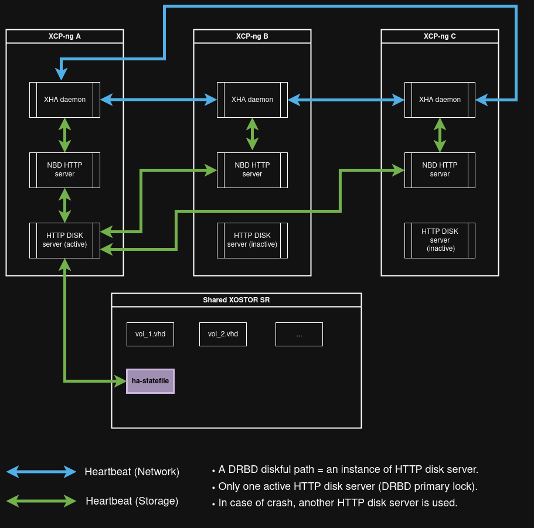

# High availability

In XCP-ng, high availability (or HA) is the ability to detect a failed host and automatically boot all the VMs that were running on this host to the other alive machines.

## 📋 Introduction

Implementing VM High availability (HA) is a real challenge.

First, because you need to reliably detect when a server has really failed to avoid unpredictable behavior. 

But that's not the only one. If you lose the network link but not the shared storage, how to ensure you will not write simultaneously on the storage and corrupt all your data as a result?

We'll see how to protect your precious VM in multiple cases, and we'll illustrate that with real examples.

:::info
You can have high availability with as few as 2 hosts, but we strongly recommended to do it with 3 at the minimum, for obvious split-brain issues you might encounter.
:::

:::warning
High availability requires **far more maintenance** and will create some traps if you are not aware. In short, it comes at a cost. 

Before using it, **please think about it carefully**: do you **REALLY** need it? We've seen people having less uptime using HA than when not using it, because you **must understand** what you are doing every time you reboot or update a host.
:::

## 🎓 Concepts

The pool concept allows hosts to exchange their data and status:

* If you lose a host, that will be detected by the pool master.
* If you lose the master, another host will take over the master role automatically.

To be sure a host is really unreachable, HA in XCP-ng uses multiple heartbeat mechanisms. As you saw in the introduction, it's not enough to check the network: what about storage? That's why there is also a specific heartbeat for shared storage between hosts in a pool. In fact, each host regularly writes some blocks in a dedicated VDI. That's the principle of the [Dead man's switch](http://en.wikipedia.org/wiki/Dead_man%27s_switch). 

This concept is important, and it explains why you need to **configure high availability with a shared storage** (iSCSI, Fiber Channel or NFS) to avoid simultaneous writing in a VM disk.

Here are the possible cases and how they are dealt with:

* **Lost both network and storage heartbeat**: the host is considered unreachable and the HA plan is started
* **Lost storage but not network**: if the host can contact a majority of pool members, it can stay alive. Indeed, in this scenario, there is no harm for the data (can't write to the VM disks). If the host is alone (i.e can't contact any other host or less than the majority), it goes for a reboot procedure.
* **Lost network but not storage (worst case!)**: the host considers itself as problematic and starts a reboot procedure (hard power off and restart). This fencing procedure guarantees the sanity of your data.

## Requirements

Enabling HA in XCP-ng requires thorough planning and validation of several prerequisites:

- **Pool-Level HA only**: HA can only be configured at the pool level, not across different pools.
- **Minimum of 3 hosts recommended**: While HA can function with just 2 XCP-ng servers in a pool, we recommend using **at least 3** to prevent issues such as a split-brain scenario. With only 2 hosts, they risk getting fenced if the connection between them is lost.
- **Shared storage requirements**: You must have shared storage available, including at least one iSCSI, NFS, XOSTOR or Fiber Channel LUN with a minimum size of **356 MB for the heartbeat Storage Repository (SR)**. The HA mechanism creates two volumes on this SR:
    - A **4 MB heartbeat volume** for monitoring host status.
    - A **256 MB metadata volume** to store pool master information for master failover situations.
- **Dedicated heartbeat SR optional**: While it's not necessary to dedicate a separate SR for the heartbeat, you can choose to do so. Alternatively, you can use the same SR that hosts your VMs.
- **Unsupported storage for heartbeat**: Storage using SMB or iSCSI authenticated via CHAP **cannot be used as the heartbeat SR**.
- **Static IP addresses**: Make sure that all hosts have static IP addresses to avoid disruptions from DHCP servers potentially reassigning IPs.
- **Dedicated bonded interface recommended**: For optimal reliability, we recommend using a dedicated bonded interface for the HA management network.
- **VM agility for HA protection**: For a VM to be protected by HA, it must meet certain agility requirements:
    - The VM’s virtual disks must **reside on shared storage**, such as iSCSI, NFS, or Fibre Channel LUN, which is also necessary for the storage heartbeat.
    - The VM must **support live migration**.
    - The VM should **not have a local DVD drive connection configured**.
    - The VM’s network interfaces should be on **pool-wide networks**.

:::tip
For enabling HA, we **strongly recommend** to use a bonded management interface for servers in the pool, and to configure multipathed storage for the heartbeat SR.
:::


If you create VLANs and bonded interfaces via the CLI, they might not be active or properly connected, causing a VM to appear non-agile and, therefore, unprotected by HA. 

Use the `pif-plug` command in the CLI to activate VLAN and bond PIFs, ensuring the VM becomes agile. 

Additionally, the `xe diagnostic-vm-status` CLI command can help identify why a VM isn’t agile, allowing you to take corrective action as needed.


## ⚙️ Configuration

### Prepare the pool

You can check if your pool has HA enabled or not. 

* In Xen Orchestra, for each pool where HA has been enabled, go to the **Home → Pool** view and you'll see a small "cloud" icon with a green check.
* In the **Pool → Advanced** tab, you'll see a **High Availability** switch that shows if HA is enabled or not:


To enable HA, just toggle it on, which gives you a SR selector as Heartbeat SR. 

You can also enable it with this xe CLI command:

```
xe pool-ha-enable heartbeat-sr-uuids=<SR_UUID>
```

:::tip
Remember that you need to use a shared storage repository to enable high availability.
:::

Once enabled, HA status will be displayed with the green toggle.

### Maximum host failure number

How many host failures you can tolerate before running out of options? For 2 hosts in a Pool, the answer is pretty simple: **1** is the maximum number: after losing one host, it will be impossible to ensure a HA policy if the last one also fails.

XCP-ng can calculate this value for you. In our sample case, it looks like this:

```
xe pool-ha-compute-max-host-failures-to-tolerate
1
```

But it could be also **0**. Because, even if you lose 1 host, is there not enough RAM to boot the HA VM on the last one? If not, you can't ensure their survival. 

If you want to set the number yourself, you can do it with this command:

```
xe pool-param-set ha-host-failures-to-tolerate=1 uuid=<Pool_UUID>
```

If more hosts fail than this number, the system will raise an **over-commitment** alert.

### Configure a VM for HA

#### VM High availability modes

In XCP-ng, you can choose between 3 high availability modes: restart, best-effort, and disabled:

- **Restart**: if a protected VM cannot be immediately restarted after a server failure, HA will attempt to restart the VM when additional capacity becomes available in the pool. However, there is no guarantee that this attempt will be successful.
- **Best-Effort**: for VMs configured with best-effort, HA will try to restart them on another host if their original host goes offline.\
This attempt will only occur after all VMs set to the "restart" mode have been successfully restarted. HA will make only one attempt to restart a best-effort VM. If it fails, no further attempts will be made.
- **Disabled**: if an unprotected VM or its host is stopped, HA will not attempt to restart the VM.

#### Choosing a high availability mode

This is pretty straightforward with Xen Orchestra. Go to the **Advanced** panel of your VM page and use the **HA** dropdown menu:


You can also do that configuration with *xe CLI*:

```
xe vm-param-set uuid=<VM_UUID> ha-restart-priority=restart
```

#### Start order

##### What's the start order?

The start order defines the sequence in which XCP-ng HA attempts to restart protected VMs following a failure. The order property of each protected VM determines this sequence.

##### How and when does it apply?

While the order property can be set for any VM, HA only uses it for VMs marked as **protected**. 

The order value is an integer, with the default set to **0**, indicating the **highest priority**. VMs with an order value of 0 are restarted first, and those with higher values are restarted later in the sequence.

##### How do I set the start order?

You can set the order property value of a VM via the command-line interface:

```
xe vm-param-set uuid=<VM UUID> order=<number>
```

#### Configure HA timeout

##### What's the HA timeout?

The HA timeout represents the duration during which networking or storage might be inaccessible to the hosts in your pool. 

If any XCP-ng server cannot regain access to networking or storage within the specified timeout period, it may self-fence and restart. 

##### How do I configure it?

The **default timeout is 60 seconds**, but you can adjust this value using the following command to suit your needs:

```
xe pool-param-set uuid=<pool UUID> other-config:default_ha_timeout=<timeout in seconds>
```

## 🔧 Updates/maintenance

Before any update or host maintenance, planned reboot and so on, **ALWAYS** put your host in maintenance mode. If you don't do that, XAPI will think it's an unplanned failure, and will act accordingly.

If you have enough memory to put one host in maintenance (migrating all its VMs to another member of the pool), that will be alright. If you don't, you'll need to shut VMs down manually **from a XAPI client** (Xen Orchestra or `xe`), and **NOT from inside the operating system**.

:::warning
**Be very careful before doing ANY maintenance task**, otherwise HA will kick in and provide unpleasant surprises. You have been warned.
:::

## ↔️ Behavior

### Halting the VM

If you shut the VM down with `Xen Orchestra` or `xe`, the VM will be stopped normally, because XCP-ng knows that's what you want.

However, if you halt the VM directly in the guest OS (via the console or in SSH), XCP-ng is NOT aware of what's going on. The system will think the VM is down and will consider that an anomaly. As a result, the VM will be **started automatically!**. This behavior prevents an operator from shutting down the system and leaving the VM unavailable for a long time.

:::tip

Starting with XAPI 25.16.0, VM restart behavior can be changed. To do this, run this command:

```
xe pool-param-set uuid=... ha-reboot-vm-on-internal-shutdown=false
```
As a result, VMs that are shut down internally or through the API will restart the exact same way.

:::

### Host failure

We'll see 3 different scenarios for the host, with an example on 2 hosts, **lab1** and **lab2**:

* Physically power off the server.
* Physically remove the **storage** connection.
* Physically remove the **network** connection.

**lab1** is not the *Pool Master*, but the results would be the same (just longer to test because of time to the other host becoming the master itself).

Let's stay in our example of 2 hosts in a single pool. We configured the VM **Minion 1** for HA, and this VM is running on the host **lab1**.

After each test, **Minion 1** go back to **lab1** to start in the exact same conditions.

#### Pull the power plug

Now, we will decide to pull the plug for my host **lab1**: this is exactly where my VM currently runs. After some time (when XAPI detects and reports that the host is lost, which usually takes 2 minutes), we can see that **lab1** is reported as **Halted**. In the same time, the VM **Minion 1** is booted on the other running host - **lab 2**:

If you decide to re-plug the **lab1** host, it will be back online, without any VM on it, which is normal.

#### Pull the storage cable

Another scenario: this time, we will unplug the iSCSI/NFS link on **lab1**, even though **Minion 1** is running on it.

So? **Minion 1** lost access to its disks and after some time, **lab1** saw it can't access the heartbeat disk. Fencing protection is activated! The machine is rebooted, and after that, any `xe CLI` command on this host will give you that message:

```
The host could not join the liveset because the HA daemon could not access the heartbeat disk.
```

Immediatly after fencing, **Minion 1** will be booted on the other host.

:::info
**lab1** is not physically halted, you can access it through SSH. But from the XAPI point of view, it's dead. Now, let's try to re-plug the ethernet cable... and just wait! Everything will be back to normal!
:::

#### Pull the network cable

Finally, the worst case: keep the storage operational, but "cut" the (management) network interface. Same procedure: unplug the cable physically and wait... Because **lab1** cannot contact any other host in the pool (in this case, **lab2**), it starts the fencing procedure. The result is exactly the same as the previous test. It's gone for the pool master, displayed as **Halted** until we re-plug the cable.

## 🤓 Architecture

### General

The diagram below shows how HA is managed on a pool.


As you can see, a `XHA daemon` is running on each host and two main paths are used: one for the network, another for storage.
For HA to operate properly, two communication paths are used: one over the network and another reserved for storage.
There are two paths because this is the solution chosen to distinguish a network problem between hosts and a storage issue.
In both cases, data is constantly transmitted through these paths to ensure proper HA operation:
- UDP packets are exchanged over the network management interface so that each server can indicate it is alive.
- Disk data is written to and read by the hosts through a volume called `ha-statefile`. In this example, the volume resides on an NFS SR, which is shared and accessible by the entire pool. It’s a standard SR containing VHD files used by VMs.
The only difference is that `ha-statefile` is a raw volume in which data is written directly.

Regarding the structure of this SR heartbeat volume:


- As the picture shows, this volume contains a single entry for each host, where each host writes to its own dedicated area AND can also read the state of other hosts. In other words, each host writes a “heartbeat” value indicating that it’s alive at a given time, which is verified by the whole pool.

- There is no write lock; each host can write at any time. It's why there is one entry for each host.

### XOSTOR

For DRBD/LINSTOR experts, and with the general architecture explanation, you can understand what happens when we replace the NFS hearbeat volume by a DRBD device.

We must change our architecture because — basically — a DRBD volume can only be opened in one place at a time. We cannot easily write in each volume at the same time, because we would have to open or close the heartbeat volume several times per second. Or, we would have to set up a mechanism in the xha daemon so that each one writes in turn. Since this is complex to set up, we chose another approach.



To support the fact that only one DRBD volume can be PRIMARY, and to avoid making significant changes to the xha/XHAPI modules, we had to be a bit creative. Instead of writing to or reading directly from the heartbeat volume on all hosts, we use an `NBD HTTP server` daemon. It's a process that listens through an NBD device, which is seen as the heartbeat volume by the XHA daemon.

As a result, each read and write request from the XHA daemon goes through an NBD device. It is then transmitted via the HTTP protocol to another daemon called `HTTP disk server`, which is responsible for writing to the DRBD heartbeat volume.
This whole new path acts as a proxy, hiding direct access to the actual heartbeat volume of the SR.

Now, what happens if the host running the active `HTTP disk server` daemon crashes?
In that case, the heartbeat volume loses its PRIMARY status on that host. Among the surviving hosts, another server daemon will then attempt to become PRIMARY in its place.
Then, the one that successfully becomes PRIMARY will start receiving the heartbeat requests from the `NBD HTTP server` daemons.

For those curious about the LINSTOR/DRBD options used behind the heartbeat volume, these are the ones used by LINBIT in their LINSTOR guide for creating a Highly Available LINSTOR cluster:

```
'DrbdOptions/auto-quorum': 'disabled',
'DrbdOptions/Resource/auto-promote': 'no',
'DrbdOptions/Resource/on-no-data-accessible': 'io-error',
'DrbdOptions/Resource/on-no-quorum': 'io-error',
'DrbdOptions/Resource/on-suspended-primary-outdated': 'force-secondary',
'DrbdOptions/Resource/quorum': 'majority'
```
