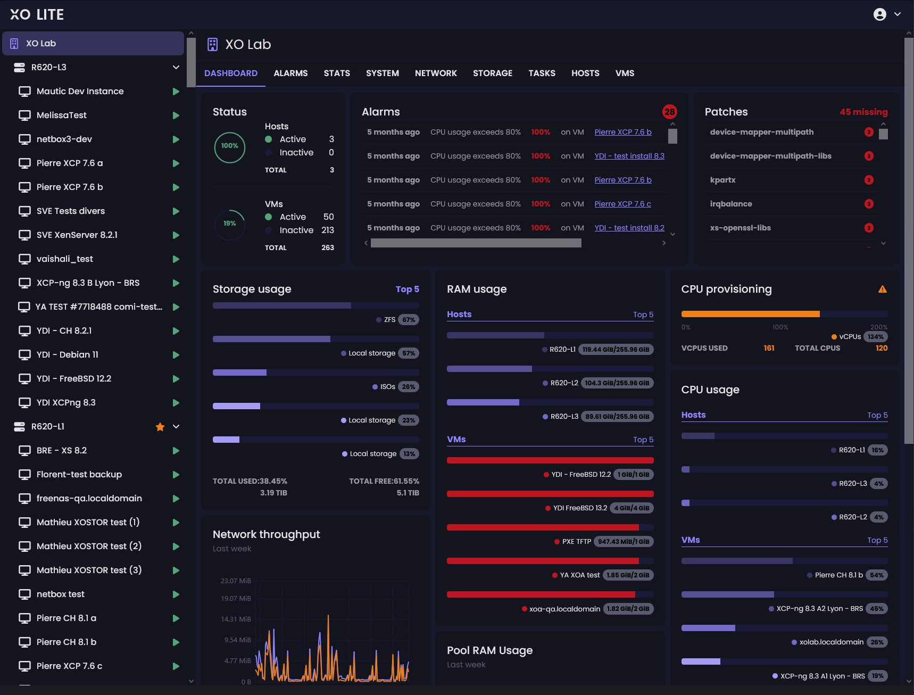

# XO Lite

Xen Orchestra Lite is a lightweight version of the Xen Orchestra meant for single-host administration, running directly from your browser without having to deploy anything, hosted on XCP-ng directly.
You can access it directly on the default https port. So you will access it with https://[XCP-NGHOSTNAME]OR[XCP-NGIP ADDRESS].
For example 
if my XCP-ng machine has the dns hostname mycloud.local, I will access XO-lite at this address https://mycloud.local
if my XCP-ng machine has the ip 192.168.0.1, I will access XO-lite at this address https://192.168.0.1

:::warning
XO Lite is bundled by default in XCP-ng 8.3. If you want to use it on an older release, you can do so by using this URL in your browser: `https://lite.xen-orchestra.com/#/?master=<IP_of_your_XCP-ng_master>`. Don't forget to visit the page of your XCP-ng master first to accept the self-signed certificate!
:::

:::warning
XO Lite uses a self-signed certificate. You need to accept the certificate (follow your web browser's instructions) to access the login page.
:::

:::note
XO Lite is still a work in progress! However, it's meant to cover all basic actions you need to boostrap your infrastructure or just do basic operation on your VMs.
:::

## 🔐 Credentials

XO Lite credentials are the same than the host (SSH credentials), usually `root` as user and the password chosen during the installation process.


## 📊 Dashboard

Once logged, you can see the dashboard:



:::info
XO Lite isn't a multi-cluster orchestrator, it's just a local management console. If you want to orchestrate your VMs at scale (load balancing, backup, warm migration and so on), you MUST use [Xen Orchestra](../manage-at-scale/xo-web-ui.md)!
:::

## Disabling XO Lite

First, let's emphasize that XO Lite is merely an XAPI client. While it is made readily available by the web server on XCP-ng, it actually runs entirely in your web browser. It does **not** increase the attack surface on XCP-ng servers. Additionally, in a properly configured XCP-ng deployment, the management interface resides on a dedicated network, accessible only to administrators.

However, you might still want to prevent XCP-ng from offering XO Lite altogether. To do so, simply add the following line to a new file in `/etc/xapi.conf.d/`:

```
disable-webserver=true
```

Here's a one-liner to do that:

```
echo "disable-webserver=true" > /etc/xapi.conf.d/disable-webserver.conf
```

You must perform this step on every host in the pool, followed by a toolstack restart (ensure no critical tasks are running before doing so):

```
xe-toolstack-restart
```
