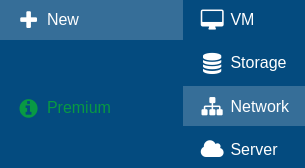
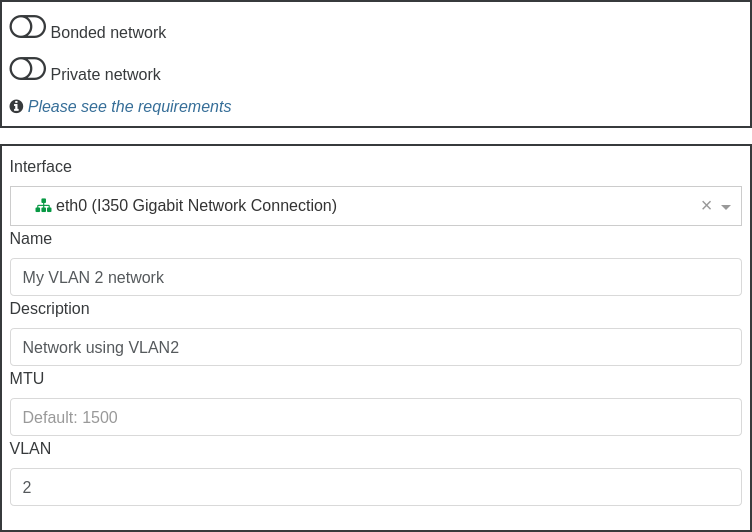
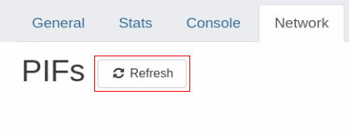

# Networking

XCP-ng is using Open vSwitch as its core, and supports various features from it.

:::tip
Even if one NIC can be enough for your host, having a dedicated NIC for storage will be really important to get consistent performances (especially if you use shared storage like iSCSI or NFS).
:::

## 🎓 Concepts

This section describes the general concepts of networking in XCP-ng.

XCP-ng creates a network for each physical NIC during installation. When you add a server to a pool, the default networks **are merged**. This is meant to be sure that all physical NICs with the same device name are attached to the same network, authorizing seamless VM flexibility on any host of the pool.

Typically, you add a network to create a new external network (bridge), set up a new VLAN using an existing NIC, or create a NIC bond.

You can configure four different types of networks in XCP-ng:

* Default Networks have an association with a physical network interface. Those are also called "External networks" provide a bridge between a virtual machine and the physical network interface connected to the network. External networks enable a virtual machine to connect to resources available through the server’s physical NIC.
* Bonded networks create a bond between two or more NICs to create a single, high-performing channel between the virtual machine and the network.
* Private networks are used to connect VMs internally, without sending traffic outside the host
* Global Private Networks extend the single server private network concept to allow VMs on different pools and/or hosts to communicate with each other by using the XOA SDN controller.

### Network objects

This section uses three types of server-side software objects to represent networking entities. These objects are:

* A PIF, which represents a physical NIC on a host. PIF objects have a name and description, a UUID, the parameters of the NIC they represent, and the network and server they are connected to.
* A VIF, which represents a virtual NIC on a virtual machine. VIF objects have a name and description, a UUID, and the network and VM they are connected to.
* A network, which is a virtual Ethernet switch on a host. Network objects have a name and description, a UUID, and the collection of VIFs and PIFs connected to them.

`xe` CLI, Xen Orchestra or XCP-ng center allow you to configure networking options. You can control the NIC used for management operations, and create advanced networking features such as VLANs and NIC bonds.

### Networks

Each XCP-ng server has one or more networks, which are virtual Ethernet switches. Networks that are not associated with a PIF are considered internal. Internal networks can be used to provide connectivity only between VMs on a given XCP-ng server, with no connection to the outside world. Networks associated with a PIF are considered external. External networks provide a bridge between VIFs and the PIF connected to the network, enabling connectivity to resources available through the PIF’s NIC.

### MTUs

#### Definition

The **Maximum Transmission Unit (MTU)** represents the largest packet size, measured in bytes, that a network layer—such as Ethernet or TCP/IP—can transmit without fragmenting the data. It effectively sets the upper limit for the payload size of a single network packet.

#### Typical MTU values

In most Ethernet networks, the default MTU is **1500 bytes**, though this value can differ depending on the infrastructure. For instance, high-performance environments often use **Jumbo frames**, which support MTU sizes up to 9000 bytes to reduce overhead and improve throughput. When a packet exceeds the MTU, it is split into smaller fragments, which can increase latency and processing overhead.

#### MTUs and virtualized environments

In virtualized environments like XCP-ng, maintaining consistent MTU settings across physical and virtual network interfaces is critical. Mismatched MTU values can lead to connectivity problems or degraded performance, particularly in storage or high-bandwidth scenarios.

For example, if a virtual machine (VM) in XCP-ng communicates over a network with a non-standard MTU, administrators should ensure the VM’s network interface MTU aligns with the physical network’s configuration to prevent packet loss or inefficiencies.

#### Support in XCP-ng

:::danger
Non-standard MTUs (such as jumbo frames) are not supported on **management interfaces**. Using them can lead to serious issues, including failed pool member joins or unexpected network outages.
:::

:::warning
Non-standard MTUs are supported on **storage interfaces**. However, jumbo frames are unnecessary for most modern workloads, and can introduce more issues than benefits. Use them with caution.
:::

While these limitations may be addressed in future updates, **stick to default MTU settings on management interfaces** to ensure **operational stability**.

## 🏷️ VLANs

VLANs, as defined by the IEEE 802.1Q standard, allow a single physical network to support multiple logical networks. XCP-ng hosts support VLANs in multiple ways.

### VLANs for VMs

Switch ports configured as 802.1Q VLAN trunk ports can be used with XCP-ng VLAN features to connect guest virtual network interfaces (VIFs) to specific VLANs. In this case, XCP-ng server performs the VLAN tagging/untagging functions for the guest, which is unaware of any VLAN configuration.

XCP-ng VLANs are represented by additional PIF objects representing VLAN interfaces corresponding to a specified VLAN tag. You can connect XCP-ng networks to the PIF representing the physical NIC to see all traffic on the NIC. Alternatively, connect networks to a PIF representing a VLAN to see only the traffic with the specified VLAN tag. You can also connect a network such that it only sees the native VLAN traffic, by attaching it to VLAN 0.

To use VLANs for your network logical isolation, it's really easy. You'll create a new network with a VLAN ID, and all virtual interfaces created on this network will transparently have traffic tagged in this VLAN. No need to configure anything inside your VM.

First step, go in Xen Orchestra menu, "New" then "Network":



Then, select a pool where you want to create this network, and fill what's required, like physical interface selection, name and description and also VLAN number:



Finally, click on "Create network":


That's it!

## 🔗 Bonds

It's same as previous section, just check the "Bonded Network" and select multiple PIFs in the Interface selector. You can either use VLANs or not, it doesn't matter!

## 🌐 Manage physical NICs

### Add a new NIC

Once a NIC is physically installed, in Xen Orchestra, go to your host's networking tab and click refresh.



This can also be done on the command line. After physically installing a new NIC, you'll need to run a `xe pif-scan` command on the host to get this NIC added as an available PIF.
```
xe pif-scan host-uuid=<HOST UUID>
```

Check new NIC by UUID:
```
xe pif-list
```

Plug new NIC:
```
xe pif-plug uuid=<NIC UUID>
```

### Renaming NICs

In a pool, all NICs across your hosts should match up exactly. So if your management is NIC 0 and your 10Gbit storage interface is NIC 4 on host 1, it should be the same on host 2.

If for some reason the NIC order between hosts doesn't match up, you can fix it with the interface-rename command.

:::tip
These commands are meant to be done on non-active interfaces. Typically this will be done directly after install, before even joining a pool.
:::

```
interface-rename --help
```
This will display all available options.

```
interface-rename --list
```
This will display the current interface mapping/assignments.

Interfaces you wish to rename need to be downed first:
```
ifconfig eth4 down
ifconfig eth8 down
```

The most common use will be an update statement like the following:
```
interface-rename --update eth4=00:24:81:80:19:63 eth8=00:24:81:7f:cf:8b
```
This example will set the mac-address for eth4 & eth8, switching them in the process.

The XAPI database needs the old PIFs removed. First list your PIFs for the affected NICs:
```
xe pif-list
xe pif-forget uuid=<uuid of eth4>
xe pif-forget uuid=<uuid of eth8>
```
Reboot the host to apply these settings.

The interfaces by their new names need to be re-enabled:
```
ifconfig eth4 up
ifconfig eth8 up
```

The new interfaces need to be introduced to the PIF database:
```
xe host-list
```
Make note of the host uuid. Then introduce the interfaces:
```
xe pif-introduce device=eth4 host-uuid=<host uuid> mac=<mac>
xe pif-introduce device=eth8 host-uuid=<host uuid> mac=<mac>
```

By renaming/updating interfaces like this, you can assure all your hosts have the same interface order.


### Remove a physical NIC

Before removing a physical NIC, ensure that no VMs are using the interface. Shutdown the host, physically remove the NIC and boot.
After boot, the PIF will need to be removed. You can do it this way:
```
xe pif-forget uuid=<PIF UUID>
```
The `<PIF UUID>` can be obtained with either `xe pif-list` or with Xen Orchestra. This command only needs to be ran once on the pool. 

## 🛞 SDN controller

An SDN controller is provided by a [Xen Orchestra](../management#%EF%B8%8F-manage-at-scale) plugin. Thanks to that, you can enjoy advanced network features.

### GRE/VXLAN tunnels

Private network (using tunnels) are very handy when you want to access resources in a secure manner, that are not in the same physical network.

So we want a network that is:
- reachable by all the hosts in a pool or **even between different pools!**
- unreachable by anything outside the network
- reactive when the pool changes (new host, host ejected, `PIF` unplugged etc):

That's exactly what you can have thanks to XO SDN controller (here via GRE tunnels):


To create a private network, go in Xen Orchestra, New/Network and select "Private Network":


#### Encryption

To be able to encrypt the networks, `openvswitch-ipsec` package must be installed on all the hosts:

* `yum install openvswitch-ipsec --enablerepo=xcp-ng-testing`
* `systemctl enable ipsec`
* `systemctl enable openvswitch-ipsec`
* `systemctl start ipsec`
* `systemctl start openvswitch-ipsec`

More information available on [XO official documentation for SDN controller](https://xen-orchestra.com/docs/sdn_controller.html).

### OpenFlow Rules

:::tip
`xcp-ng-xapi-plugins` >= 0.15.0 is required. To check the version, run  `yum info xcp-ng-xapi-plugins`.
:::

Using Open vSwitch OpenFlow rules, you can setup traffic rules limiting some network accesses directly at the hypervisor vswitch level. No need for an additional layer of firewalling or filtering setup or equipment.

There are 3 ways to configure OpenFlow rules:
- Through [Xen Orchestra](https://docs.xen-orchestra.com/sdn_controller#openflow-rules)'s web UI (currently only available for per VIF rules)
- Using `xo-cli` as explained in the [Xen Orchestra documentation](https://docs.xen-orchestra.com/sdn_controller#xapi-plugin)
- Manually, by using the `xe` command on your hosts

We recommend using Xen Orchestra or `xo-cli`, depending on your use case. This documentation will focus on how to set up rules manually.

:::warning
The procedure below explains how to set up rules temporarily, but the rules won't persist after reboot.
:::

Keep in mind that these steps must be performed on every host where you want the rules applied. For non-cross-pool private networks, you can run the commands from one host for each host UUID in your pool. For cross-pool private networks, repeat the process for each pool involved.

To set rules manually, you can call the plugin using `xe`:

```
xe host-call-plugin host-uuid<uuid> plugin=sdncontroller.py \
  fn=<function> \
  args:<key>="<value>" [args:…] …`
```

The `<fuction>` parameter can be:
- `add-rule` to add a new rule
- `del-rule` to delete an existing rule
- `dump-flows` to dump the current flow table from Open vSwitch

#### Adding a rule

Parameters for adding a rule:
- *bridge*: The name of the bridge to add rule to
- *priority* (optional): A number between 0 and 65535 for the rule priority
- *mac* (optional): The MAC address of the VIF to create the rule for (if not specified, a network-wide rule will be created)
- *ipRange*: An IP or range of IPs in CIDR notation (for example `192.168.1.0/24`)
- *direction*: can be **from**, **to** or **from/to**
  - *to*: means the parameters for **port** and **ipRange** are to be used as destination
  - *from*: means they will be use as source
  - *from/to*: 2 rules will be created, one per direction
- *protocol*: IP, TCP, UDP, ICMP or ARP
- *port*: required for TCP/UDP protocol
- *allow*: If set to false, the packets are dropped.

Example to block SSH access to/from the 192.168.1.0/24 subnet, for a VM with MAC address `6e:0b:9e:72:ab:c6` on bridge `xenbr0`:

```
$ xe host-call-plugin host-uuid<uuid> plugin=sdncontroller.py \
  fn=add-rule                   \
  args:bridge="xenbr0"          \
  args:mac="6e:0b:9e:72:ab:c6"  \
  args:ipRange="192.168.1.0/24" \
  args:direction="from/to"      \
  args:protocol="tcp"           \
  args:port="22"                \
  args:allow="false"
```


#### Deleting a rule

Parameters for removing a rule:
- *bridge* :  The name of the bridge to delete the rule from
- *mac* (optional): The MAC address of the VIF to delete the rule for
- *ipRange*: An IP or range of IPs in CIDR notation, for example `192.168.1.0/24`
- *direction*: can be **from**, **to** or **from/to**
  - *to*: means the parameters for **port** and **ipRange** are to be used as destination
  - *from*: means they will be use as source
  - *from/to*: 2 rules will be created, one per direction
- *protocol*: IP, TCP, UDP, ICMP or ARP
- *port*: required for TCP/UDP protocol

Example to remove the rule created in the previous section:

```
$ xe host-call-plugin host-uuid<uuid> plugin=sdncontroller.py \
  fn=del-rule                   \
  args:bridge="xenbr0"          \
  args:mac="6e:0b:9e:72:ab:c6"  \
  args:ipRange="192.168.1.0/24" \
  args:direction="from/to"      \
  args:protocol="tcp"           \
  args:port="22"
```
#### Dumping the flow table

This command will return all flows entries in the bridge passed as a parameter.
```
$ xe host-call-plugin host-uuid=<uuid> plugin=sdncontroller.py fn=dump-flows args:bridge=xenbr0 | jq .
{
  "returncode": 0,
  "command": [
    "ovs-ofctl",
    "dump-flows",
    "xenbr0"
  ],
  "stderr": "",
  "stdout": "NXST_FLOW reply (xid=0x4):\n cookie=0x0, duration=248977.339s, table=0, n_packets=24591786, n_bytes=3278442075, idle_age=0, hard_age=65534, priority=0 actions=NORMAL\n"
}
```

### Common errors

#### TLS connection issue

The error would look like this:
> Client network socket disconnected before secure TLS connection was established

It means the TLS certificate, used to identify an SDN controller, on the host doesn't match the one of the plugin, to solve it:
- unload the SDN Controller plugin
- in plugin config, set `override-certs` option to on (it will allow the plugin to uninstall the existing certificate before installing its own)
- load the plugin

The issue should be fixed.

## Static routes

Sometimes you need to add extra routes to an XCP-ng host. It can be done manually with an `ip route add 10.88.0.0/14 via 10.88.113.193` (for example). But it won't persist after a reboot.

To properly create persistent static routes, first create your xen network interface as usual. If you already have this network created previously, just get its UUID with an `xe network-list`. You're looking for the interface you have a management IP on typically, something like `xapi0` or `xapi1` for example. If you're not sure which one it is, you can run `ifconfig` and find the interface name that has the IP address this static route traffic will be exiting. Then get that interfaces UUID using the previous `xe network-list` command.

Now insert the UUID in the below example command. Also change the IPs to what you need, using the following format: `<network>/<netmask>/gateway IP>`. For example, our previous `ip route add 10.88.0.0/14 via 10.88.113.193` will be translated into:

```
xe network-param-set uuid=<network UUID> other-config:static-routes=10.88.0.0/14/10.88.113.193
```

:::tip
You **must** restart the toolstack on **every host in the pool** for the new route to be added!
:::

You can check the result with a `route -n` afterwards on each host to see if the route is now present. It may take a short time to appear. If you must add multiple static routes, it must be in one command, and the routes separated by commas. For example, to add both 10.88.0.0/14 via 10.88.113.193 *and* 10.0.0.0/24 via 192.168.1.1, you would use this:
```
xe network-param-set uuid=<network UUID> other-config:static-routes=10.88.0.0/14/10.88.113.193,10.0.0.0/24/192.168.1.1
```
### Removing static routes

To **remove** static routes you have added, stick the same network UUID from before in the below command:
```
xe network-param-remove uuid=<network UUID> param-key=static-routes param-name=other-config
```
A toolstack restart is needed as before.

:::tip
XAPI might not remove the already-installed route until the host is rebooted. If you need to remove it ASAP,  you can use `ip route del 10.88.0.0/14 via 10.88.113.193`. Check that it's gone with `route -n`.
:::

## 🕸️ Full mesh network

This page describes how to configure a three node meshed network ([see Wikipedia](https://en.wikipedia.org/wiki/Mesh_networking)) which is a very cheap approach to create a 3 node HA cluster, that can be used to host a Ceph cluster, or similar clustered solutions that require 3 nodes in order to operate with full high-availability.

Meshed network requires no physical network switches, the 3 physical nodes are interlinked with each other using multiple network interfaces.

Example with 3 nodes that each has 3 NIC, 1 is for WAN connection and 2 are used to interlink with remaining 2 nodes:


:::warning
Right now only known-to-work option is to use bridge network backend, but hopefully in future it should be possible to setup meshed network using Open vSwitch as well (should you know how, please update this wiki)
:::

### Using bridge backend

:::warning
These steps will require reboot of all 3 nodes multiple times. They will also require you to use bridge network backend instead of Open vSwitch, which will result in loss of some functionality and is not commercially supported
:::

#### Switch to bridge mode on all nodes

SSH to dom0
```
# on dom0 on each hypervisor as root user
xe-switch-network-backend bridge
# reboot the hypervisor
reboot
```

#### Create a bond on all nodes

In XCP-ng Center go to NICs tab and create a bond, selecting eth1 and eth2 as bond devices, leave all options as default

#### Reconfigure the bond device to broadcast mode

Again, ssh to dom0 on all nodes and execute
```
xe pif-list
# Example output
uuid ( RO)                  : f1580a37-6726-6479-d399-635e2cb719b6
                device ( RO): eth2
    currently-attached ( RO): false
                  VLAN ( RO): -1
          network-uuid ( RO): b33187c0-b231-0c69-6ee9-3ad2dcefa6f8


uuid ( RO)                  : 63abf866-890d-79bb-d276-8a50e8e4a94b
                device ( RO): eth0
    currently-attached ( RO): true
                  VLAN ( RO): -1
          network-uuid ( RO): 7404e9f7-7dfe-b666-d6f2-1fe9886498cd


uuid ( RO)                  : 77826c83-4b60-8137-c00f-3027d89b86b2
                device ( RO): eth1
    currently-attached ( RO): false
                  VLAN ( RO): -1
          network-uuid ( RO): ae9847e4-5587-2e61-4870-365143837aba


uuid ( RO)                  : 65380308-0c53-3d96-f564-06a724a792be
                device ( RO): bond0
    currently-attached ( RO): true
                  VLAN ( RO): -1
          network-uuid ( RO): b7e4d20b-64ed-bf38-c56f-4d740b579005

# Replace the UUID with the bond ID and execute following command
xe pif-param-set uuid=65380308-0c53-3d96-f564-06a724a792be other-config:bond-mode=broadcast
reboot
```

#### Configure the interface in XCP-ng center

Go to tab Networking, rename bond1+2 device to something more memorable such as "MeshLAN", then add IP to all dom0 VMs to test it out, click "Configure" in IP configuration, add IP address and insert following addresses (you can use different addresses and range if you prefer to):

On each node respectively
* 192.168.10.1
* 192.168.10.2
* 192.168.10.3

Netmask: 255.255.255.0
Gateway: leave empty

Now SSH to each dom0 and try if you can ping all 3 IP addresses. If you can, you successfully created a meshed network. This network is going to provide interconnection between all 3 nodes and even if some node die, connectivity between remaining 2 nodes will remain operational.

This setup will save you costs of 2 network switches you would otherwise have to purchase and use instead to achieve HA connectivity.

#### References

* Forum post: [https://xcp-ng.org/forum/topic/1897/mesh-network](https://xcp-ng.org/forum/topic/1897/mesh-network)
* Proxmox wiki: [https://pve.proxmox.com/wiki/Full_Mesh_Network_for_Ceph_Server](https://pve.proxmox.com/wiki/Full_Mesh_Network_for_Ceph_Server)

## 🔎 DNS Search Domains

When XCP-ng is configured for static IP configuration there are no DNS search domains added. It is possible to add search domains into `/etc/resolv.conf`, however those won't persist across reboots. Use `xe pif-param-set` to add search domains that should persist across reboots.

* First identify the PIF used as management interface.
```
# xe pif-list host-name-label=xcpng-srv01 management=true
uuid ( RO)                  : 76608ca2-e099-9344-af36-5b63c0022913
                device ( RO): bond0
    currently-attached ( RO): true
                  VLAN ( RO): -1
          network-uuid ( RO): cc966455-d5f8-0257-04a7-d3d7c671636b
```
* Take note of the `uuid` field and pass that to `xe pif-param-set`
```
# xe pif-param-set uuid=76608ca2-e099-9344-af36-5b63c0022913 other-config:domain=searchdomain1.com,searchdomain2.com,searchdomain3.com
```
This procedure has to be done for all hosts in the same pool.

## 👷 Network Troubleshooting

### Network corruption

Disabling TX offload might help to diagnose NIC issues:

```
xe pif-param-set uuid=<PIF UUID> other-config:ethtool-tx=off
```

### Disabling FCoE

If you are using bonds on FCoE capable devices, it's preferable to disable it entirely:

```
systemctl stop fcoe
systemctl stop xs-fcoe
systemctl mask fcoe
systemctl mask xs-fcoe
```

See [https://github.com/xcp-ng/xcp/issues/138](https://github.com/xcp-ng/xcp/issues/138).

:::tip
`systemctl mask` is similar to `systemctl disable`, but will also prevent the service from being re-enabled automatically by future XCP-ng maintenance updates. This change will however have to be done again after an upgrade to a newer release of XCP-ng.
:::

### Emergency Network Reset

Incorrect networking settings can cause loss of network connectivity. When there is no network connectivity, XCP-ng host can become inaccessible through Xen Orchestra or remote SSH. Emergency Network Reset provides a simple mechanism to recover and reset a host’s networking.

The Emergency network reset feature is available from the CLI using the `xe-reset-networking` command, and within the Network and Management Interface section of xsconsole.

Incorrect settings that cause a loss of network connectivity include renaming network interfaces, creating bonds or VLANs, or mistakes when changing the management interface. For example, typing the wrong IP address. You may also want to run this utility in the following scenarios:

:::warning
If a Pool master or host in a resource pool is unable to contact with other hosts.
:::

Use the `xe-reset-networking` utility only in an emergency because it deletes the configuration for all PIFs, bonds, VLANs, and tunnels associated with the host. Guest Networks and VIFs are preserved. As part of this utility, VMs are shut down forcefully. Before running this command, cleanly shut down the VMs where possible. Before you apply a reset, you can change the management interface and specify which IP configuration, DHCP, or Static can be used.

If the pool master requires a network reset, reset the network on the pool master first before applying a network reset on pool members. Apply the network reset on all remaining hosts in the pool to ensure that the pool’s networking configuration is homogeneous. Network homogeneity is an important factor for live migration.

:::tip
* If the pool master’s IP address (the management interface) changes as a result of a network reset or xe host-management-reconfigure, apply the network reset command to other hosts in the pool. This is to ensure that the pool members can reconnect to the Pool Master on its new IP address. In this situation, the IP address of the Pool Master must be specified.
* Network reset is NOT supported when High Availability is enabled. To reset network configuration in this scenario, you must first manually disable high availability, and then run the network reset command.
:::

#### Verifying the network reset

After you specify the configuration mode to be used after the network reset, xsconsole and the CLI display settings that will be applied after host reboot. It is a final chance to modify before applying the emergency network reset command. After restart, the new network configuration can be verified in Xen Orchestra and xsconsole. In Xen Orchestra, with the host selected, select the Networking tab to see the new network configuration. The Network and Management Interface section in xsconsole display this information.

### SR-IOV

TO have SR-IOV enabled, you need:

* SR-IOV / ASPM compatible mainboard
* SR-IOV compatible CPU
* SR-IOV compatible network card
* SR-IOV compatible drivers for XCP-ng

:::warning
You can't live migrate a VM with SR-IOV enabled. Use it only if you really need it!
:::

#### Setup

* enable SR-IOV in your BIOS
* enable ASPM (seem to be needed acording to https://www.juniper.net/documentation/en_US/contrail3.1/topics/concept/sriov-with-vrouter-vnc.html and https://www.supermicro.com/support/faqs/faq.cfm?faq=26448)
* enable SR-IOV in your network card firmware

Then, you can enable and configure it with `xe` CLI:

```
xe network-create name-label=SRIOV
xe network-sriov-create network-uuid=<network_uuid> pif-uuid=<physical_pif_uuid>
xe network-sriov-param-list uuid=<SR-IOV Network_uuid>
```

The last command will tell you if you need to reboot or not.

Assign the SR-IOV network to your VM:
```
xe vif-create device=<device index> mac=<vf_mac_address> network-uuid=<sriov_network> vm-uuid=<vm_uuid>
```

If you want to disable it:
```
xe network-sriov-destroy uuid=<network_sriov_uuid>
```

:::tip
You can read a Citrix guide here: [https://support.citrix.com/article/CTX235044](https://support.citrix.com/article/CTX235044)
:::

### Intel i218/i219 slow speed

With kernel version 4.15 a fix in the e1000e driver [has been introduced](https://github.com/torvalds/linux/commit/b10effb92e272051dd1ec0d7be56bf9ca85ab927). However, this fix slightly slows down DMA access times to prevent the NIC to hang up on heavy UDP traffic. This impacts the TCP performance. A workaround to regain full transfer speeds, you can turn off TCP segmentation offloading via the following command:

```
ethtool -K <interface> tso off gso off
```

There is currently no fix available / announced that allows offloading TCP segmentation to the NIC without sacrificing performance.

:::tip
The following error message can be ignored: `Cannot get device udp-fragmentation-offload settings: Operation not supported`
:::
