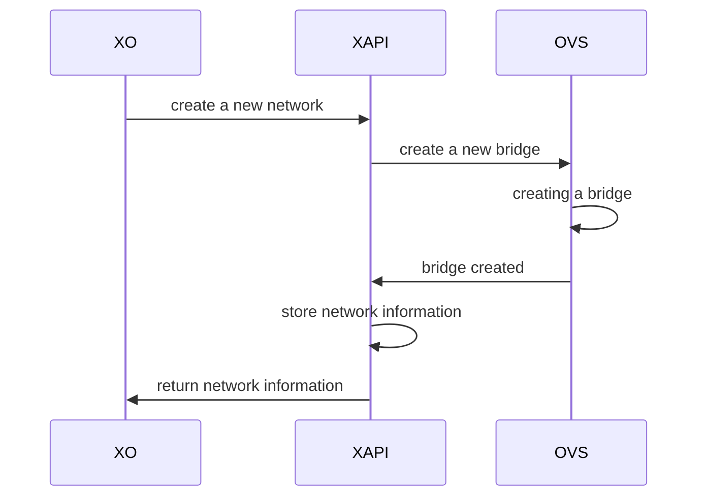
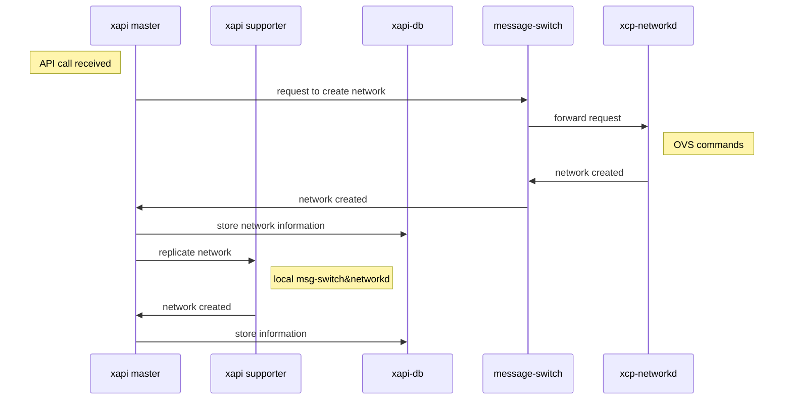
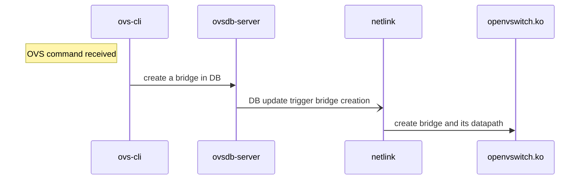
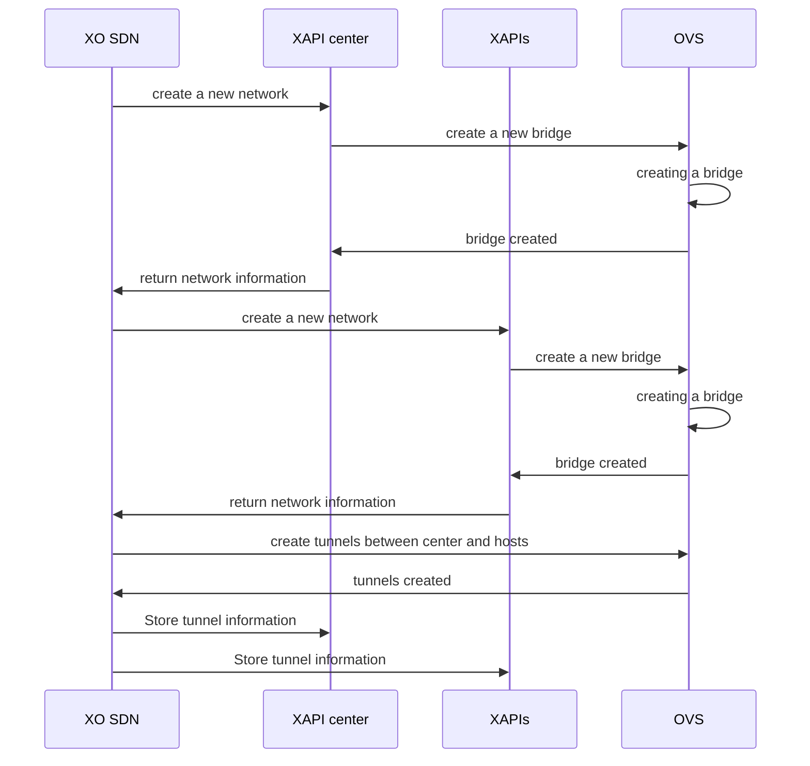
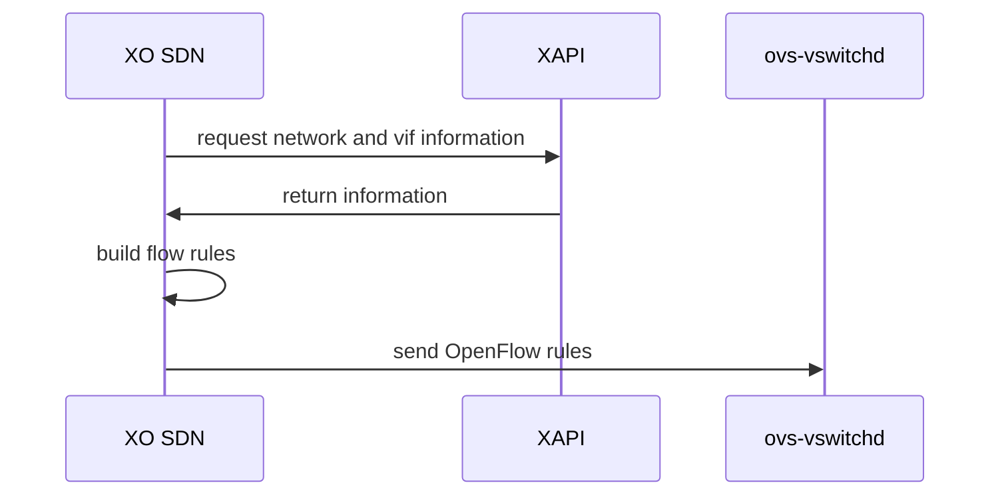
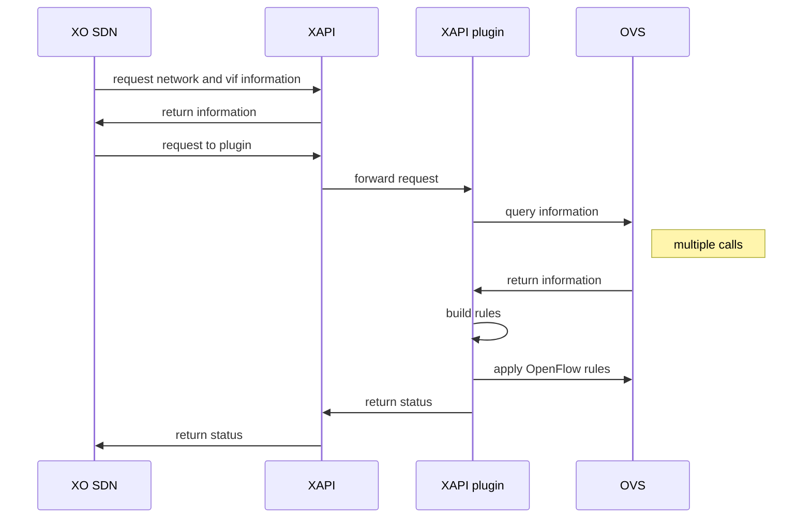
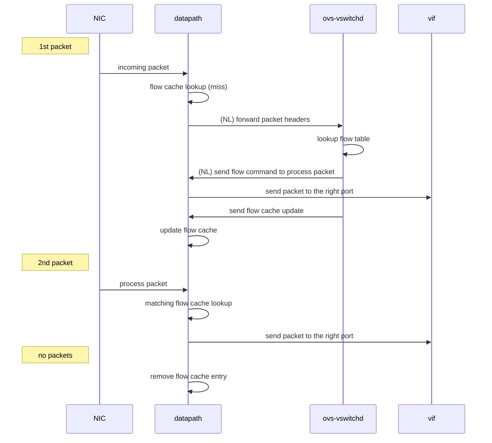

# Architecture

This page contains advanced info regarding XCP-ng architecture.

## :minidisc: Storage {#storage}

### Virtual disks on HVMs and PV guests

<Schema label="Virtual disk I/O path · from a guest process down to the real storage" legend={[["#56c288", "guest side"], ["#4a90e2", "dom0 side"], ["#e0a94a", "shared ring (blkif)"]]} maxWidth="720px">
<svg viewBox="0 0 720 350" role="img" aria-label="In the guest, a user process goes through libc, the block layer and blkfront; requests cross to dom0 through a shared blkif ring using grant tables and event channels; in dom0, tapdisk picks them up, uses libaio through the block layer and device driver to reach the VHD data on the physical storage; qemu-dm handles the emulated path">
  <g fill="rgba(255,255,255,0.04)" stroke="rgba(255,255,255,0.28)">
    <rect x="20" y="20" width="270" height="310" rx="8"/>
    <rect x="430" y="20" width="270" height="310" rx="8"/>
  </g>
  <text x="155" y="44" fontSize="17" fill="#56c288" textAnchor="middle">Guest VM (domU)</text>
  <text x="565" y="44" fontSize="17" fill="#4a90e2" textAnchor="middle">Control domain (dom0)</text>
  <g fill="rgba(255,255,255,0.06)" stroke="rgba(255,255,255,0.28)">
    <rect x="90" y="60" width="130" height="30" rx="5"/>
    <rect x="90" y="128" width="130" height="30" rx="5"/>
    <rect x="90" y="196" width="130" height="30" rx="5"/>
  </g>
  <rect x="90" y="264" width="130" height="30" rx="5" fill="rgba(86,194,136,0.14)" stroke="#56c288" strokeOpacity="0.85"/>
  <g fontSize="14" fill="#c6d2e1" textAnchor="middle">
    <text x="155" y="79">user process</text>
    <text x="155" y="147">block layer</text>
    <text x="155" y="215">/dev/xvda</text>
  </g>
  <text x="155" y="283" fontSize="14" fill="#56c288" textAnchor="middle">blkfront</text>
  <g fontSize="11.5" fill="#7a8699">
    <text x="166" y="112">libc · syscalls</text>
    <text x="166" y="180">guest kernel</text>
    <text x="166" y="248">PV disk driver</text>
  </g>
  <g stroke="#56c288" strokeWidth="1.6">
    <line x1="155" y1="90" x2="155" y2="128"/>
    <line x1="155" y1="158" x2="155" y2="196"/>
    <line x1="155" y1="226" x2="155" y2="264"/>
  </g>
  <rect x="310" y="240" width="100" height="78" rx="8" fill="rgba(224,169,74,0.12)" stroke="#e0a94a" strokeOpacity="0.85"/>
  <text x="360" y="264" fontSize="12.5" fill="#e0a94a" textAnchor="middle">shared ring</text>
  <text x="360" y="279" fontSize="12.5" fill="#e0a94a" textAnchor="middle">(blkif)</text>
  <text x="360" y="302" fontSize="11" fill="#7a8699" textAnchor="middle">grant tables +</text>
  <text x="360" y="313" fontSize="11" fill="#7a8699" textAnchor="middle">event channels</text>
  <g stroke="#e0a94a" strokeWidth="1.6">
    <line x1="220" y1="279" x2="310" y2="279"/>
    <line x1="410" y1="279" x2="460" y2="279"/>
  </g>
  <rect x="460" y="252" width="120" height="30" rx="5" fill="rgba(74,144,226,0.14)" stroke="#4a90e2" strokeOpacity="0.85"/>
  <text x="520" y="271" fontSize="14" fill="#4a90e2" textAnchor="middle">tapdisk</text>
  <g fill="rgba(255,255,255,0.06)" stroke="rgba(255,255,255,0.28)">
    <rect x="600" y="252" width="86" height="30" rx="5"/>
    <rect x="460" y="184" width="120" height="30" rx="5"/>
    <rect x="460" y="116" width="120" height="30" rx="5"/>
  </g>
  <g fontSize="12.5" fill="#c6d2e1" textAnchor="middle">
    <text x="643" y="271">qemu-dm</text>
    <text x="520" y="203">block layer</text>
    <text x="520" y="135">device driver</text>
  </g>
  <g fontSize="11.5" fill="#7a8699">
    <text x="531" y="240">libaio · aio syscalls</text>
    <text x="531" y="172">dom0 kernel</text>
  </g>
  <text x="643" y="298" fontSize="11" fill="#7a8699" textAnchor="middle">emulated devices</text>
  <g stroke="#4a90e2" strokeWidth="1.6">
    <line x1="520" y1="252" x2="520" y2="214"/>
    <line x1="520" y1="184" x2="520" y2="146"/>
    <line x1="520" y1="116" x2="520" y2="86"/>
  </g>
  <line x1="580" y1="267" x2="600" y2="267" stroke="rgba(255,255,255,0.35)" strokeWidth="1.4"/>
  <g fill="rgba(255,255,255,0.06)" stroke="rgba(255,255,255,0.28)">
    <rect x="470" y="56" width="100" height="30" rx="12"/>
  </g>
  <text x="520" y="75" fontSize="12.5" fill="#c6d2e1" textAnchor="middle">VHD data</text>
  <text x="531" y="104" fontSize="11.5" fill="#7a8699">physical storage</text>
</svg>
</Schema>

#### `qemu-dm` and `tapdisk` at startup

When a VM starts, whether it is a HVM or a PV guest, it is always started as a HVM. So during the boot process, the device of the VM is emulated. The process for mapping a virtual device from a host to a guest is called `qemu-dm`. There is one instance per disk like `tapdisk`, another process used to read/write in a VHD file the disk data. `qemu-dm` reads and writes to a `/dev/blktap/blktapX` host device, which is created by tapdisk and is managed by a driver in Dom 0: `blktap`.

For each read/write in the VM disk, requests pass through an emulated driver, then `qemu-dm` and finally they are sent to `blktap`; since `tapdisk` is the creator/manager of the `blktap` device, it handles requests by reading them through a shared ring. The requests are consumed by reading or writing in the VHD file representing the disk of the VM, the `libaio` is used to access/modify the physical blocks. Finally `tapdisk` responds to `qemu-dm` by writing responses in the same ring.

#### tapdisk & PV guests

The process described above is used for HVMs and also for PV guests (at startup, PV drivers are not loaded).
After starting a PV guest, the emulated driver in the VM is replaced by `blkfront` (a PV driver) which allows to communicate directly with `tapdisk` using a protocol: `blkif`; `blktap` and `qemu-dm` then become useless to handle devices requests. Note that system calls are used with two drivers: `eventchn dev` and `gntdev` to map VM memory pages in the user space of the host. Thus a shared ring can be used to receive requests directly from `tapdisk` in host user space instead of using the kernel space.

## :arrow_up_down: Components for VDI I/O {#components-for-vdi-io}

### XenStore

XenStore is a centralized database residing on `Dom0`, it is accessible using a `UNIX socket` or with `XenBus` + `ioctl`. It's also a hierarchical namespace allowing reads/writes, enumeration of virtual directories and notifications of observed changes via `watches`. Each domain has its own path in the store.

A PV driver can interact with the `XenStore` to get or set configuration, it's not used for large data exchanges. The store is mainly used during PV driver negotiation via `XenBus`.

:::tip
For more information, take a look at:
* [https://wiki.xen.org/wiki/XenStore](https://wiki.xen.org/wiki/XenStore)
* [https://wiki.xenproject.org/wiki/XenStore_Reference](https://wiki.xenproject.org/wiki/XenStore_Reference)
:::

### XenBus

XenBus is a kernel API allowing PV drivers to communicate between domains. It's often used for configuration negotiation. It is built over the `XenStore`.

For implementation, you can take a look at: `drivers/xen/xenbus/xenbus_xs.c` and `drivers/xen/xenbus/xenbus_client.c`.

Generally the communication is made between a `front` and `back` driver. The front driver is in the `DomU`, and the back in `Dom0`. For example it exists a `xen-blkfront.c` driver in the PV guest and a `blkback.c` driver in the host to support disk devices. This concept is called `split-driver model`. It's used for the network layer too.

Note: Like said in the top section, it's not always the case but we can avoid usage of a back driver, we can use a process in the host user space. In the case of XCP-ng, `tapdisk`/`tapback` are used instead of `blkback` to talk with `blkfront`.


#### Negotiation and connection

Implementation of a `Xenbus` driver in `blkfront`:

```C
static const struct xenbus_device_id blkfront_ids[] = {
  { "vbd" }, // Device class.
  { "" }
};

static struct xenbus_driver blkfront_driver = {
  .ids  = blkfront_ids,
  .probe = blkfront_probe, // Called when new device is created: create the virtual device structure.
  .remove = blkfront_remove, // Called when a xbdev is removed.
  .resume = blkfront_resume, // Called to resume after a suspend.
  .otherend_changed = blkback_changed, // Called when the backend's state is modified.
  .is_ready = blkfront_is_ready,
};
```

In the PV driver, it's necessary to implement these callbacks to react to backend changes. Here we will see the different steps during the negotiation between tapdisk and blkfront. The reactions to changes are made in this piece of code in `tapdisk`:

```C
int frontend_changed (vbd_t *const device, const XenbusState state) {
  int err = 0;

  DBG(device, "front-end switched to state %s\n", xenbus_strstate(state));
  device->frontend_state = state;

  switch (state) {
    case XenbusStateInitialising:
      if (device->hotplug_status_connected)
        err = xenbus_switch_state(device, XenbusStateInitWait);
      break;
    case XenbusStateInitialised:
    case XenbusStateConnected:
      if (!device->hotplug_status_connected)
        DBG(device, "udev scripts haven't yet run\n");
      else {
        if (device->state != XenbusStateConnected) {
          DBG(device, "connecting to front-end\n");
          err = xenbus_connect(device);
        } else
        DBG(device, "already connected\n");
      }
      break;
    case XenbusStateClosing:
      err = xenbus_switch_state(device, XenbusStateClosing);
      break;
    case XenbusStateClosed:
      err = backend_close(device);
      break;
    case XenbusStateUnknown:
      err = 0;
      break;
    default:
      err = EINVAL;
      WARN(device, "invalid front-end state %d\n", state);
      break;
  }
  return err;
}
```

And in the PV driver:

```C
static void blkback_changed (struct xenbus_device *dev, enum xenbus_state backend_state) {
  struct blkfront_info *info = dev_get_drvdata(&dev->dev);

  dev_dbg(&dev->dev, "blkfront:blkback_changed to state %d.\n", backend_state);

  switch (backend_state) {
    case XenbusStateInitWait:
      if (dev->state != XenbusStateInitialising)
        break;
      if (talk_to_blkback(dev, info))
        break;
    case XenbusStateInitialising:
    case XenbusStateInitialised:
    case XenbusStateReconfiguring:
    case XenbusStateReconfigured:
    case XenbusStateUnknown:
      break;

    case XenbusStateConnected:
      /*
       * talk_to_blkback sets state to XenbusStateInitialised
       * and blkfront_connect sets it to XenbusStateConnected
       * (if connection went OK).
       *
       * If the backend (or toolstack) decides to poke at backend
       * state (and re-trigger the watch by setting the state repeatedly
       * to XenbusStateConnected (4)) we need to deal with this.
       * This is allowed as this is used to communicate to the guest
       * that the size of disk has changed!
       */
      if ((dev->state != XenbusStateInitialised) && (dev->state != XenbusStateConnected)) {
        if (talk_to_blkback(dev, info))
          break;
      }

      blkfront_connect(info);
      break;

    case XenbusStateClosed:
      if (dev->state == XenbusStateClosed)
        break;
      fallthrough;
    case XenbusStateClosing:
      if (info)
        blkfront_closing(info);
      break;
    }
  }
```

This negotiation is essentially a state machine updated using `xenbus_switch_state` in the frontend and backend. They have their own state and are notified when a change is observed. We start from `XenbusStateUnknown` to `XenbusStateConnected`.
To detail these steps a little more:

* `XenbusStateUnknown`: Initial state of the device on `Xenbus`, before connection.
* `XenbusStateInitialising`: During back end initialization.
* `XenbusStateInitWait`: Entered by the backend just before the end of the initialization. The state is useful for the frontend, at this moment it can read driver parameters written by the backend in the Xenstore; it can also write info for the backend always using the store.
* `XenbusStateInitialised`: Set to indicate that the backend is now initialized. The frontend can then switch to connected state.
* `XenbusStateConnected`: The main state of `Xenbus`.
* `XenbusStateClosing`: Used to interrupt properly the connection.
* `XenbusStateClosed`: Final state when frontend and backend are disconnected.

The starting point of the initialization is in `xenopsd`:

```ocaml
(* The code is simplified in order to keep only the interesting parts. *)
let add_device ~xs device backend_list frontend_list private_list
      xenserver_list =
    Mutex.execute device_serialise_m (fun () ->
        (* ... Get backend end frontend paths... *)
        Xs.transaction xs (fun t ->
            ( try
                ignore (t.Xst.read frontend_ro_path) ;
                raise (Device_frontend_already_connected device)
              with Xs_protocol.Enoent _ -> ()
            ) ;
            t.Xst.rm frontend_rw_path ;
            t.Xst.rm frontend_ro_path ;
            t.Xst.rm backend_path ;

            (* Create paths + permissions. *)
            t.Xst.mkdirperms frontend_rw_path
              (Xenbus_utils.device_frontend device) ;
            t.Xst.mkdirperms frontend_ro_path (Xenbus_utils.rwperm_for_guest 0) ;
            t.Xst.mkdirperms backend_path (Xenbus_utils.device_backend device) ;
            t.Xst.mkdirperms hotplug_path (Xenbus_utils.hotplug device) ;
            t.Xst.writev frontend_rw_path
              (("backend", backend_path) :: frontend_list) ;
            t.Xst.writev frontend_ro_path [("backend", backend_path)] ;
            t.Xst.writev backend_path
              (("frontend", frontend_rw_path) :: backend_list) ;
          (* ... *)
```

One of the role of `xenopsd` here is to create VIFs and VBDs to boot correctly a VM. This is the output given when a new device must be added:

```
/var/log/xensource.log:36728:Nov 24 16:40:24 xcp-ng-lab-1 xenopsd-xc: [debug||14 |Parallel:task=5.atoms=1.(VBD.plug RW vm=6f25b64e-9887-7017-02cc-34e79bfae93d)|xenops] adding device  B0[/local/domain/0/backend/vbd3/1/768]  F1[/local/domain/1/device/vbd/768]  H[/xapi/6f25b64e-9887-7017-02cc-34e79bfae93d/hotplug/1/vbd3/768]
```

The interesting paths are:
* Backend path: `/local/domain/0/backend/vbd3/1/768`
* Frontend path: `/local/domain/1/device/vbd/768`

When the two paths are written, the creation of the device connection is triggered. In fact the `Xenbus` backend instance in the kernel space of `Dom0` has a watch on the `/local/domain/0/backend/vbd` path. Same idea for the `/local/domain/<DomU id>/device/vbd` in the guest kernel space.

After that the creation/connection can start in `tapdisk`/`tapback`. When a new device must be created in the guest, `tapback_backend_create_device` is executed to start the creation; at this moment parameters like `"max-ring-page-order"` are written using `Xenstore` to be read later by the PV driver. Important: only a structure is allocated in memory at this time, there is no communication with the guest, the `Xenbus` state is `XenbusStateUnknown` on both sides.

After that the real connection can start, it's the goal of `static inline int reconnect(vbd_t *device)` in `tapback`:

1. A watch is added on `<Frontend path>/state` by the backend to be notified when the state is updated. Same idea in the frontend code, a watch is added on `<Backend path>/state`.

2. `tapback` is waiting for the hotplug scripts completion of the guest. After that it can switch to `XenbusStateInitWait` state. The frontend can then read the parameters like `"max-ring-page-order"` and responds using the store. `blkfront` creates a shared ring buffer using `xenbus_grant_ring`, so under the hood memory pages are shared between the `DomU` and `Dom0` to use this ring. Also an event channel is created by the frontend via `xenbus_alloc_evtchn` to be notified when data is written in the ring. Finally `blkfront` can update its state to: `XenbusStateInitialised`.

3. After the last state update, `tapback` can finalize the bus connection in `xenbus_connect`: the grant references of the shared ring and event channel port are fetched then it opens a `blkif` connection using the details given by the frontend.

:::tip
References and interesting links:
* Xen documentation: [https://wiki.xen.org/wiki/XenBus](https://wiki.xen.org/wiki/XenBus)
* How to write a XenBus driver? [https://fnordig.de/2016/12/02/xen-a-backend-frontend-driver-example/](https://fnordig.de/2016/12/02/xen-a-backend-frontend-driver-example/)
:::

### Xen Grant table

The grant table is a mechanism to share memory between domains: it's essentially used in this part to share data between a PV driver of a `DomU` and the `Dom0`. Each domain has its own grant table and it can give an access to its memory pages to  another domain using Write/Read permissions. Each entry of the table are identified by a `grant reference`, it's a simple integer which indexes into the grant table.

Normally the grant table is used in the kernel space, but it exists a `/dev/xen/gntdev` device used to map granted pages in user space. It's useful to implement Xen backends in userspace for qemu and tapdisk: we can write and read in the blkif ring with this helper.

:::tip
Xen documentation:
* [https://wiki.xenproject.org/wiki/Grant_Table](https://wiki.xenproject.org/wiki/Grant_Table)
:::

### Blkif

#### Shared memory details

Like said in the previous part, when the frontend and backend are connected using `XenBus`, a `blkif` connection is created. We know the ring is used in the `tapdisk` case to read and write requests on a VHD file. It is created directly in `blkfront` using a `__get_free_pages` call to allocate a memory pointer, after that, this memory area is shared with `Dom0` using this call:

```C
// Note: For more details concerning the ring initialization, you can
// take a look at the `setup_blkring` function.
// ...
xenbus_grant_ring(dev, rinfo->ring.sring, info->nr_ring_pages, gref);
// ...
```

To understand this call, we can look at this implementation with small comments to understand the logic:

```C
/**
 * xenbus_grant_ring
 * @dev: xenbus device
 * @vaddr: starting virtual address of the ring
 * @nr_pages: number of pages to be granted
 * @grefs: grant reference array to be filled in
 *
 * Grant access to the given @vaddr to the peer of the given device.
 * Then fill in @grefs with grant references.  Return 0 on success, or
 * -errno on error.  On error, the device will switch to
 * XenbusStateClosing, and the error will be saved in the store.
 */
int xenbus_grant_ring (
  struct xenbus_device *dev,
  void *vaddr,
  unsigned int nr_pages,
  grant_ref_t *grefs
) {
  int err;
  int i, j;

  for (i = 0; i < nr_pages; i++) {
    unsigned long gfn;

    // We must retrieve a gfn from the allocated vaddr.
    // A gfn is a Guest Frame Number.
    if (is_vmalloc_addr(vaddr))
      gfn = pfn_to_gfn(vmalloc_to_pfn(vaddr));
    else
      gfn = virt_to_gfn(vaddr);

    // Grant access to this Guest Frame to the other end, here Dom0.
    err = gnttab_grant_foreign_access(dev->otherend_id, gfn, 0);
    if (err < 0) {
      xenbus_dev_fatal(dev, err, "granting access to ring page");
      goto fail;
    }
    grefs[i] = err;

    vaddr = vaddr + XEN_PAGE_SIZE;
  }

  return 0;

fail:
  // In the error case, we must remove access to the guest memory.
  for (j = 0; j < i; j++)
    gnttab_end_foreign_access_ref(grefs[j], 0);
  return err;
}
```

#### Event channel & blkif

So, after the creation of the ring, when a request is written inside it by the guest, the backend is notified via an `event channel`, in this case, an event is similar to a hardware interrupt in the Xen env.

The interesting code is here:
```C
// ...

// Allocate a new event channel on the blkfront device.
xenbus_alloc_evtchn(dev, &rinfo->evtchn);

// ...

// Bind an event channel to a handler called here blkif_interrupt using a blkif
// device with no flags.
bind_evtchn_to_irqhandler(rinfo->evtchn, blkif_interrupt, 0, "blkif", rinfo);
```

When a request is added in the ring, the backend receives a notification after this call:

```C
void notify_remote_via_irq(int irq)
{
  evtchn_port_t evtchn = evtchn_from_irq(irq);

  if (VALID_EVTCHN(evtchn))
    notify_remote_via_evtchn(evtchn);
}
```

`blkfront` can then be notified when a response is written in `tapdisk` using a function in the `libxenctrl` API:

```C
int xenevtchn_notify(xenevtchn_handle *xce, evtchn_port_t port);
```

:::tip
For more information concerning event channels: [https://xenbits.xenproject.org/people/dvrabel/event-channels-F.pdf](https://xenbits.xenproject.org/people/dvrabel/event-channels-F.pdf)
:::

#### Steps during write from guest to host

1. A user process in the guest execute a write call on the virtual device.

2. The request is sent to the `blkfront` driver. At this moment the driver must associate a grant reference to the guest buffer address using this function (more precisely gfn to which the address belongs):

```C
static struct grant *get_grant (
  grant_ref_t *gref_head,
  unsigned long gfn,
  struct blkfront_ring_info *rinfo
) {
  struct grant *gnt_list_entry = get_free_grant(rinfo);
  struct blkfront_info *info = rinfo->dev_info;

  if (gnt_list_entry->gref != GRANT_INVALID_REF)
    return gnt_list_entry;

  /* Assign a gref to this page */
  gnt_list_entry->gref = gnttab_claim_grant_reference(gref_head);
  BUG_ON(gnt_list_entry->gref == -ENOSPC);
  if (info->feature_persistent)
    grant_foreign_access(gnt_list_entry, info);
  else {
    /* Grant access to the GFN passed by the caller */
    gnttab_grant_foreign_access_ref(
      gnt_list_entry->gref,
      info->xbdev->otherend_id,
      gfn,
      0
    );
  }

  return gnt_list_entry;
}
```

:::tip
If you want more info concerning the persistent feature: [https://xenproject.org/2012/11/23/improving-block-protocol-scalability-with-persistent-grants/](https://xenproject.org/2012/11/23/improving-block-protocol-scalability-with-persistent-grants/)

The persistent grants are not used in `tapdisk`.
:::

3. The grant reference is then added to the ring, and the backend is notified.

4. In tapdisk when the event channel is notified, the request is read and the guest segments are copied into a local buffer using `ioctl` with a `IOCTL_GNTDEV_GRANT_COPY` request. So before writing to the VHD file we must **make a copy** of the data. Another possible solution is to use the `IOCTL_GNTDEV_MAP_GRANT_REF` + a `mmap` call to avoid a copy, but **it is not necessarily faster**.

5. Finally we can write the request and notify the frontend.

The read steps are similar, the main difference is that we must copy from the `Dom0` VHD file to the `guest` buffer.

## :satellite: API {#api}

XCP-ng uses **XAPI** as main API. This API is used by all clients. For more details go to [XAPI website](https://xapi-project.github.io/).

:::tip
If you want to build an application on top of XCP-ng, we strongly suggest the Xen Orchestra API instead of XAPI. *Xen Orchestra* provides an abstraction layer that's easier to use, and also acts as a central point for your whole infrastructure.
:::

### XAPI architecture

XAPI is a toolstack split in two parts: `xenopsd` and XAPI itself (see the diagram below):

<Schema label="Toolstack comparison · XCP-ng (XAPI) next to plain Xen setups" legend={[["#56c288", "OCaml"], ["#4a90e2", "C"]]} maxWidth="760px">
<svg viewBox="0 0 760 420" role="img" aria-label="Three columns: XCP-ng where clients like xe, Xen Orchestra and CloudStack drive XAPI over xenops, libxc and Xen; Xen with libvirt where virsh and OpenStack drive libvirt over libxl; and plain Xen driven by the xl CLI">
  <g fill="rgba(255,255,255,0.04)" stroke="rgba(255,255,255,0.28)">
    <rect x="20" y="20" width="240" height="360" rx="8"/>
    <rect x="280" y="20" width="220" height="360" rx="8"/>
    <rect x="520" y="20" width="220" height="360" rx="8"/>
  </g>
  <g fontSize="13" fill="#c6d2e1" textAnchor="middle">
    <text x="140" y="44">XCP-ng</text>
    <text x="390" y="44">Xen + libvirt</text>
    <text x="630" y="44">plain Xen</text>
  </g>
  <g fill="rgba(255,255,255,0.06)" stroke="rgba(255,255,255,0.28)">
    <rect x="36" y="60" width="98" height="24" rx="5"/>
    <rect x="146" y="60" width="98" height="24" rx="5"/>
    <rect x="36" y="92" width="98" height="24" rx="5"/>
    <rect x="146" y="92" width="98" height="24" rx="5"/>
    <rect x="296" y="60" width="90" height="24" rx="5"/>
    <rect x="398" y="60" width="90" height="24" rx="5"/>
    <rect x="536" y="60" width="188" height="24" rx="5"/>
  </g>
  <g fontSize="10" fill="#c6d2e1" textAnchor="middle">
    <text x="85" y="76">xe (CLI)</text>
    <text x="195" y="76">Xen Orchestra</text>
    <text x="85" y="108">XCP-ng Center</text>
    <text x="195" y="108">CloudStack</text>
    <text x="341" y="76">virsh</text>
    <text x="443" y="76">OpenStack</text>
    <text x="630" y="76">xl CLI</text>
  </g>
  <rect x="36" y="152" width="208" height="34" rx="5" fill="rgba(86,194,136,0.14)" stroke="#56c288" strokeOpacity="0.85"/>
  <text x="140" y="174" fontSize="12.5" fill="#56c288" textAnchor="middle">XAPI</text>
  <rect x="36" y="202" width="208" height="30" rx="5" fill="rgba(86,194,136,0.14)" stroke="#56c288" strokeOpacity="0.85"/>
  <text x="140" y="222" fontSize="11.5" fill="#56c288" textAnchor="middle">xenopsd</text>
  <rect x="296" y="152" width="192" height="34" rx="5" fill="rgba(74,144,226,0.14)" stroke="#4a90e2" strokeOpacity="0.85"/>
  <text x="390" y="174" fontSize="12.5" fill="#4a90e2" textAnchor="middle">libvirt</text>
  <rect x="296" y="202" width="192" height="30" rx="5" fill="rgba(74,144,226,0.14)" stroke="#4a90e2" strokeOpacity="0.85"/>
  <text x="390" y="222" fontSize="11.5" fill="#4a90e2" textAnchor="middle">libxl</text>
  <rect x="536" y="152" width="188" height="34" rx="5" fill="rgba(74,144,226,0.14)" stroke="#4a90e2" strokeOpacity="0.85"/>
  <text x="630" y="174" fontSize="12.5" fill="#4a90e2" textAnchor="middle">libxl</text>
  <g fill="rgba(74,144,226,0.14)" stroke="#4a90e2" strokeOpacity="0.85">
    <rect x="36" y="248" width="208" height="30" rx="5"/>
    <rect x="296" y="248" width="192" height="30" rx="5"/>
    <rect x="536" y="248" width="188" height="30" rx="5"/>
    <rect x="36" y="300" width="208" height="44" rx="5"/>
    <rect x="296" y="300" width="192" height="44" rx="5"/>
    <rect x="536" y="300" width="188" height="44" rx="5"/>
  </g>
  <g fontSize="11" fill="#4a90e2" textAnchor="middle">
    <text x="140" y="268">libxc (libxenctrl)</text>
    <text x="390" y="268">libxc (libxenctrl)</text>
    <text x="630" y="268">libxc (libxenctrl)</text>
  </g>
  <g fontSize="12.5" fill="#4a90e2" textAnchor="middle">
    <text x="140" y="327">Xen</text>
    <text x="390" y="327">Xen</text>
    <text x="630" y="327">Xen</text>
  </g>
  <g stroke="rgba(255,255,255,0.3)" strokeWidth="1.3">
    <line x1="140" y1="116" x2="140" y2="152"/>
    <line x1="140" y1="186" x2="140" y2="202"/>
    <line x1="140" y1="232" x2="140" y2="248"/>
    <line x1="140" y1="278" x2="140" y2="300"/>
    <line x1="390" y1="88" x2="390" y2="152"/>
    <line x1="390" y1="186" x2="390" y2="202"/>
    <line x1="390" y1="232" x2="390" y2="248"/>
    <line x1="390" y1="278" x2="390" y2="300"/>
    <line x1="630" y1="88" x2="630" y2="152"/>
    <line x1="630" y1="186" x2="630" y2="248"/>
    <line x1="630" y1="278" x2="630" y2="300"/>
  </g>
  <text x="140" y="368" fontSize="10" fill="#7a8699" textAnchor="middle">what XCP-ng runs</text>
</svg>
</Schema>

:::warning
XCP-ng is meant to use XAPI. Don't use it with `xl` or anything else!
:::

#### General design

<Schema label="Inside xapi · one daemon, many subsystems" legend={[["#56c288", "entry points"], ["#e0a94a", "storage"], ["#ef6a5f", "high availability"]]} maxWidth="920px">
<svg viewBox="0 0 920 620" role="img" aria-label="Clients from the outside world reach xapi's XML-RPC and HTTP handlers on ports 80 and 443; requests go through message forwarding which locks and dispatches to the subsystems: authentication, CLI server, storage access over SMAPI, high availability with xhad, VM lifecycle via xenopsd, host plugins and the replicated database">
  <text x="90" y="34" fontSize="11" fill="#7a8699">the outside world</text>
  <g fill="rgba(255,255,255,0.05)" stroke="rgba(255,255,255,0.28)">
    <rect x="120" y="46" width="130" height="24" rx="5"/>
    <rect x="270" y="46" width="130" height="24" rx="5"/>
    <rect x="420" y="46" width="130" height="24" rx="5"/>
    <rect x="570" y="46" width="130" height="24" rx="5"/>
    <rect x="720" y="46" width="90" height="24" rx="5"/>
  </g>
  <g fontSize="10" fill="#c6d2e1" textAnchor="middle">
    <text x="185" y="62">Xen Orchestra</text>
    <text x="335" y="62">XCP-ng Center</text>
    <text x="485" y="62">OpenStack</text>
    <text x="635" y="62">CloudStack</text>
    <text x="765" y="62">xe CLI</text>
  </g>
  <rect x="270" y="110" width="380" height="40" rx="6" fill="rgba(86,194,136,0.12)" stroke="#56c288" strokeOpacity="0.85"/>
  <text x="460" y="128" fontSize="11.5" fill="#56c288" textAnchor="middle">XenAPI (XML-RPC) · HTTP GET/PUT</text>
  <text x="460" y="143" fontSize="9" fill="#7a8699" textAnchor="middle">ports 80 / 443</text>
  <g stroke="#56c288" strokeWidth="1.3" fill="none">
    <path d="M185 70 C 185 92, 300 100, 340 110"/>
    <path d="M335 70 C 335 92, 390 98, 410 110"/>
    <path d="M485 70 L 470 110"/>
    <path d="M635 70 C 635 92, 560 98, 530 110"/>
    <path d="M765 70 C 765 94, 640 100, 600 110"/>
  </g>
  <rect x="290" y="186" width="340" height="36" rx="6" fill="rgba(255,255,255,0.06)" stroke="rgba(255,255,255,0.35)"/>
  <text x="460" y="204" fontSize="11.5" fill="#c6d2e1" textAnchor="middle">message forwarding</text>
  <text x="460" y="217" fontSize="9" fill="#7a8699" textAnchor="middle">locking · dispatch</text>
  <line x1="460" y1="150" x2="460" y2="186" stroke="#56c288" strokeWidth="1.5"/>
  <path d="M630 200 L 730 200" stroke="#56c288" strokeWidth="1.3"/>
  <text x="740" y="196" fontSize="9.5" fill="#7a8699">other hosts</text>
  <text x="740" y="209" fontSize="9.5" fill="#7a8699">in the pool (443)</text>
  <rect x="40" y="180" width="180" height="76" rx="6" fill="rgba(255,255,255,0.04)" stroke="rgba(255,255,255,0.28)"/>
  <text x="130" y="200" fontSize="10.5" fill="#c6d2e1" textAnchor="middle">authentication</text>
  <g fill="rgba(255,255,255,0.06)" stroke="rgba(255,255,255,0.25)">
    <rect x="52" y="212" width="74" height="30" rx="4"/>
    <rect x="136" y="212" width="72" height="30" rx="4"/>
  </g>
  <text x="89" y="226" fontSize="9" fill="#c6d2e1" textAnchor="middle">PAM</text>
  <text x="89" y="237" fontSize="8" fill="#7a8699" textAnchor="middle">/etc/passwd</text>
  <text x="172" y="230" fontSize="9" fill="#c6d2e1" textAnchor="middle">AD</text>
  <line x1="290" y1="204" x2="220" y2="210" stroke="rgba(255,255,255,0.3)" strokeWidth="1.3"/>
  <g fill="rgba(255,255,255,0.04)" stroke="rgba(255,255,255,0.28)">
    <rect x="40" y="300" width="150" height="60" rx="6"/>
    <rect x="640" y="470" width="140" height="90" rx="6"/>
    <rect x="40" y="470" width="170" height="90" rx="6"/>
  </g>
  <text x="115" y="325" fontSize="10.5" fill="#c6d2e1" textAnchor="middle">CLI server</text>
  <text x="115" y="342" fontSize="8.5" fill="#7a8699" textAnchor="middle">handles xe commands</text>
  <rect x="230" y="300" width="260" height="90" rx="6" fill="rgba(224,169,74,0.08)" stroke="#e0a94a" strokeOpacity="0.7"/>
  <text x="360" y="320" fontSize="10.5" fill="#e0a94a" textAnchor="middle">storage access</text>
  <g fill="rgba(255,255,255,0.06)" stroke="rgba(255,255,255,0.25)">
    <rect x="244" y="332" width="110" height="24" rx="4"/>
    <rect x="366" y="332" width="110" height="24" rx="4"/>
  </g>
  <text x="299" y="348" fontSize="9.5" fill="#c6d2e1" textAnchor="middle">SMAPIv2</text>
  <text x="421" y="348" fontSize="9.5" fill="#c6d2e1" textAnchor="middle">usage tracking</text>
  <text x="421" y="378" fontSize="8.5" fill="#7a8699" textAnchor="middle">storage.db</text>
  <rect x="530" y="300" width="260" height="90" rx="6" fill="rgba(239,106,95,0.08)" stroke="#ef6a5f" strokeOpacity="0.7"/>
  <text x="660" y="320" fontSize="10.5" fill="#ef6a5f" textAnchor="middle">high availability</text>
  <g fill="rgba(255,255,255,0.06)" stroke="rgba(255,255,255,0.25)">
    <rect x="544" y="332" width="110" height="24" rx="4"/>
    <rect x="666" y="332" width="110" height="24" rx="4"/>
  </g>
  <text x="599" y="348" fontSize="9.5" fill="#c6d2e1" textAnchor="middle">failure planner</text>
  <text x="721" y="348" fontSize="9.5" fill="#c6d2e1" textAnchor="middle">liveset monitor</text>
  <rect x="820" y="326" width="70" height="30" rx="4" fill="rgba(239,106,95,0.12)" stroke="#ef6a5f" strokeOpacity="0.8"/>
  <text x="855" y="345" fontSize="9.5" fill="#ef6a5f" textAnchor="middle">xhad</text>
  <line x1="776" y1="344" x2="820" y2="342" stroke="#ef6a5f" strokeWidth="1.3"/>
  <text x="855" y="308" fontSize="8.5" fill="#7a8699" textAnchor="middle">other hosts (694)</text>
  <line x1="855" y1="326" x2="855" y2="314" stroke="#ef6a5f" strokeWidth="1.2"/>
  <rect x="230" y="470" width="240" height="90" rx="6" fill="rgba(224,169,74,0.08)" stroke="#e0a94a" strokeOpacity="0.7"/>
  <text x="350" y="490" fontSize="10.5" fill="#e0a94a" textAnchor="middle">SMAPIv1 drivers</text>
  <g fill="rgba(255,255,255,0.06)" stroke="rgba(255,255,255,0.25)">
    <rect x="244" y="504" width="46" height="22" rx="4"/>
    <rect x="298" y="504" width="46" height="22" rx="4"/>
    <rect x="352" y="504" width="46" height="22" rx="4"/>
    <rect x="406" y="504" width="52" height="22" rx="4"/>
  </g>
  <g fontSize="8.5" fill="#c6d2e1" textAnchor="middle">
    <text x="267" y="519">EXT</text>
    <text x="321" y="519">NFS</text>
    <text x="375" y="519">LVM</text>
    <text x="432" y="519">LVMoISCSI…</text>
  </g>
  <line x1="299" y1="356" x2="330" y2="470" stroke="#e0a94a" strokeWidth="1.3"/>
  <text x="125" y="494" fontSize="10.5" fill="#c6d2e1" textAnchor="middle">VM lifecycle</text>
  <g fill="rgba(255,255,255,0.06)" stroke="rgba(255,255,255,0.25)">
    <rect x="54" y="506" width="66" height="24" rx="4"/>
    <rect x="130" y="506" width="66" height="24" rx="4"/>
  </g>
  <text x="87" y="522" fontSize="9" fill="#c6d2e1" textAnchor="middle">xenopsd</text>
  <text x="163" y="522" fontSize="9" fill="#c6d2e1" textAnchor="middle">xcp-rrdd</text>
  <rect x="500" y="470" width="120" height="90" rx="6" fill="rgba(255,255,255,0.04)" stroke="rgba(255,255,255,0.28)"/>
  <text x="560" y="494" fontSize="10.5" fill="#c6d2e1" textAnchor="middle">host plugins</text>
  <text x="560" y="512" fontSize="8" fill="#7a8699" textAnchor="middle">/etc/xapi.d/plugins</text>
  <text x="710" y="494" fontSize="10.5" fill="#c6d2e1" textAnchor="middle">database</text>
  <text x="710" y="512" fontSize="8.5" fill="#7a8699" textAnchor="middle">+ events</text>
  <text x="710" y="524" fontSize="8.5" fill="#7a8699" textAnchor="middle">+ replication</text>
  <g stroke="rgba(255,255,255,0.3)" strokeWidth="1.3" fill="none">
    <path d="M340 222 C 250 250, 160 270, 120 300"/>
    <path d="M420 222 C 400 250, 380 270, 370 300"/>
    <path d="M520 222 C 560 250, 610 270, 640 300"/>
    <path d="M320 222 C 220 300, 140 380, 122 470"/>
    <path d="M520 222 C 505 300, 512 400, 552 470"/>
    <path d="M628 220 C 810 290, 815 400, 718 470"/>
  </g>
</svg>
</Schema>

#### Objects

<Schema label="XAPI object model · the main classes and their references" legend={[["#e0a94a", "storage objects"], ["#8e83fe", "network objects"], ["#7a8699", "metrics and auxiliaries"]]} maxWidth="760px">
<svg viewBox="0 0 760 500" role="img" aria-label="A user opens a session on a host; hosts connect to SRs through PBDs; VDIs live in SRs and attach to VMs through VBDs; PIFs and VIFs connect hosts and VMs to networks; most objects have companion metrics classes; pool, task and event stand on their own">
  <g fill="rgba(255,255,255,0.06)" stroke="rgba(255,255,255,0.35)">
    <rect x="30" y="200" width="70" height="28" rx="5"/>
    <rect x="120" y="200" width="80" height="28" rx="5"/>
    <rect x="220" y="200" width="80" height="30" rx="5"/>
  </g>
  <g fontSize="10.5" fill="#c6d2e1" textAnchor="middle">
    <text x="65" y="218">user</text>
    <text x="160" y="218">session</text>
    <text x="260" y="219">host</text>
  </g>
  <g fill="rgba(224,169,74,0.12)" stroke="#e0a94a" strokeOpacity="0.8">
    <rect x="270" y="90" width="70" height="26" rx="5"/>
    <rect x="360" y="40" width="70" height="28" rx="5"/>
    <rect x="470" y="90" width="70" height="26" rx="5"/>
    <rect x="470" y="160" width="70" height="26" rx="5"/>
  </g>
  <g fontSize="10" fill="#e0a94a" textAnchor="middle">
    <text x="305" y="107">PBD</text>
    <text x="395" y="58">SR</text>
    <text x="505" y="107">VDI</text>
    <text x="505" y="177">VBD</text>
  </g>
  <rect x="360" y="0" width="70" height="24" rx="5" fill="rgba(255,255,255,0.05)" stroke="rgba(255,255,255,0.25)"/>
  <text x="395" y="16" fontSize="9.5" fill="#7a8699" textAnchor="middle">SM</text>
  <rect x="580" y="200" width="80" height="34" rx="5" fill="rgba(255,255,255,0.08)" stroke="rgba(255,255,255,0.45)"/>
  <text x="620" y="221" fontSize="11" fill="#c6d2e1" textAnchor="middle">VM</text>
  <g fill="rgba(142,131,254,0.12)" stroke="#8e83fe" strokeOpacity="0.8">
    <rect x="220" y="330" width="70" height="26" rx="5"/>
    <rect x="350" y="380" width="90" height="28" rx="5"/>
    <rect x="490" y="330" width="70" height="26" rx="5"/>
  </g>
  <g fontSize="10" fill="#8e83fe" textAnchor="middle">
    <text x="255" y="347">PIF</text>
    <text x="395" y="398">network</text>
    <text x="525" y="347">VIF</text>
  </g>
  <g fill="rgba(255,255,255,0.04)" stroke="rgba(255,255,255,0.22)">
    <rect x="80" y="130" width="90" height="24" rx="10"/>
    <rect x="80" y="270" width="100" height="24" rx="10"/>
    <rect x="600" y="90" width="100" height="24" rx="10"/>
    <rect x="670" y="160" width="86" height="24" rx="10"/>
    <rect x="670" y="250" width="86" height="24" rx="10"/>
    <rect x="590" y="290" width="120" height="24" rx="10"/>
    <rect x="600" y="420" width="90" height="24" rx="10"/>
    <rect x="160" y="420" width="90" height="24" rx="10"/>
    <rect x="330" y="200" width="70" height="24" rx="10"/>
    <rect x="330" y="250" width="70" height="24" rx="10"/>
    <rect x="440" y="225" width="70" height="24" rx="10"/>
  </g>
  <g fontSize="8.5" fill="#7a8699" textAnchor="middle">
    <text x="125" y="146">host_cpu</text>
    <text x="130" y="286">host_metrics</text>
    <text x="650" y="106">VBD_metrics</text>
    <text x="713" y="176">crashdump</text>
    <text x="713" y="266">VM_metrics</text>
    <text x="650" y="306">VM_guest_metrics</text>
    <text x="645" y="436">VIF_metrics</text>
    <text x="205" y="436">PIF_metrics</text>
    <text x="365" y="216">pool</text>
    <text x="365" y="266">task</text>
    <text x="475" y="241">event</text>
  </g>
  <g stroke="rgba(255,255,255,0.35)" strokeWidth="1.2">
    <line x1="100.0" y1="214.0" x2="120.0" y2="214.0"/>
    <line x1="200.0" y1="214.4" x2="220.0" y2="214.6"/>
    <line x1="266.0" y1="200.0" x2="299.8" y2="116.0"/>
    <line x1="328.9" y1="90.0" x2="369.3" y2="68.0"/>
    <line x1="395.0" y1="24.0" x2="395.0" y2="40.0"/>
    <line x1="475.8" y1="90.0" x2="426.4" y2="68.0"/>
    <line x1="505.0" y1="116.0" x2="505.0" y2="160.0"/>
    <line x1="539.0" y1="186.0" x2="580.0" y2="201.7"/>
    <line x1="147.2" y1="154.0" x2="232.3" y2="200.0"/>
    <line x1="153.3" y1="270.0" x2="230.9" y2="230.0"/>
    <line x1="255.5" y1="330.0" x2="259.4" y2="230.0"/>
    <line x1="290.0" y1="355.8" x2="356.6" y2="380.0"/>
    <line x1="491.9" y1="356.0" x2="430.7" y2="380.0"/>
    <line x1="534.8" y1="330.0" x2="607.2" y2="234.0"/>
    <line x1="625.5" y1="114.0" x2="531.5" y2="160.0"/>
    <line x1="688.2" y1="184.0" x2="655.1" y2="200.0"/>
    <line x1="688.2" y1="250.0" x2="655.1" y2="234.0"/>
    <line x1="645.8" y1="290.0" x2="626.0" y2="234.0"/>
    <line x1="628.8" y1="420.0" x2="542.5" y2="356.0"/>
    <line x1="211.7" y1="420.0" x2="247.7" y2="356.0"/>
  </g>
</svg>
</Schema>

#### Pool design

<Schema label="Pool design · every host runs XAPI, requests converge on the coordinator" legend={[["#56c288", "XenAPI over TLS (443)"], ["#7a8699", "storage and migration traffic"]]} maxWidth="720px">
<svg viewBox="0 0 720 380" role="img" aria-label="Four hosts each run xapi and talk to each other over TLS port 443; XenAPI clients target the pool coordinator which redirects requests as needed; the shared storage sits in the middle: the coordinator creates a disk, any member can then use it; VM migrations stream memory directly between hosts">
  <text x="120" y="30" fontSize="12" fill="#c6d2e1" textAnchor="middle">XenAPI clients</text>
  <g fill="rgba(86,194,136,0.14)" stroke="#56c288" strokeOpacity="0.85">
    <rect x="40" y="70" width="160" height="40" rx="6"/>
  </g>
  <g fill="rgba(255,255,255,0.05)" stroke="rgba(255,255,255,0.28)">
    <rect x="40" y="170" width="160" height="40" rx="6"/>
    <rect x="520" y="70" width="160" height="40" rx="6"/>
    <rect x="520" y="170" width="160" height="40" rx="6"/>
  </g>
  <g fontSize="12" fill="#c6d2e1" textAnchor="middle">
    <text x="120" y="88">xapi</text>
    <text x="120" y="188">xapi</text>
    <text x="600" y="88">xapi</text>
    <text x="600" y="188">xapi</text>
  </g>
  <g fontSize="9.5" fill="#7a8699" textAnchor="middle">
    <text x="120" y="103">pool coordinator</text>
    <text x="120" y="203">host</text>
    <text x="600" y="103">host</text>
    <text x="600" y="203">host</text>
  </g>
  <path d="M120 38 L 120 68" stroke="#56c288" strokeWidth="1.6"/>
  <g stroke="#56c288" strokeWidth="1.4" fill="none">
    <line x1="120" y1="110" x2="120" y2="170"/>
    <line x1="600" y1="110" x2="600" y2="170"/>
    <path d="M200 84 C 320 60, 420 60, 520 84"/>
    <path d="M200 196 C 320 224, 420 224, 520 196"/>
  </g>
  <text x="360" y="60" fontSize="9.5" fill="#56c288" textAnchor="middle">TLS · port 443</text>
  <rect x="280" y="110" width="160" height="70" rx="14" fill="rgba(255,255,255,0.05)" stroke="rgba(255,255,255,0.3)"/>
  <text x="360" y="142" fontSize="11.5" fill="#c6d2e1" textAnchor="middle">shared storage</text>
  <text x="360" y="160" fontSize="9.5" fill="#7a8699" textAnchor="middle">(SR)</text>
  <g stroke="rgba(255,255,255,0.35)" strokeWidth="1.4" fill="none">
    <path d="M200 96 C 250 100, 280 102, 300 110"/>
    <path d="M520 100 C 470 102, 440 104, 420 110"/>
  </g>
  <g fontSize="9" fill="#7a8699">
    <text x="212" y="92">create disk</text>
    <text x="448" y="96" textAnchor="end">use disk</text>
  </g>
  <path d="M200 204 C 320 250, 420 250, 520 204" stroke="rgba(255,255,255,0.35)" strokeWidth="1.4" fill="none" strokeDasharray="5 4"/>
  <text x="360" y="252" fontSize="9" fill="#7a8699" textAnchor="middle">VM migration: memory image streamed host to host</text>
  <g fontSize="9.5" fill="#7a8699">
    <text x="40" y="290">All XenAPI requests are redirected to the coordinator,</text>
    <text x="40" y="304">except stats, consoles and import/export,</text>
    <text x="40" y="318">which go straight to the host concerned.</text>
  </g>
  <text x="680" y="318" fontSize="10" fill="#7a8699" textAnchor="end">a resource pool: a unit of shared storage</text>
</svg>
</Schema>

## :spider_web: Network {#network}

### Overview

<Schema label="Network architecture · from the toolstack to the wire" legend={[["#8e83fe", "PV path (netfront/netback)"], ["#4a90e2", "emulated path"], ["#e0a94a", "Open vSwitch"], ["#56c288", "control plane"]]} maxWidth="920px">
<svg viewBox="0 0 920 800" role="img" aria-label="Clients reach XAPI in dom0 userland, which drives Open vSwitch; in the dom0 kernel, the openvswitch module hosts bridges connecting VM interfaces, VLAN fake bridges, a bond and the physical NICs; VM traffic flows through netfront/netback or through qemu-dm for emulated NICs; one NIC is passed through directly to a VM">
  <g fill="rgba(255,255,255,0.04)" stroke="rgba(255,255,255,0.28)">
    <rect x="210" y="20" width="520" height="180" rx="8"/>
    <rect x="210" y="230" width="520" height="390" rx="8"/>
    <rect x="20" y="30" width="150" height="112" rx="8"/>
    <rect x="20" y="310" width="150" height="104" rx="8"/>
    <rect x="20" y="434" width="150" height="70" rx="8"/>
    <rect x="760" y="300" width="140" height="70" rx="8"/>
    <rect x="760" y="560" width="140" height="70" rx="8"/>
    <rect x="210" y="650" width="520" height="30" rx="8"/>
  </g>
  <text x="470" y="40" fontSize="12.5" fill="#c6d2e1" textAnchor="middle">dom0 · userland</text>
  <text x="240" y="252" fontSize="12.5" fill="#c6d2e1">dom0 · kernel</text>
  <text x="470" y="670" fontSize="12" fill="#c6d2e1" textAnchor="middle">Xen hypervisor</text>
  <text x="95" y="48" fontSize="10.5" fill="#7a8699" textAnchor="middle">management clients</text>
  <g fill="rgba(86,194,136,0.10)" stroke="#56c288" strokeOpacity="0.5">
    <rect x="28" y="56" width="134" height="22" rx="5"/>
    <rect x="28" y="84" width="134" height="22" rx="5"/>
    <rect x="28" y="112" width="134" height="22" rx="5"/>
  </g>
  <g fontSize="9.5" fill="#c6d2e1" textAnchor="middle">
    <text x="95" y="70">Xen Orchestra</text>
    <text x="95" y="98">remote xe</text>
    <text x="95" y="126">xapi (pool members)</text>
  </g>
  <rect x="230" y="48" width="280" height="140" rx="6" fill="rgba(86,194,136,0.06)" stroke="#56c288" strokeOpacity="0.6"/>
  <text x="370" y="66" fontSize="11" fill="#56c288" textAnchor="middle">XAPI toolstack</text>
  <g fill="rgba(255,255,255,0.06)" stroke="rgba(255,255,255,0.28)">
    <rect x="246" y="78" width="110" height="22" rx="4"/>
    <rect x="246" y="108" width="110" height="22" rx="4"/>
    <rect x="246" y="152" width="110" height="22" rx="4"/>
    <rect x="372" y="78" width="122" height="22" rx="4"/>
    <rect x="372" y="108" width="122" height="22" rx="4"/>
  </g>
  <g fontSize="10" fill="#c6d2e1" textAnchor="middle">
    <text x="301" y="93">xapi</text>
    <text x="301" y="123">xe (local)</text>
    <text x="301" y="167">networkd</text>
    <text x="433" y="93">message-switch</text>
    <text x="433" y="123">xenopsd</text>
  </g>
  <rect x="530" y="48" width="184" height="84" rx="6" fill="rgba(224,169,74,0.08)" stroke="#e0a94a" strokeOpacity="0.7"/>
  <text x="622" y="66" fontSize="11" fill="#e0a94a" textAnchor="middle">Open vSwitch (userland)</text>
  <g fill="rgba(255,255,255,0.06)" stroke="rgba(255,255,255,0.28)">
    <rect x="542" y="76" width="160" height="20" rx="4"/>
    <rect x="542" y="104" width="160" height="20" rx="4"/>
  </g>
  <g fontSize="9.5" fill="#c6d2e1" textAnchor="middle">
    <text x="622" y="90">ovsdb-server</text>
    <text x="622" y="118">ovs-vswitchd · flow table</text>
  </g>
  <rect x="530" y="152" width="86" height="26" rx="4" fill="rgba(74,144,226,0.14)" stroke="#4a90e2" strokeOpacity="0.85"/>
  <text x="573" y="169" fontSize="10" fill="#4a90e2" textAnchor="middle">qemu-dm</text>
  <rect x="630" y="152" width="84" height="26" rx="4" fill="rgba(86,194,136,0.10)" stroke="#56c288" strokeOpacity="0.6"/>
  <text x="672" y="169" fontSize="10" fill="#c6d2e1" textAnchor="middle">xenstore</text>
  <g stroke="#56c288" strokeWidth="1.4" fill="none">
    <path d="M162 67 C 200 67, 210 89, 244 89"/>
    <path d="M162 95 C 200 95, 205 92, 244 90"/>
    <path d="M162 123 C 200 123, 210 95, 244 92"/>
  </g>
  <g fill="rgba(255,255,255,0.06)" stroke="rgba(255,255,255,0.28)">
    <rect x="250" y="266" width="90" height="22" rx="4"/>
    <rect x="380" y="266" width="90" height="22" rx="4"/>
    <rect x="500" y="266" width="90" height="22" rx="4"/>
  </g>
  <g fontSize="10" fill="#c6d2e1" textAnchor="middle">
    <text x="295" y="281">netlink</text>
    <text x="425" y="281">xenbus</text>
    <text x="545" y="281">tun/tap</text>
  </g>
  <g stroke="#56c288" strokeWidth="1.4">
    <line x1="301" y1="174" x2="295" y2="266"/>
    <line x1="672" y1="178" x2="429" y2="266"/>
  </g>
  <line x1="622" y1="132" x2="602" y2="298" stroke="#e0a94a" strokeWidth="1.4"/>
  <line x1="573" y1="178" x2="548" y2="266" stroke="#4a90e2" strokeWidth="1.4"/>
  <rect x="230" y="300" width="480" height="226" rx="6" fill="rgba(224,169,74,0.06)" stroke="#e0a94a" strokeOpacity="0.7"/>
  <text x="470" y="318" fontSize="11" fill="#e0a94a" textAnchor="middle">openvswitch.ko</text>
  <rect x="246" y="330" width="220" height="184" rx="5" fill="rgba(255,255,255,0.03)" stroke="rgba(255,255,255,0.25)"/>
  <text x="356" y="346" fontSize="10" fill="#c6d2e1" textAnchor="middle">bridge xenbr0 · flow cache</text>
  <g fill="rgba(142,131,254,0.12)" stroke="#8e83fe" strokeOpacity="0.7">
    <rect x="258" y="356" width="120" height="20" rx="4"/>
    <rect x="258" y="384" width="120" height="20" rx="4"/>
  </g>
  <rect x="258" y="412" width="120" height="20" rx="4" fill="rgba(255,255,255,0.06)" stroke="rgba(255,255,255,0.28)"/>
  <g fontSize="9" fill="#c6d2e1" textAnchor="middle">
    <text x="318" y="370">port vif1.0 (netback)</text>
    <text x="318" y="398">port vif2.0 (netback)</text>
    <text x="318" y="426">port eth0</text>
  </g>
  <rect x="258" y="442" width="196" height="62" rx="5" fill="rgba(255,255,255,0.03)" stroke="rgba(255,255,255,0.25)" strokeDasharray="4 3"/>
  <text x="356" y="458" fontSize="9.5" fill="#c6d2e1" textAnchor="middle">xapi0 (fake bridge) · VLAN 42</text>
  <rect x="270" y="468" width="120" height="20" rx="4" fill="rgba(142,131,254,0.12)" stroke="#8e83fe" strokeOpacity="0.7"/>
  <text x="330" y="482" fontSize="9" fill="#c6d2e1" textAnchor="middle">port vif2.1 (netback)</text>
  <rect x="486" y="330" width="208" height="184" rx="5" fill="rgba(255,255,255,0.03)" stroke="rgba(255,255,255,0.25)"/>
  <text x="590" y="346" fontSize="10" fill="#c6d2e1" textAnchor="middle">bridge xapi1 · flow cache</text>
  <rect x="498" y="356" width="110" height="20" rx="4" fill="rgba(74,144,226,0.14)" stroke="#4a90e2" strokeOpacity="0.7"/>
  <text x="553" y="370" fontSize="9" fill="#c6d2e1" textAnchor="middle">port tap3.0</text>
  <rect x="498" y="404" width="184" height="62" rx="5" fill="rgba(255,255,255,0.03)" stroke="rgba(255,255,255,0.25)"/>
  <text x="590" y="420" fontSize="9.5" fill="#c6d2e1" textAnchor="middle">port bond0</text>
  <g fill="rgba(255,255,255,0.06)" stroke="rgba(255,255,255,0.28)">
    <rect x="510" y="430" width="70" height="20" rx="4"/>
    <rect x="596" y="430" width="70" height="20" rx="4"/>
  </g>
  <g fontSize="9" fill="#c6d2e1" textAnchor="middle">
    <text x="545" y="444">eth1</text>
    <text x="631" y="444">eth2</text>
  </g>
  <g fill="rgba(255,255,255,0.06)" stroke="rgba(255,255,255,0.28)">
    <rect x="280" y="544" width="80" height="22" rx="4"/>
    <rect x="440" y="544" width="80" height="22" rx="4"/>
    <rect x="580" y="544" width="80" height="22" rx="4"/>
  </g>
  <g fontSize="9.5" fill="#c6d2e1" textAnchor="middle">
    <text x="320" y="559">eth0 netdev</text>
    <text x="480" y="559">eth1 netdev</text>
    <text x="620" y="559">eth2 netdev</text>
  </g>
  <rect x="250" y="580" width="440" height="22" rx="4" fill="rgba(255,255,255,0.03)" stroke="rgba(255,255,255,0.2)"/>
  <text x="470" y="595" fontSize="9.5" fill="#7a8699" textAnchor="middle">device drivers</text>
  <g stroke="rgba(255,255,255,0.3)" strokeWidth="1.3">
    <line x1="318" y1="432" x2="320" y2="544"/>
    <line x1="545" y1="450" x2="480" y2="544"/>
    <line x1="631" y1="450" x2="620" y2="544"/>
    <line x1="320" y1="566" x2="320" y2="580"/>
    <line x1="480" y1="566" x2="480" y2="580"/>
    <line x1="620" y1="566" x2="620" y2="580"/>
  </g>
  <text x="95" y="328" fontSize="11" fill="#c6d2e1" textAnchor="middle">VM2</text>
  <g fill="rgba(142,131,254,0.12)" stroke="#8e83fe" strokeOpacity="0.85">
    <rect x="32" y="340" width="126" height="22" rx="4"/>
    <rect x="32" y="372" width="126" height="22" rx="4"/>
    <rect x="32" y="462" width="126" height="22" rx="4"/>
  </g>
  <g fontSize="9.5" fill="#c6d2e1" textAnchor="middle">
    <text x="95" y="355">eth0 (netfront)</text>
    <text x="95" y="387">eth1 (netfront)</text>
    <text x="95" y="477">eth0 (netfront)</text>
  </g>
  <text x="95" y="452" fontSize="11" fill="#c6d2e1" textAnchor="middle">VM1</text>
  <g stroke="#8e83fe" strokeWidth="1.5" fill="none">
    <path d="M158 351 C 210 351, 220 394, 256 394"/>
    <path d="M158 383 C 210 383, 225 478, 268 478"/>
    <path d="M158 473 C 205 473, 215 366, 256 366"/>
  </g>
  <text x="830" y="318" fontSize="11" fill="#c6d2e1" textAnchor="middle">VM3</text>
  <rect x="772" y="330" width="116" height="22" rx="4" fill="rgba(74,144,226,0.14)" stroke="#4a90e2" strokeOpacity="0.85"/>
  <text x="830" y="345" fontSize="9.5" fill="#c6d2e1" textAnchor="middle">eth0 (emulated)</text>
  <path d="M573 178 C 573 214, 700 212, 770 240 C 815 262, 828 290, 828 330" stroke="#4a90e2" strokeWidth="1.4" fill="none"/>
  <text x="830" y="578" fontSize="11" fill="#c6d2e1" textAnchor="middle">VM4</text>
  <rect x="772" y="590" width="116" height="22" rx="4" fill="rgba(255,255,255,0.06)" stroke="rgba(255,255,255,0.35)"/>
  <text x="830" y="605" fontSize="9.5" fill="#c6d2e1" textAnchor="middle">eth0 (passthrough)</text>
  <g fill="rgba(255,255,255,0.05)" stroke="rgba(255,255,255,0.3)">
    <rect x="280" y="710" width="80" height="24" rx="5"/>
    <rect x="440" y="710" width="80" height="24" rx="5"/>
    <rect x="580" y="710" width="80" height="24" rx="5"/>
    <rect x="790" y="710" width="80" height="24" rx="5"/>
  </g>
  <g fontSize="10" fill="#c6d2e1" textAnchor="middle">
    <text x="320" y="726">NIC1</text>
    <text x="480" y="726">NIC2</text>
    <text x="620" y="726">NIC3</text>
    <text x="830" y="726">NIC4</text>
  </g>
  <g stroke="rgba(255,255,255,0.3)" strokeWidth="1.3">
    <line x1="320" y1="710" x2="320" y2="602"/>
    <line x1="480" y1="710" x2="480" y2="602"/>
    <line x1="620" y1="710" x2="620" y2="602"/>
  </g>
  <line x1="830" y1="710" x2="830" y2="630" stroke="rgba(255,255,255,0.45)" strokeWidth="1.5"/>
  <text x="822" y="676" fontSize="9" fill="#7a8699" textAnchor="end">PCI passthrough</text>
  <path d="M548 288 C 500 320, 486 340, 496 364" stroke="#4a90e2" strokeWidth="1.4" fill="none"/>
  <line x1="295" y1="288" x2="300" y2="300" stroke="#56c288" strokeWidth="1.4"/>
  <text x="470" y="770" fontSize="9.5" fill="#7a8699" textAnchor="middle">VM1/VM2: PV datapath · VM3: emulated NIC through qemu-dm and tap · VM4: direct hardware access</text>
</svg>
</Schema>

At the highest level, Xen Orchestra and `xe` commands interact with XAPI to manage network configuration. The `xapi` daemon provides the main API, receiving requests and passing them to `message-switch`, which dispatches commands to the appropriate daemon. For networking, this is `xcp-networkd`, which applies the required configuration using Open vSwitch (OVS) commands.

In XCP-ng, all networking is managed by OVS:
- The `openvswitch.ko` kernel module handles bridges, bonds, and actual network traffic.
- `ovsdb-server` stores and applies OVS configuration.
- `ovs-vswitchd` is the main OVS daemon, managing each bridge’s backend and flow table.

The bonds and bridges are all OVS ones. XCP-ng does not use linux bridges or bonds. For example, a `bond0` device won't appear in `ip link` as it only exists as a port of an OVS bridge. To have an ip used for it, it will have to be set on the matching bridge interface.

Almost all configuration is handled through XAPI, ensuring pool-wide consistency. Only Xen Orchestra’s SDN Controller plugin interacts directly with `ovsdb-server`, `ovs-vswitchd` for Global private network and traffic rules respectively. These exceptions are detailed in later sections.

### XAPI Objects

The core concepts are introduced on the [Networking](../../networking) page. Here, we explain their operation and underlying mechanisms. XAPI stores the configuration and relationships for these objects, then configures OVS on each host in the pool.

:::tip
Configuration is stored on the master’s XAPI, which then propagates it to pool members.
:::

#### Networks

A Network in XCP-ng is a layer 2 segment that VMs can join, providing flexible infrastructure options. Networks are created at the pool level and backed by an [OVS Bridge](#bridges) on each host in the pool (or across pools for Global Private Networks). Each Network is then available to VMs running on that pool.

Network types include:
- Default Networks: A NIC provides external connectivity.
- Bonded Networks: Multiple NICs are bonded for redundancy or increased throughput.
- VLAN Networks: VLANs layered on Default or Bonded networks (can be implicitly created).
- Private Networks: Internal-only, with no external connectivity.
- Global Private Networks: Layer 3 tunnels (GRE or VXLAN) connect multiple hosts, even across pools as long as they have IP connectivity.

At the XAPI level, Networks are associated with PIFs for external access and VIFs for VM traffic.

#### PIFs

PIF stands for Physical Interface, but it can represent more than just a physical NIC. A PIF is any network interface that provides external connectivity for a host:

- Physical Interfaces: Standard NICs (e.g., `eth0`), mapped directly to hardware.
- Bonds: Aggregations of multiple physical interfaces for redundancy or throughput.
- Tunnels: Used for Global Private Networks (GRE or VXLAN), creating overlays across hosts.
- VLANs: Layered on other PIF types, supporting 802.1Q VLAN tagging.

#### VIFs

VIFs are virtual network interfaces attached to VMs. Each VIF has an interface inside the VM (e.g., `eth0`, `enp1s0`) and another on the host (`vifX.Y`, `tapX.Y` where X = domain ID, Y = VIF number). At a high level (as shown in Xen Orchestra), each VIF connects to a Network. Internally, the VM uses its interface as a normal NIC, while the host-side interface is bound to the bridge for that Network. The following sections describe the two VIF models.

##### Emulated NICs

When booting an HVM VM, an emulated NIC (typically Intel E1000 or Realtek RTL8139) is used. These are fully emulated by `qemu-dm`, with a tap device created on the host. The tap device is bound to the appropriate bridge. Emulated NICs are widely supported by guest OS drivers but offer lower performance than para-virtualized NICs.

##### Para-virtualized NICs

Para-virtualized NICs use Xen’s PV drivers (`xen-netfront` in the guest and `xen-netback` in the host). They are mostly interesting for offering improved performance over emulated devices.

If the VM has the necessary drivers, it replaces the emulated device once loaded. On the host, a `vifX.Y` interface is created and bound to the bridge. The VM and host negotiate the connection via XenBus and XenStore, using Xen’s grant tables and event channels for packet exchange.

:::tip
Although Xen Orchestra’s **Advanced** tab shows Intel e1000 or Realtek RTL8139, once para-virtualized drivers are loaded, the emulated device is no longer used.
:::

### OVS

#### Key Elements

Here’s a glossary of main OVS elements (details follow):
- Bridges: Configurable virtual switches.
- Datapath: Packet processing component of a bridge.
- Flow Table: List of OpenFlow rules for packet handling.
- Flow Cache: Matched flows within the datapath.
- Ports: Logical bridge ports, each with one or more interfaces.
- Interfaces: Actual devices in dom0 (e.g., `eth0`, `vif1.0`, `tap2.0`, `xenbr0`, `xapi1`).

#### Bridges

Networking in XCP-ng centers on “networks”, each backed by an OVS bridge on relevant hosts.

:::warning
Two key points:
- If no VM on a host uses a network, its bridge is not created, and the PIF appears “Disconnected” in Xen Orchestra.
- The PIF is not forcibly disconnected if no more VMs use it.
This is expected and does not cause any issue.
:::

A bridge consists of:
- Configuration in `ovsdb-server`.
- Flow table in `ovs-vswitchd`.
- Datapath in `openvswitch.ko`.
- Ports matching XAPI’s PIFs and VIFs.
- One or more interfaces per port.
- An “internal port” with a matching interface of type “internal.”

The `ovs-vsctl show` command displays all bridges, ports, and interfaces currently configured in OVS. For example:

```
    Bridge xenbr0
        fail_mode: standalone
        Port vif1.0
            Interface vif1.0
        Port eth0
            Interface eth0
        Port xenbr0
            Interface xenbr0
                type: internal
```

#### VLANs

The way we handle VLAN in OVS is somewhat unique. When you create a network in XOA, you select a PIF to back it. On the OVS side, if a bridge without VLAN tagging does not already exist (e.g., `xenbrX` for standard networks), it will be created. Then, an additional "fake bridge" is created (typically named `xapiX`, where X is a number). The ports of this fake bridge are assigned a VLAN tag and are added to the `xenbrX` bridge. This setup allows OVS to:

- Create OpenFlow rules that tag or untag VLAN IDs as packets leave the bridge.
- Control which ports can communicate with each other, even though they appear on the same `xenbrX` bridge.

VMs are unaware of the VLAN they are on; traffic remains untagged as long as it stays within the bridge. For example, two VMs on the same host and VLAN network can communicate without VLAN tags ever being applied. However, they cannot reach VMs connected to `xenbrX` without a tag. When a VM sends traffic outside the host, the VLAN tag is added before the packet leaves through the appropriate NIC. Conversely, incoming tagged frames are untagged when entering the bridge. This means OpenFlow rules cannot match on VLAN tags for internal traffic, as the tag is only present when the frame exits the bridge.

Although the fake bridge exists as a bridge, not all bridge-related commands work on it. For example, after adding a VLAN network on `eth0`, `ovs-vsctl list-br` shows:

```
xapi0
xenbr0
```

Here, `xapi0` is a bridge, but as a fake bridge, it lacks its own datapath or flow table:

```
# ovs-ofctl dump-flows xapi0
ovs-ofctl: xapi0 is not a bridge or a socket
```

Additionally, `ovs-vsctl show` does not display it as a separate bridge, but instead shows all its ports under `xenbr0` with their respective VLAN tags:

```
    Bridge xenbr0
        fail_mode: standalone
        Port xapi0
            tag: 2121
            Interface xapi0
                type: internal
        Port vif1.0
            Interface vif1.0
        Port eth0
            Interface eth0
        Port xenbr0
            Interface xenbr0
                type: internal
        Port xapi9
            tag: 2142
            Interface xapi9
                type: internal
        Port vif20.1
            tag: 2121
            Interface vif20.1
```

Although its ports are added to `xenbr0` it does have a list of its own ports:

<Terminal title="ovs-ofctl dump-flows xapi0">{`
ovs-vsctl list-ports xapi9
vif20.1
`}</Terminal>

This makes it easier to identify its ports and interfaces than trying to match the tags to a port.

#### Bonds

Bonds aggregate multiple interfaces into a single port within a bridge. OVS manages this entirely. To list bonds:

```
# ovs-appctl bond/show
---- bond0 ----
bond_mode: balance-tcp
bond may use recirculation: no, Recirc-ID : -1
bond-hash-basis: 0
updelay: 31000 ms
downdelay: 200 ms
lacp_status: configured
active slave mac: 12:60:84:5c:1f:74(eth0)

slave eth0: enabled
        active slave
        may_enable: true

slave eth1: enabled
        may_enable: true
```

For LACP bonds, use the `ovs-appctl lacp/show` command for more details.

To see the overall organization, use `ovs-vsctl show`:

```
    Bridge xapi1
        fail_mode: standalone
        Port bond0
            Interface eth0
            Interface eth1
        Port xapi1
            Interface xapi1
                type: internal
```

#### Global Private Networks (tunnels)

Global private networks are managed by Xen Orchestra's [SDN Controller plugin](https://docs.xen-orchestra.com/sdn_controller), also documented in the [XCP-ng SDN Controller documentation](../../networking/#sdn-controller). Here, we explain their setup within OVS.

A network is created, and its associated bridge is created on the required hosts. Unlike other network types, these can span multiple pools, which is why the SDN Controller plugin is needed as XAPI is not aware of other pools. After the bridge is created, tunnels (GRE or VXLAN, encrypted or not) are established between the center host and all hosts in the included pools. For encrypted tunnels, libreswan is used for IPsec, establishing routes at the kernel level. This currently limits you to one encrypted tunnel per protocol, as multiple tunnels would attempt to set the same route.

:::tip
In cross-pool setups, networks created on each pool have the same name, but their XAPI UUIDs will differ, as UUIDs are unique per pool.
:::

These networks create their own bridges, and you can identify them by a port name `<bridge>_portX`, which will have a type indicating the protocol and a `remote_ip` field. This is visible in the `ovs-vsctl show` output:

```
    Bridge xapi7
        Controller "pssl:"
        fail_mode: standalone
        Port xapi7_port5
            Interface xapi7_iface5
                type: gre
                options: {key="11", remote_ip="192.168.1.220"}
        Port xapi7
            Interface xapi7
                type: internal
        Port vif28.3
            Interface vif28.3
```

On the central host, there will be one interface with a `remote_ip` per host, and each remote host will have a single interface pointing to the center's IP, as shown above.

### Configuration flow

#### Network creation

Network creation is triggered via XO or `xe`, passing through XAPI, which instructs OVS to create the corresponding bridge. The following diagrams illustrate the process at a high level and then zoom in on the XAPI and OVS components.

High level flow:

```mermaid
sequenceDiagram
    participant XO
    participant XAPI
    participant OVS

    XO->>XAPI: create a new network
    XAPI->>OVS: create a new bridge
    OVS->>OVS: creating a bridge
    OVS->>XAPI: bridge created
    XAPI->>XAPI: store network information
    XAPI->>XO: return network information
```

XAPI flow:

```mermaid
sequenceDiagram
   participant xapi master
   participant xapi supporter
   participant xapi-db
   participant message-switch
   participant xcp-networkd

   Note left of xapi master: API call received
   xapi master->>message-switch: request to create network
   message-switch->>xcp-networkd: forward request
   Note right of xcp-networkd: OVS commands
   xcp-networkd->>message-switch: network created
   message-switch->>xapi master: network created
   xapi master->>xapi-db: store network information
   xapi master->>xapi supporter: replicate network
   Note right of xapi supporter: local msg-switch&networkd
   xapi supporter->>xapi master: network created
   xapi master->>xapi-db: store information
   
```

OVS flow:

```mermaid
sequenceDiagram
   participant ovs-cli
   participant ovsdb-server
   participant netlink
   participant openvswitch.ko

   Note left of ovs-cli: OVS command received
   ovs-cli->>ovsdb-server: create a bridge in DB
   ovsdb-server-)netlink: DB update trigger bridge creation
   netlink->>openvswitch.ko: create bridge and its datapath
```

#### Global Private Networks creation

To simplify the diagram, names have been shortened:
- XO SDN refers to XO and its SDN Controller plugin.
- XAPI center is the master XAPI on the central host.
- XAPIs are the master XAPI instances on other pools.
- OVS refers to OVS on each host.


```mermaid
sequenceDiagram
    participant XO SDN
    participant XAPI center
    participant XAPIs
    participant OVS

    XO SDN->>XAPI center: create a new network
    XAPI center->>OVS: create a new bridge
    OVS->>OVS: creating a bridge
    OVS->>XAPI center: bridge created
    XAPI center->>XO SDN: return network information
    XO SDN->>XAPIs: create a new network
    XAPIs->>OVS: create a new bridge
    OVS->>OVS: creating a bridge
    OVS->>XAPIs: bridge created
    XAPIs->>XO SDN: return network information
    XO SDN->>OVS: create tunnels between center and hosts
    OVS->>XO SDN: tunnels created
    XO SDN->>XAPI center: Store tunnel information
    XO SDN->>XAPIs: Store tunnel information
```

#### OpenFlow rules

There are currently two ways to manage traffic rules:

- The legacy method, where the SDN Controller plugin communicates directly with `ovs-vswitchd` to add or remove flows.
- The new (BETA) method, which uses a XAPI plugin to manage OpenFlow rules locally by running OVS commands.

The legacy approach is simpler but limited: `ovs-vswitchd` only listens for a single datapath, making it difficult to configure multiple networks or fake bridges (used for [VLANs](#vlans)). The new approach, using a XAPI plugin, overcomes these limitations by allowing each host to define rules locally, with full access to all datapaths, ports, and interfaces.

##### OpenFlow protocol


```mermaid
sequenceDiagram
    participant XO SDN
    participant XAPI
    participant ovs-vswitchd

    XO SDN->>XAPI: request network and vif information
    XAPI->>XO SDN: return information
    XO SDN->>XO SDN: build flow rules
    XO SDN->>ovs-vswitchd: send OpenFlow rules
```
##### XAPI plugin


```mermaid
sequenceDiagram
    participant XO SDN
    participant XAPI
    participant XAPI plugin
    participant OVS

    XO SDN->>XAPI: request network and vif information
    XAPI->>XO SDN: return information
    XO SDN->>XAPI: request to plugin
    XAPI->>XAPI plugin: forward request
    XAPI plugin->>OVS: query information
    Note right of OVS: multiple calls
    OVS->>XAPI plugin: return information
    XAPI plugin->>XAPI plugin: build rules
    XAPI plugin->>OVS: apply OpenFlow rules
    XAPI plugin->>XAPI: return status
    XAPI->>XO SDN: return status
```

### Packet flow

This section traces the path of packets arriving from outside to reach a VM. The same principles apply to VM-to-VM traffic.

:::tip
NL stands for netlink. OVS uses Netlink almost exclusively, to communicate between the kernel and userland, through Generic Netlink commands.
:::


```mermaid
sequenceDiagram
    participant NIC
    participant datapath
    participant ovs-vswitchd
    participant vif

    Note left of NIC: 1st packet
    NIC->>datapath: incoming packet
    datapath->>datapath: flow cache lookup (miss)
    datapath->>ovs-vswitchd: (NL) forward packet headers
    ovs-vswitchd->>ovs-vswitchd: lookup flow table
    ovs-vswitchd->>datapath: (NL) send flow command to process packet
    datapath->>vif: send packet to the right port
    ovs-vswitchd->>datapath: send flow cache update
    datapath->>datapath: update flow cache
    Note left of NIC: 2nd packet
    NIC->>datapath: process packet
    datapath->>datapath: matching flow cache lookup
    datapath->>vif: send packet to the right port
    Note left of NIC: no packets
    datapath->>datapath: remove flow cache entry
``` 
