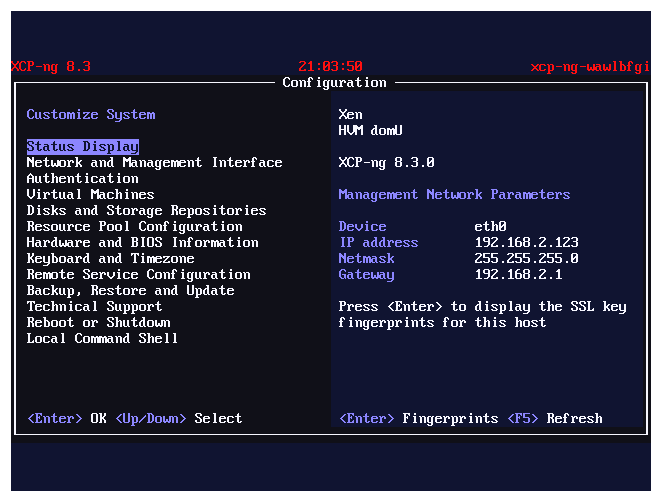
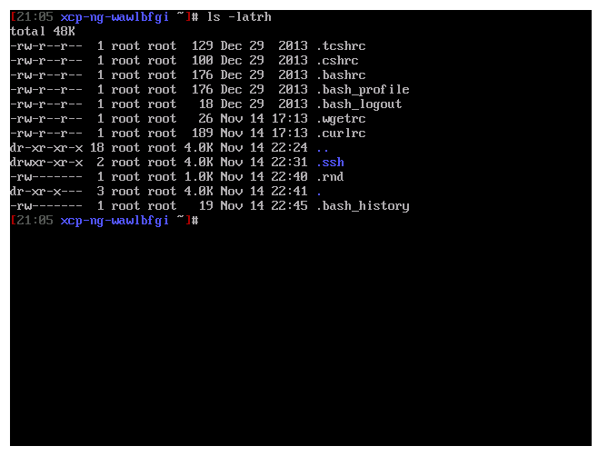
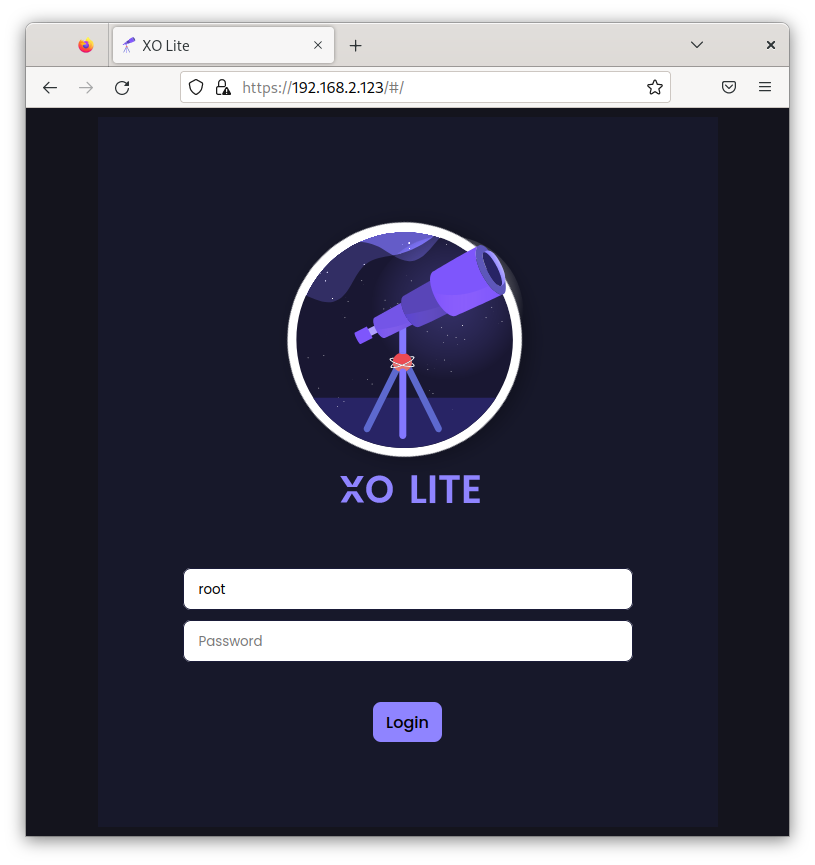
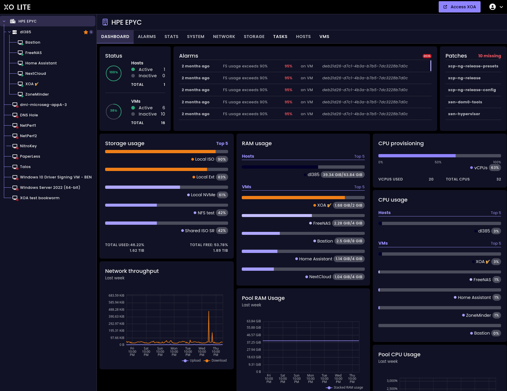
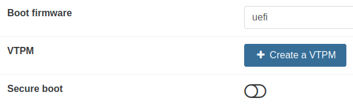
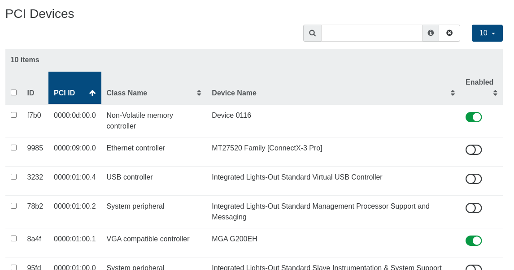
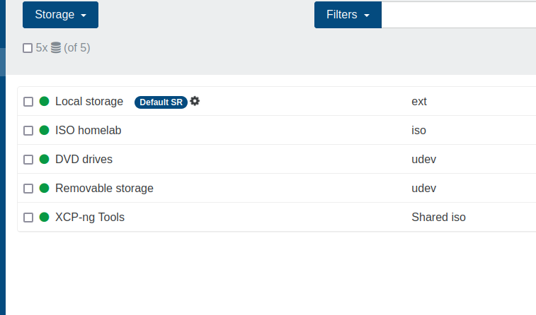
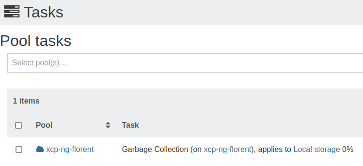

# XCP-ng 8.3 LTS


XCP-ng 8.3 is an [LTS Release](../#-lts-releases). [Download the installation ISO](https://mirrors.xcp-ng.org/isos/8.3/xcp-ng-8.3.0-20250606.iso?https=1).

SHA256 checksums, GPG signatures, and the net-install ISO are available [here](https://xcp-ng.org/#easy-to-install).

:::info
LTS means **Long Term Support**: more information in [this section](../#-lts-releases).
:::

## Structure of the document

* [Release information](#release-information)
* [What's new](#whats-new)
* [Status of XOSTOR in XCP-ng 8.3](#status-of-xostor-in-xcp-ng-83) - A must-read for XOSTOR users.
* [Deprecations and removals](#deprecations-and-removals)
* [Attention points](#attention-points) - Highly recommended read before upgrading.
* [Known issues](#known-issues)

## Release information

For this release, the product lifecycle has changed:
* A longer preview phase, enabling broad user feedback, now ended.
* After the General Availability release, XCP-ng 8.3 continued to receive updates, allowing us to introduce new features while maintaining platform stability through improved testing processes.
* On 2025-06-16, XCP-ng 8.3 transitioned to a Long-Term Support (LTS) release model, with a more conservative approach to updates.

Key details:
* Released on 2024-10-07.
* Partly based on XenServer 8 (which succeeded Citrix Hypervisor 8.2 CU1) + updates.
* Base version of CentOS in the control domain (dom0): 7 + security fixes backported by XCP-ng's Security Team.
* Xen version: 4.17.5 + patches.
* Linux kernel version in the control domain (dom0): 4.19 + patches + additional drivers.
* LTS since 2025-06-16.
* Supported until 2028-11-30.

## Install

See [Installation](../../../installation/install-xcp-ng).

## Upgrade from previous releases

Upgrading to XCP-ng 8.3 is possible from:
- An up-to-date XCP-ng 8.2.1 (recommended)
- XCP-ng 8.0 or 8.1
- A prerelease of XCP-ng 8.3

To upgrade from earlier releases, it is necessary to first upgrade the pool to XCP-ng 8.2.1 before proceeding with the upgrade to XCP-ng 8.3.

:::warning
* Only upgrades using the installation ISO image are supported. An in-place upgrade using `yum` is not possible nor supported.
* Please carefully read these release notes, especially the [Deprecations and Removals](#deprecations-and-removals), [Attention Points](#attention-points), and [Known Issues](#known-issues) sections before performing the upgrade.
:::

Refer to the [Upgrade How-to](../../../installation/upgrade) for the exact upgrade process.

:::note
Users who installed a prerelease of XCP-ng 8.3 must upgrade to the final 8.3.0 version using the installation ISO image. The only exception is for users who installed XCP-ng 8.3 RC2 or have already upgraded to RC2 using the installation ISO image. These users can simply [update their system](../../management/updates) without needing the ISO image.
:::

## What's new

XCP-ng 8.3 is the result of years of development on XCP-ng, XenServer, and common open-source foundations such as the Xen Project.

In order to give credit where it's due, changes primarily carried out by the developers at XenServer are marked with `[XS]`.

Interested readers can also review all blog announcements related to XCP-ng 8.3 published over the last two years. These contain more detailed information than these release notes on specific topics, as well as development stories:
* [XCP-ng 8.3 Alpha](https://xcp-ng.org/blog/2022/11/18/xcp-ng-8-3-alpha/)
* [News about 8.3 Alpha](https://xcp-ng.org/blog/2023/02/27/news-about-8-3-alpha/)
* [XCP-ng 8.3 Beta 1](https://xcp-ng.org/blog/2023/06/22/xcp-ng-8-3-beta-1/)
* [XCP-ng 8.3 Beta 2](https://xcp-ng.org/blog/2024/02/15/xcp-ng-8-3-beta-2/)
* [XCP-ng 8.3 Release Candidate 1](https://xcp-ng.org/blog/2024/07/12/xcp-ng-8-3-release-candidate-1/)
* [XCP-ng 8.3 Release Candidate 2](https://xcp-ng.org/blog/2024/09/17/xcp-ng-8-3-release-candidate-2/)

However, things changed during the development of XCP-ng 8.3, so if you come across anything that contradicts the release notes, trust the release notes.

More changed after the initial release. Check the update announcements on the official blog for further changes brought to XCP-ng 8.3 after the initial release.

### New visual theme

After the release of XCP-ng 8.2.1, Vates' visual identity was updated, and XCP-ng 8.3 is an opportunity to reflect this at the XCP-ng level.

New start and shutdown screens:


New `xsconsole` theme:



New prompt colors:



These are aligned with XO Lite's colors (see below), creating real coherence: you always know where you are and what tools you are using.

### Xen Orchestra Lite (XO Lite)

XO Lite, a work-in-progress web client for XCP-ng, is eventually going to provide all the basic features needed to manage a simple pool of XCP-ng hosts when the full [Xen Orchestra](../../management/manage-at-scale/xo-web-ui/) management Web UI is not yet installed or temporarily unavailable. It is accessible directly by querying XCP-ng's IP address over HTTPS.





Its feature set is currently limited, but we are improving it regularly, and it will automatically fetch the latest version for you in your web browser whenever a new one is available.

### Windows 11 and vTPM support [XS]

As Windows 11 requires a TPM (Trusted Platform Module), developers at XenServer have put a lot of work into using virtualized TPMs (vTPMs), reused or wrote open-source components for vTPM support (virtual TPM), and integrated this support into the Xen API (XAPI). XCP-ng users also benefit from this open-source work.

A vTPM can be created for any UEFI VM in XCP-ng, but since the most common use case is likely running Windows 11, creating a VM using the Windows 11 template automatically triggers the provisioning of a vTPM module for the VM.

:::warning
As of the XCP-ng 8.3 release, Xen Orchestra's incremental backups and incremental replication do not include vTPM data, unlike full backups. We are working on resolving this issue.

**Update:** Xen Orchestra was shortly updated to support it.
:::

:::warning
BitLocker is not officially supported: **it works**, but it involves *Measured Boot*, which is very sensitive to firmware changes. On a hypervisor, **the emulated firmware can be updated at any time** to fix bugs or security issues, causing the Windows VM to ask for the BitLocker recovery password when the VM starts. Use at your own risk!

**Update:** It turns out that enabling Secure Boot alongside BitLocker encryption helps avoid this firmware change detection. That said, it's still too early for us to make any promises about full BitLocker support, so the "Use at your own risk!" warning remains in place. There may still be other scenarios where virtualization requirements and BitLocker could come into conflict.
:::

If you need to manually create a vTPM for a VM, you can from its *Advanced* tab.



### IPv6 support

Tens of upstream contributions over four years, extensive testing, valuable user feedback, and many bug fixes now allow us to offer IPv6 support for XCP-ng 8.3!

IPv6 was already supported for VMs, but IPv4 remained mandatory for the management interface and shared storage.

Now, when you install XCP-ng, you can choose between three modes: IPv6 only, IPv4 only, or IPv4+IPv6 (still experimental). This setting only applies to the control domain, not to VMs, whose networking is handled separately.

Unfortunately, this setting cannot be modified after installation. This means that there is no way to convert an existing installation of XCP-ng at the moment. It is necessary to install from scratch to switch to another mode.

Known issues remain: see [IPv6-related issues](#ipv6-related-issues).

We ensured all mirrors hosting updates for XCP-ng support both IPv4 and IPv6. A big thanks to all the sysadmins who added this support after we informed them of the new requirement!

### Increased limits [XS]

VM limits:
- Virtual CPUs per VM: raised to 64, when the guest OS supports it. At the time of writing, RHEL 8 and derivatives do not support more than 32.

XCP-ng host limits:
- Logical processors per host: raised to 960, depending on CPU support.

### Hardware support

Our Hardware Compatibility List is initially based on [that of XenServer 8](https://hcl.xenserver.com/), excluding hardware requiring proprietary components. We also offer best-effort support for a wider range of hardware, as illustrated below.

#### Consumer-level hardware

Although XCP-ng is primarily targeted at enterprise-grade servers, we are well aware that openness is one of our major strengths. Therefore, we also strive to support popular hardware outside the HCL, typically found in home labs or small companies.

With help from our user community, we improved support for recent consumer-level devices such as the popular Intel NUC and 2.5G network devices, commonly found in this hardware category. With the igc and r8125 drivers, we now cover Intel i225 (including close variants) and the RTL8125 family from Realtek.

This may seem like old news since this work was retrofitted to XCP-ng 8.2.1's latest refreshed installation ISO, but it was initially done for XCP-ng 8.3.

Other hardware drivers have also been updated.

#### 4K native disks

Another change backported to XCP-ng 8.2.1 is support for 4K native disks.

We added a new `largeblock` storage driver, which is a local SR driver that works around the current limitation in our storage stack with 4K native devices by transparently emulating a 512B block size (with some performance cost, of course).

### Guest UEFI Secure Boot

In XCP-ng 8.2.1, we introduced Secure Boot support for VMs, based on a reimplementation of XenServer's `varstored` (which was not open source at the time) called `uefistored`.

XenServer has since open-sourced `varstored`, and we decided to switch to it to avoid duplicating efforts (it was a tough decision given the work put into `uefistored`).

Later, XenServer implemented changes in XAPI related to how UEFI certificates were stored and updated at the pool level, which would have caused regressions for XCP-ng users (despite the fact that they had attempted to take our needs into account, and consulted with us, which we appreciated). So we proposed and then implemented changes which retained the behaviour wanted by XenServer, while at the same time enabling us to offer a bigger flexibility to our users.

As a result, Guest UEFI Secure Boot is handled slightly differently in XCP-ng 8.3 compared to XCP-ng 8.2.1, and you will need to set up Secure Boot for your pools again after upgrading to XCP-ng 8.3. The process is simple: just run `secureboot-certs install`, but it needs to be done manually.

Here’s how it works now. Although it may seem a bit convoluted, it balances various constraints while ensuring usability:

- For Secure Boot to be available to UEFI VMs in a pool, UEFI certificates need to be installed once.
- VMs get their copy of the certificates from the pool the first time they boot and are not updated by XCP-ng afterward.
- An unfortunate consequence is that some VMs booted before the certificates were installed on the pool, or imported from another pool where certificates were missing, will not be ready for Secure Boot.

However, we expanded XAPI's features and collaborated with Xen Orchestra developers to offer the following helpers:

- A warning when attempting to enable Secure Boot on a pool that is not ready for it.
- Auto-detection of a VM's Secure Boot readiness when users want to enable it.
- A big button to propagate the pool's certificates to a VM's UEFI variable store if the certificates are missing for that VM, and thus make it Secure Boot ready.
- Plus, links to our extensive [Guest UEFI Secure Boot guide](../guides/guest-UEFI-Secure-Boot.md) are provided in the user interface where needed.

We also fixed an issue — reported by one of our testers — that caused all UEFI VMs to fail on some specific hardware, and we sent the patch to XenServer developers.

### Certificate verification [XS]

While hosts within a pool are supposed to communicate over a secure, dedicated management network, the risk of a Man-in-the-Middle attack is never zero. To fully protect pools, XenServer developers added the *Certificate Verification* feature. This ensures that "all TLS communication endpoints use certificates to validate the identity of their peers before transmitting confidential information." (Quoting XenServer documentation.)

:::note
The feature is enabled for new installations but not enforced on upgraded pools. We strongly advise enabling it after the upgrade.

Enable it with: `xe pool-enable-tls-verification`.
:::

:::warning
If you don't enable it after an upgrade, you may encounter situations where you try to add a new, freshly installed host to a pool, and it fails due to `POOL_JOINING_HOST_TLS_VERIFICATION_MISMATCH`. This happens because the new host needs to verify the identity of its peers, but the pool doesn't support it yet. To resolve this, enable TLS verification on the pool.
:::

More about this feature can be found [in XenServer's documentation](https://docs.xenserver.com/en-us/xenserver/8/hosts-pools/certificate-verification).

### OpenSSH, security, ciphers, and user configuration

Accepted ciphers, keys and algorithms used to be defined in `/etc/sshd_config` and `/etc/ssh_config`. Whenever we wanted to update them, we had to choose between potentially overwriting user modifications to these files, and not updating them (actually we had a middle ground where we attempted to patch just the relevant lines, but success was not guaranteed).

Now it's simpler:
- We define the accepted ciphers, keys, and algorithms directly at OpenSSH build time.
- As long as users do not define settings that take precedence, we use our built-in defaults. To update them, we just publish a new build.
- Users who choose to modify their SSH configuration will need to maintain these settings themselves, as any updates provided by our Security Team through new builds will be overridden by user-defined settings.

### Restricted use of port 80 [XS]

To enhance security, it is now possible to close TCP port 80 on the management interface. By default, port 80 remains open for specific clients that may still require it, but all internal connections now utilize HTTPS. Previously, VM migration occurred over port 80, but this has been updated.

To close port 80, run the following command:
```
xe pool-param-set uuid=<pool-uuid> https-only=true
```

### Improvements in the installer

Two years ago, development around XenServer's (and XCP-ng's) installer [was opened](https://github.com/xenserver/host-installer), allowing us to introduce several improvements and fixes (while previously we could modify the installer, contributing upstream reduces the long-term maintenance burden of divergence between our version and theirs).

However, despite good intentions on both sides, not every change we submitted was accepted, and the XS image-creation process is still not open, leading to some remaining divergences. Unfortunately, some improvements we developed couldn’t be included in XCP-ng 8.3 as they would have caused significant differences with the upstream base (keeping large patches up to date as the base code evolves is not sustainable).

Key improvements made to the installer include:
- `memtest86+` has been updated to version 6 with EFI support.
- The `xen-pciback.hide` boot parameter (useful for PCI passthrough) will now persist when upgrading XCP-ng (merged upstream).
- The default SR type now defaults to `ext`, and users are presented with radio buttons instead of a checkbox for the choice (not contributed upstream as it’s irrelevant for XenServer).
- The "Do you want to install any supplemental packs?" dialog was removed at the end of installation (submitted upstream to make it optional, so we can disable it while maintaining upstream consistency). Exception: it still appears if a driver disk was loaded during installation.
- The primary disk selection screen always appears, even if only one disk is available. Previously, if only one disk met the prerequisites, the screen was skipped, leading users to mistake the Local SR creation screen for the primary disk selection (merged upstream).
- Better error message granularity when installations fail due to incorrect system dates, signature issues, etc. (merged upstream).
- Improved robustness when installing on used disks that contain ZFS metadata.
- Earlier warnings if attempting to upgrade a system with a different BIOS type (Legacy BIOS vs. UEFI), preventing issues later in the process.
- The installer now blocks upgrades if the host's certificate key length is less than 2048 bits. See [Host certificate key too small prevents upgrade](#host-certificate-key-too-small-prevents-upgrade).
- IPv6 support was added. Although not accepted upstream yet, it was important enough to retain in XCP-ng's installer version, with hopes that XenServer developers will review it in the future.
- Various bugfixes.

Our contribution was not (yet?) accepted for:
- LACP bond creation from the installer.
- Improved handling of existing software RAIDs.

We redesigned the image-creation process to [use a brand new set of scripts](https://github.com/xcp-ng/create-install-image/) - here again, this effort which started for 8.3 was already put to good use last year with XCP-ng 8.2.1's latest refreshed installation ISOs. Users willing to customize the installation images also have a more light-weight option, with our [iso-remaster script](https://github.com/xcp-ng/xcp/tree/master/scripts/iso-remaster). And those facing a missing hardware driver at installation time will also have the option of [producing a Driver Disk](https://github.com/xcp-ng/driver-disks) to complement a pristine installation image.

### VM anti-affinity [XS]

XenServer added a new feature which allows to constitute anti-affinity VM groups, meaning that you would like to avoid VMs to be started, or evacuated from another host, towards a host where another VM of the same group already runs.

For more information, refer to [XenServer's documentation](https://docs.xenserver.com/en-us/xenserver/8/vms/placement).

### PCI passthrough support in the API

We expanded the XAPI API by adding endpoints to manage PCI passthrough devices. Xen Orchestra developers added corresponding UI elements, enabling users to add or remove devices from the passthrough list. After a reboot of the host, these devices are released by dom0 (the control domain) and become available for assignment to VMs.



### Custom multipath configuration

Already backported to XCP-ng 8.2.1, we’ve provided a clean way for users and vendors to define custom multipath configurations without modifying the default setup.

There have been various guides online, user or vendor habits, and even Citrix Hypervisor’s official documentation (until we pointed it out), suggesting that you should modify `/etc/multipath.conf` to adapt to your setup. This approach was incorrect and caused issues when updates were made to that file to add support for new hardware.

The correct method for adding custom multipath configurations is by creating a file in `/etc/multipath/conf.d/`. However, this wasn’t documented, and the directory wasn’t created by default, before we made the change.

To address these issues, we contributed changes to Citrix Hypervisor/XenServer developers, which were accepted.

Here's what changes:
- A warning is now added at the top of `/etc/multipath.conf`, instructing users not to edit it and directing them to use `/etc/multipath/conf.d/` instead.
- The `/etc/multipath/conf.d/` directory is created by default.
- A ready-to-modify `/etc/multipath/conf.d/custom.conf` file is included. As noted inside the file, it will even be preserved during upgrades to future XCP-ng versions.
- Any changes made to the default `/etc/multipath.conf` will be overwritten by future updates to the file.

### Network selection for the Host Evacuate feature

Previously, the Host Evacuate feature (which moves all VMs off a host for maintenance) always selected the management interface for live migration. We enhanced XAPI to allow users to choose a different network for migration, offering the option of using faster, more suitable network links. Xen Orchestra’s user interface now reflects this option.

### VM snapshot with disk exclusion

A long-requested feature, VM snapshots with disk exclusion, is now available. Users can exclude specific disks (e.g., a raw or large irrelevant disk) from snapshots to save space.

This feature was enabled through API enhancements and is already functional in the current stable version of Xen Orchestra. This is implemented as the `[NOBAK]` feature, which conveniently excludes a virtual disk from backups. Additionally, we’ve introduced a new string, `[NOSNAP]`, which allows you to ignore the disk during regular snapshots. You can combine both strings to exclude a disk from both VM snapshots and VM backups: `[NOSNAP] [NOBAK]`.

### Enhanced coalesce detection [XS + Xen Orchestra]

Thanks to improvements in the storage API reporting, Xen Orchestra can now display more details, such as whether an SR is performing a coalesce operation (Gear⚙️ icon).



It also shows the coalesce progress percentage within the task view.



### Migration stream compression [XS + Xen Orchestra]

For environments with slow network connections between hosts, you can now enable compression on the migration stream during live VM migrations. This feature, already available in Xen Orchestra, uses additional resources on the involved hosts, but can significantly speed up the migration process if your network bandwidth is limited. However, since the effectiveness of this feature can vary, we recommend testing it in your environment before deciding to keep it enabled.


### `host.evacuate` max limit

When you put a host into "maintenance mode" in Xen Orchestra (or during a Rolling Pool Update), it triggers the `host.evacuate` XAPI method in XCP-ng. This initiates the live migration of all VMs from the host to other available hosts in the pool, migrating up to 10 VMs at once to expedite the process.

However, if your storage or host is already under heavy load, this can impact the "freeze" time of a VM during the migration. In particularly crowded or noisy environments, a VM may be paused for as long as 30 seconds, which is significantly longer than the usual few hundred milliseconds in normal conditions. There is a workaround that involves modifying XAPI's configuration to reduce the number of concurrent migrations, but this requires changes on all hosts and isn't a permanent solution. We wanted something more integrated!

To address this, we enhanced the XAPI method with an optional "batch size" parameter:

https://github.com/xapi-project/xen-api/pull/5203

Thanks to the responsiveness of the XAPI team, this modification was merged quickly. But it doesn't stop there! Now that the method has this optional parameter, Xen Orchestra also uses it, with a default concurrency of 3. This strikes a balance between migration speed and reducing VM pause time during live migrations, and it doesn't require changing any default configuration on your hosts.

This feature highlights the advantage of Vates delivering the entire stack: when we modify the host API (XCP-ng), we can immediately apply and leverage the improvements in Xen Orchestra as well!

### Dynamic Memory Control

Although no changes were made to the Dynamic Memory Control feature (which allows defining minimum and maximum RAM limits for VMs), it’s worth noting that this feature had initially been flagged for removal by XenServer but was retained after reconsideration.

However, this feature has known flaws, so we recommend against using it unless absolutely necessary. Additionally, setting the dynamic minimum limit too low can cause VMs to crash when the hypervisor requests RAM that the VM needs. Improvements in this area are still necessary.

### Other changes

- Almost all Python components have been ported to Python 3.
- VLAN display support has been added to `xsconsole` (contributed upstream to the XAPI project).
- `smartmontools` was updated to version 7, adding JSON export. We also added a XAPI plugin used by Xen Orchestra to display disk status.
- Updated guest templates, including two new generic Linux templates (BIOS and UEFI).
- The web server provided by XAPI now reports the correct MIME type for SVG (and other) files, a requirement for XO Lite.
- IPv6 support for VM network booting [XS].
- Numerous under-the-hood changes and fixes.

We've also invested heavily in test automation to improve coverage. Nevertheless, feedback from our user community remains invaluable (and really was during all the development of XCP-ng 8.3!).

### Additional packages updated or added

[Additional packages](../../management/additional-packages) are packages made available by the XCP-ng team directly in our RPM repositories, for easy installation and update on XCP-ng hosts.

- [Alternate kernel](../../installation/hardware#-alternate-kernel) updated to version 4.19.316 (as of XCP-ng 8.3 release).
- New [alternate driver packages](../../installation/hardware#-alternate-drivers): `intel-i40e-alt`, `intel-ice-alt`, `tg3-module-alt`, and `mlx4-modules-alt`. Various other alternate driver packages were also updated. See [XCP-ng Drivers](https://github.com/xcp-ng/xcp/wiki/Drivers).
- `zfs` updated to version 2.1.15. ⚠️ Existing ZFS pools may need to be upgraded using `zpool upgrade`. Check ZFS documentation.
- `netdata` updated to version 1.44.3.
- `lsscsi` added to the XCP-ng repositories.

## Status of XOSTOR in XCP-ng 8.3

As of the initial release, XOSTOR (our hyperconverged storage solution based on LINSTOR) was available in XCP-ng 8.3 but was still considered **beta**.

Since 2025-06-16, XOSTOR is officially supported on XCP-ng 8.3, as long as it is up to date.

A [specific upgrade process](../../xostor/#upgrade) is available for pools running XCP-ng 8.2.1 with XOSTOR.

## Deprecations and removals

### PV virtualization mode

The old `PV` (paravirtualized) virtualization mode is now completely removed.

Official support for PV guests stopped with the release of XCP-ng 8.1, on 2020-03-31, but 64-bit PV guests still ran on XCP-ng 8.2.1 despite the deprecation.

In XCP-ng 8.3, they won't run at all.

If you still have PV guests, you need to convert them to HVM, and fix the bootloader because the boot process differs between PV and HVM.

[This blog post](https://xcp-ng.org/blog/2022/01/17/removing-support-for-32-bit-pv-guests/) from early 2022 when we announced the removal of 32-bit PV support may still contain information useful for users needing to make the transition.

### Legacy partitioning layout

XCP-ng 8.3 doesn't support the old partition layout where the system partition only took 4 GB on disk, and GPT partitioning is now mandatory. If you need to upgrade a pool whose hosts still use this partitioning scheme, what to do depends on the exact situation.

* If the partitioning type is GPT, see [using the new partitions](../../installation/upgrade/#using-the-new-partitions).
* If the partitioning type is MBR, a fresh installation is necessary. The presence of a Dell Utility Partition also prevents upgrading (and is usually coupled with an MBR partitioning type).

### Support for Older Operating Systems

Operating systems that have reached their End of Life (EOL) are no longer supported.

This doesn't mean they can't run, but:

* We no longer provide templates for them.
* Future changes to XCP-ng might cause them to stop running.
* Future updates to the PV drivers and VM management agents ("guest tools") may render them incompatible.

Key operating systems that are no longer supported:

* Windows Server 2012 R2
* 32-bit Windows 10
* 32-bit Debian Bullseye 11

### Nested virtualization (though not on purpose)

**Update:**  Nested virtualization is back in XCP-ng 8.3. It remains flawed and comes with no guarantees, but it is now at the same level as it was in XCP-ng 8.2.

Full support for nested virtualization still requires significant further development.

Former notes, from the initial 8.3 release:

> Upgrading Xen from version 4.13 to version 4.17 had a lot of benefits, but it came with one potential drawback: nested virtualization, which had always been experimental, unsupported and insecure (risks for the host), but was at least somewhat working in some useful situations (such as testing XCP-ng inside XCP-ng), is now entirely non-functional due to fundamental changes in the codebase.
>
> What needs to be done in the codebase for proper nested virtualization support was explained to the Xen developer community during XenSummit by Georges Dunlap ([part 1](https://youtu.be/8jKGYY1Bi_o) and [part 2](https://youtu.be/3MxWvVTmY1s) on Youtube), but it's not a small task, so we don't know at the moment when nested virtualization will be fully implemented. We'll keep you posted on our blog. If you really need it in its previous incomplete state and still want to use it despite its unsupported status and the security implications, stay on XCP-ng 8.2 for now.

### AMD MxGPU driver

The `mxgpu` third-party RPM by AMD, which allowed the use of the vGPU features of the S7150-X2 GPUs in XenServer and XCP-ng, is not maintained anymore. It might still work on XCP-ng 8.3 by chance because the kernel ABI hasn't changed much, but it's also possible it doesn't work anymore (we don't have the hardware to test it).

In any case, as soon as the Linux kernel is updated to something newer in XCP-ng 8.3 — and this might happen — the driver would become unusable.

In case you still want to try it, see [this forum thread](https://xcp-ng.org/forum/topic/5932/vgpu-amd-mxgpu-iso-nowhere-to-find).

### GlusterFS untested

A while ago, we added GlusterFS to our repositories, as well as GlusterFS SR drivers. They are still present, but we don't test GlusterFS thoroughly. It might still be useful in some use cases despite its low performance in XCP-ng's VM virtualization context, but users need to be aware that there may be bugs or security vulnerabilities.

### Legacy BIOS

Legacy BIOS boot mode is now deprecated in XCP-ng 8.3. Right now, there are no direct consequences, but you will see a warning at installation time, and it may become impossible to upgrade to later versions of XCP-ng (which version and when is not decided yet. It could be the next one, or a later one).

:::warning
Converting an existing Legacy BIOS installation of XCP-ng into a UEFI one is not supported currently. Do not attempt to upgrade after switching the BIOS mode in your server's firmware. At the moment, the only way to change the mode is by performing a fresh installation.
:::

### Active Directory in XCP-ng

So here it's not really a removal. XenServer replaced the component used for Active Directory support, `pbis`, by `winbind`. However, the script handling the transition is kept proprietary by XenServer, so we couldn't embed it into XCP-ng. This means it's likely that an existing setup would break after an upgrade and need to be done again. In any case, we have never been fans of this way to leverage Active Directory directly inside XCP-ng. We strongly advise relying on Xen Orchestra to manage users (which is AD and OpenLDAP compatible) and leave your host far from this.

### Removal of the old experimental `ext4` SR driver

We deleted the old, unsupported since XCP-ng 8.1, experimental EXT4 driver, superseded by the regular EXT driver (which also uses `ext4`). We're talking about an old experimental driver that you never used unless you installed the experimental packages in the XCP-ng 7.x era, so this removal is painless for the vast majority of XCP-ng users, if not all!

## Attention points

Important changes or adjustments that may affect how you use the product. Be sure to review these to avoid unexpected behavior.

### Host certificate key too small prevents upgrade

Hosts initially installed with a version of XenServer or XCP-ng less than 8.0, by default, have a host TLS certificate whose key length is only 1024. In XCP-ng 8.3, the `stunnel` services, which handle TLS protocols, require a key length of at least 2048 bit. A key that's too small causes communication failures, making it impossible for the host to communicate with other hosts in the pool or external clients such as Xen Orchestra or XO Lite.

To prevent this situation after an upgrade:
1. We added this warning.
2. The installer will refuse to upgrade if the detected key length is too small.
3. Xen Orchestra developers have added a visible warning to make users aware of the issue before attempting any upgrade to XCP-ng 8.3. If applicable, the warning is displayed next to the host name in the Hosts view.

If you've never installed custom host certificates, then you are likely using the default self-signed certificate XCP-ng generates the first time it is installed. In this case, you can generate a new one, from XCP-ng 8.2.1, with the command `xe host-emergency-reset-server-certificate` on the host.

You can validate your existing and new certificates with `openssl x509 -text -noout -in /etc/xensource/xapi-ssl.pem | grep Public-Key`. Running this will either output `1024` which has been depreciated or `2048` which is supported for XCP-ng 8.3.X. 

In some rare scenario's you may have very a very old version of XCP-ng still installed in a backup file on your system, please open a ticket with support if this is the case. Alternative, you may need to perform a fresh installation of XCP-ng erasing all configuration on a given host. 

On the other hand, if you installed a custom host certificate and its key is too small, you will need to generate a new one on your side and install it the same way you installed the first one.

This must be done on every host of the pool, one after the other.

### XOSTOR and XCP-ng 8.3

See [Status of XOSTOR in XCP-ng 8.3](#status-of-xostor-in-xcp-ng-83).

### PV VMs cannot be live migrated to an 8.3 host

As a consequence of the complete [removal of PV support](#pv-virtualization-mode), any PV VM still running on XCP-ng 8.2.1 will fail to migrate during a pool upgrade when VMs are evacuated from an 8.2.1 host to an 8.3 host that was just upgraded.

The error message will not be very helpful, mentioning "shadow paging". What it really means is that it's impossible to run a VM in PV mode.

Note: we still use paravirtualized (PV) drivers in HVM guests, so the old PV mode still has a legacy. But the original, old, PV mode itself is now history.

### "TLS verification feature mismatch" when adding a host to an upgraded pool

As described in [Certificate verification](#certificate-verification-xs), an upgraded pool doesn’t enable TLS verification by default, while new hosts are installed with TLS verification enabled. This mismatch causes pool join operations to fail until TLS verification is enabled on the upgraded pool.

### A UEFI VM started once on XCP-ng 8.3 can't start if moved back to XCP-ng 8.2.1

In theory, you can't move a VM to an earlier version of XCP-ng. However, there are situations where it is useful, and Xen Orchestra’s warm migration feature can help bypass restrictions.

This time, though, there's an additional difficulty: the format in which the NVRAM store of a UEFI VM is stored changed in XCP-ng 8.3. Once a VM has booted on it, it becomes incompatible with XCP-ng 8.2. Symptoms: an unbootable VM with the following error: `FAILED_TO_START_EMULATOR(OpaqueRef:[...], varstored, Daemon exited unexpectedly)`.

There’s a workaround: delete all EFI variables from the VM. In many cases, this is enough to recover. In some cases, this causes the loss of data needed to boot, requiring bootloader fixes with a virtual live CD/DVD. Debian, in particular, can be harder to recover, possibly due to its stricter application of UEFI standards.

To delete the EFI variables of a VM (after a backup!), run this on a host in the pool: `xe vm-param-remove uuid=<vm-uuid> param-name=NVRAM param-key=EFI-variables`.

You will also need to disable Secure Boot in the VM settings if it was enforced.

### PBIS to winbind transition not automated for Active Directory settings

See [Active Directory in XCP-ng](#active-directory-in-xcp-ng).

## Known issues

### IPv6-related issues

With all the IPv4-only assumptions embedded in the code of various components, adding IPv6 support was a challenging task, but we managed to make it work. However, there are still some rough edges. We already have internal fixes for several of these issues, and they'll be released shortly.

- Using IPv4 and IPv6 simultaneously ("dual stack") remains experimental and will be further stabilized through future updates.
- When both IPv6 and a VLAN are configured for the management interface, the IP configuration may be lost after a reboot. A fix will be released shortly after the initial release.
- Disabling port 80 doesn't work with IPv6 configurations on the management interface, as it currently only blocks IPv4 traffic. A fix will follow soon after the release.
- Performing an emergency network restart reverts the configuration to IPv4 + DHCP instead of retaining IPv6 settings. This will also be fixed shortly after the release.
- Ejecting a host from a pool causes it to fall back to IPv4 + DHCP, instead of maintaining its IPv6 configuration. A fix is coming soon.
- DHCPv6 support is still incomplete.
- Manually configured DNS settings can be overwritten by autoconf.

### Pool metadata backup temporarily unavailable from console

The metadata backup and restore feature, previously available from the host console, was removed due to a vulnerability and could not be restored before the initial release of XCP-ng 8.3. It will be (or has been, depending on when you read this) added back in a future update.

Meanwhile, the feature is still available through Xen Orchestra.

### Known issues from XenServer 8

Though not all issues from XenServer 8 apply to XCP-ng 8.3, some of the information and tips provided in [XenServer 8's Known Issues](https://docs.xenserver.com/en-us/xenserver/8/whats-new/known-issues) might still be useful for certain scenarios.

### Cross-pool live migration from XenServer < 7.1

Live migrating a VM from an older XenServer version can sometimes result in errors, leading to the following consequences:
* The VM may reboot.
* The VM may get duplicated, meaning the same VM UUID (and usually its VDIs too) will appear both on the sender and receiver host. In such a case, you'll need to remove the duplicate from the receiver host.

It would require a hotfix to the old XenServer, but since those versions are no longer supported, XenServer won't be developing one. If you need to migrate from such old host, you should rely on [Xen Orchestra warm migration feature](https://xen-orchestra.com/blog/warm-migration-with-xen-orchestra/).
