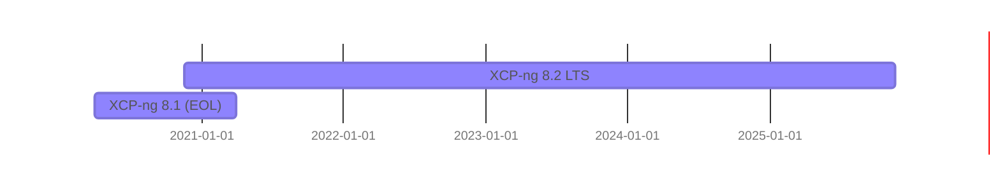

# Releases

## XCP-ng Release History

| Version                   | Released   | Status               | Support until                                | Release notes                        |
| ---                       | ---        | ---                  | ---                                          | ---                                  |
| [8.3](release-8-3.md)     | 2024-10-07 | Full support         | 2028-11-30                                   | [8.3 Release notes](release-8-3.md)  |
| [8.2 LTS](release-8-2.md) | **8.2.0**:&nbsp;2020-11-18 **8.2.1**:&nbsp;2022-02-28 | Full support, LTS    | 2025-06-25                                   | [8.2 Release notes](release-8-2.md)  |
| [8.1](release-8-1.md)     | 2020-03-31 | EOL                  | 2021-03-31                                   | [8.1 Release notes](release-8-1.md)  |
| 8.0                       | 2019-07-25 | EOL                  | 2020-11-13                                   |                                      |
| 7.6                       | 2018-10-31 | EOL                  | 2020-03-30                                   |                                      |
| 7.5                       | 2018-08-10 | EOL                  | 2019-07-25                                   |                                      |
| 7.4                       | 2018-03-31 | EOL                  | 2018-10-31                                   |                                      |

## 🟢 LTS Releases

*Latest LTS: [XCP-ng 8.2](release-8-2.md)*

Using the Long Term Support version is recommended if:

* you want to ensure system stability
* you prefer receiving security fixes without needing to perform major upgrades annually
* you need a predictable migration path over a longer timeframe
* you are not concerned about missing new features for a few years

LTS releases are supported for up to 5 years:

If you prefer to get the latest improvements, go for our [latest release](#latest-releases).

## 🟡 Standard Release

*Latest: [XCP-ng 8.3](release-8-3.md)*

Using the standard release is recommended if:

* you want access to the latest features and enhancements
* you need support for the newest hardware
* you want to benefit from improved performance
* you don't mind upgrading approximately twice a year

Standard releases are supported until the next release, plus a few additional months to allow time for transitioning. Check the support dates [in the table above](#xcp-ng-release-history).

If you prefer a more conservative approach, consider choosing our [LTS release](#lts-releases).

:::note
XCP-ng 8.3 is special in the following ways:
* After the General Availability release, XCP-ng 8.3 will continue to receive updates, allowing us to introduce new features while maintaining platform stability through improved testing processes.
* Over time, XCP-ng 8.3 will transition to a Long-Term Support (LTS) release, where only bug fixes and security patches will be applied, ensuring maximum stability.
:::

## 🔴 Pre Releases

Using a pre-release is relevant only for testing purposes. Check [the `Release` tag on our blog](https://xcp-ng.org/blog/tag/release/) for (pre-)release announcements.

:::warning
### Important Note on Pre-Releases

Pre-releases are designed for testing before final General Availability. Although generally stable, they are **NOT SUITABLE FOR PRODUCTION USE**. Key considerations include:

* Security Patches: Pre-releases may not receive urgent security updates as promptly as production-grade releases.
* Commercial Support: Vates does not offer commercial support for pre-releases until they are officially finalized.

For these reasons, pre-releases should be used strictly for testing.
:::