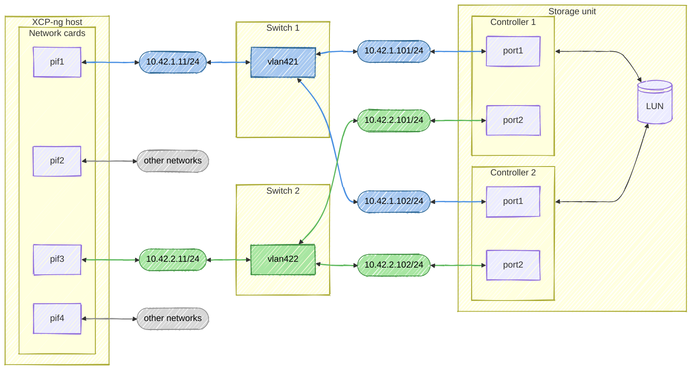
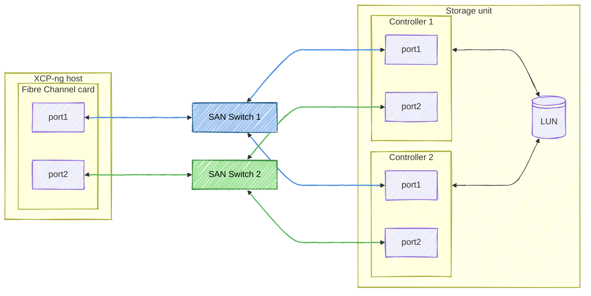

# Multipathing

How to properly setup new SR with multipathing on Xen Orchestra and XCP-ng.

:::warning
Do not attempt to enable multipathing on a production pool with existing and active iSCSI and/or HBA and/or FC SRs.
:::

## iSCSI

### Requirements
* Four different network interfaces (we recommend using two separate network cards)
* Dedicated network interfaces without VLAN tagging on XCP-ng host and storage unit
* All network interfaces to the hosts and storage unit **must be set to "STP portEdge"** on the network equipment
* Two different switches (not stacked) **without Spaning-Tree**
* Spanning-tree must be disabled on the switches
* Two VLANs **without L3 routing**
* Two IPv4 subnets **without L3 routing**
* Multiple targets per LUN on your storage unit
* iSCSI target ports are operating in portal mode

:::info
If the storage vendor recommends using Jumbo Frames, you will need to implement them.

Since each architecture is unique, feel free to check with the storage vendor if it’s possible to stay with an MTU of 1500 (e.g., using storage dedicated PIF at 10Gb/s or 25Gb/s).
:::

:::warning
1. Make sure you do not use bond-type network interfaces on the host and on the storage unit for iSCSI interfaces.
2. Make sure you do not configure network routes on iSCSI interfaces.
:::

### Target architecture

#### Configuration example
| Path | Vlan | Subnet | Host PIF address | Storage Controller 1 address | Storage Controller 2 address |
| :---: | :---: | :---: | :---: | :---: | :---: |
| 🔵 | 421 | 10.42.1.0/24 | 10.42.1.11 | 10.42.1.101 | 10.42.1.102 |
| 🟢 | 422 | 10.42.2.0/24 | 10.42.2.11 | 10.42.2.101 | 10.42.2.102 |

#### Target architecture diagram

```mermaid
---
config:
  look: handDrawn
  theme: default
---
flowchart LR
  classDef blueNode fill:#A7C8F0,stroke:#2C6693,color:#000000;
  classDef greenNode fill:#A8E6A2,stroke:#3E8E41,color:#000000;
  classDef grayNode fill:#D6D6D6,stroke:#8C8C8C,color:#000000;

  subgraph server[XCP-ng host]
    direction LR
    subgraph Card1[Network cards]
        direction RL
        card1pif1[pif1]
        card1pif2[pif2]
        card2pif1[pif4]
        card2pif2[pif3]
    end
  end
  subgraph Switch 2
    vlan422[vlan422]:::greenNode
  end
  subgraph Switch 1
    vlan421[vlan421]:::blueNode
  end
  subgraph storage[Storage unit]
  direction LR
    subgraph ctrl2[Controller 2]
        direction RL
        ctrl2-port1[port1]
        ctrl2-port2[port2]
    end
    subgraph ctrl1[Controller 1]
        direction RL
        ctrl1-port1[port1]
        ctrl1-port2[port2]
    end
    lun1@{ shape: lin-cyl, label: "LUN" }

  end

  card1-pif1-ip([10.42.1.11/24]):::blueNode
  card1-pif2-ip([other networks]):::grayNode
  card2-pif2-ip([10.42.2.11/24]):::greenNode
  card2-pif1-ip([other networks]):::grayNode
  ctrl1-port1-ip([10.42.1.101/24]):::blueNode
  ctrl1-port2-ip([10.42.2.101/24]):::greenNode
  ctrl2-port1-ip([10.42.1.102/24]):::blueNode
  ctrl2-port2-ip([10.42.2.102/24]):::greenNode

  card1pif1<-->card1-pif1-ip
  card1-pif1-ip<-->vlan421
  vlan421<-->ctrl1-port1-ip
  ctrl1-port1-ip<-->ctrl1-port1
  vlan421<-->ctrl2-port1-ip
  ctrl2-port1-ip<-->ctrl2-port1

  card2pif2<-->card2-pif2-ip
  card2-pif2-ip<-->vlan422
  vlan422<-->ctrl1-port2-ip
  ctrl1-port2-ip<-->ctrl1-port2
  vlan422<-->ctrl2-port2-ip
  ctrl2-port2-ip<-->ctrl2-port2

  card1pif2<-->card1-pif2-ip
  card2pif1<-->card2-pif1-ip
  ctrl1 <----> lun1
  ctrl2 <----> lun1

linkStyle 0 stroke:#4A90E2,stroke-width:2px;
linkStyle 1 stroke:#4A90E2,stroke-width:2px;
linkStyle 2 stroke:#4A90E2,stroke-width:2px;
linkStyle 3 stroke:#4A90E2,stroke-width:2px;
linkStyle 4 stroke:#4A90E2,stroke-width:2px;
linkStyle 5 stroke:#4A90E2,stroke-width:2px;

linkStyle 6 stroke:#5CB85C,stroke-width:2px;
linkStyle 7 stroke:#5CB85C,stroke-width:2px;
linkStyle 8 stroke:#5CB85C,stroke-width:2px;
linkStyle 9 stroke:#5CB85C,stroke-width:2px;
linkStyle 10 stroke:#5CB85C,stroke-width:2px;
linkStyle 11 stroke:#5CB85C,stroke-width:2px;

linkStyle 12 stroke:#8C8C8C,stroke-width:2px;
linkStyle 13 stroke:#8C8C8C,stroke-width:2px;
```

### Operating procedure

#### 1. Prepare XCP-ng hosts
1. On one of the host servers, make sure that the multipath.conf configuration includes your storage equipment.
   
   This can be found in the file `/etc/multipath.xenserver/multipath.conf`
2. If your equipment is not present, ask the manufacturer for the multipath configuration for GNU/Linux otherwise move on to the [next step (Prepare the pool)](../../storage/multipathing/#2-prepare-the-pool)
   
   Add it to the file ```/etc/multipath/conf.d/custom.conf```

   For exemple:
   ```
   devices {

     # Configuration for ACME CORP UltraSAN
     # This is an example of syntax; do not use it in production.
     device {
        vendor  "ACME"
        product "UltraSAN"
        path_selector "service-time 0"
        path_grouping_policy group_by_prio
        prio alua
        features "1 queue_if_no_path"
        hardware_handler "1 alua"
        failback immediate
        rr_weight uniform
        rr_min_io 100
        no_path_retry 10
     }
   }
   ```

   :::info
   In this case, the configuration will be kept after updates.
   :::
   
3. If necessary, migrate the VMs active on the XCP-ng host in question to another one
4. Reboot the current XCP-ng host on the affected pool
5. Do the same for all servers in the pool

#### 2. Prepare the pool
Make sure that multipathing is enabled on the pool. To do this, go to the advanced configuration of the pool

If this is not the case:
1. Make sure there are **no VMs running** on an iSCSI and/or HBA SR in the pool
2. Activate "Enable multipathing for all hosts"

#### 3. Configure the SR
Proceed with the iSCSI SR configuration as indicated in the [storage documentation](../../storage/#iscsi).

## Fibre Channel (HBA)
### Requirements
* Check that the Fibre Channel cards model(s) is supported via the HCL
* Two different Fibre Channel ports (You can also have multiple cards if you want)
* Two different SAN switches
* Multiple targets per LUN on your storage unit
* Zoning performed

:::warning
Make sure not to mix Fibre Channel speeds.
:::

### Target architecture
#### Target architecture diagram

```mermaid
---
config:
  look: handDrawn
  theme: default
---
flowchart LR
  classDef blueNode fill:#A7C8F0,stroke:#2C6693,color:#000000;
  classDef greenNode fill:#A8E6A2,stroke:#3E8E41,color:#000000;
  classDef grayNode fill:#D6D6D6,stroke:#8C8C8C,color:#000000;

  subgraph server[XCP-ng host]
    direction LR
    subgraph Card1[Fibre Channel card]
        direction RL
        card1port1[port1]
        card1port2[port2]
    end
  end

  subgraph storage[Storage unit]
  direction LR
    subgraph ctrl2[Controller 2]
        direction RL
        ctrl2-port1[port1]
        ctrl2-port2[port2]
    end
    subgraph ctrl1[Controller 1]
        direction RL
        ctrl1-port1[port1]
        ctrl1-port2[port2]
    end
    lun1@{ shape: lin-cyl, label: "LUN" }

  end

  vlan421[SAN Switch 1]:::blueNode
  vlan422[SAN Switch 2]:::greenNode

  card1port1<---->vlan421
  vlan421<---->ctrl1-port1
  vlan421<---->ctrl2-port1

  card1port2<---->vlan422
  vlan422<---->ctrl1-port2
  vlan422<---->ctrl2-port2

  ctrl1 <----> lun1
  ctrl2 <----> lun1

linkStyle 0 stroke:#4A90E2,stroke-width:2px;
linkStyle 1 stroke:#4A90E2,stroke-width:2px;
linkStyle 2 stroke:#4A90E2,stroke-width:2px;
linkStyle 3 stroke:#5CB85C,stroke-width:2px;
linkStyle 4 stroke:#5CB85C,stroke-width:2px;
linkStyle 5 stroke:#5CB85C,stroke-width:2px;
```
### Operating procedure

#### 1. Prepare XCP-ng hosts
1. On one of the host servers, make sure that the multipath.conf configuration includes your storage equipment.
   
   This can be found in the file `/etc/multipath.xenserver/multipath.conf`
2. If your equipment is not present, ask the manufacturer for the multipath configuration for GNU/Linux otherwise move on to the [next step (Prepare the pool)](../../storage/multipathing/#2-prepare-the-pool-1)
   
   Add it to the file ```/etc/multipath/conf.d/custom.conf```

   For exemple:
   ```
   devices {

     # Configuration for ACME CORP UltraSAN
     # This is an example of syntax; do not use it in production.
     device {
        vendor  "ACME"
        product "UltraSAN"
        path_selector "service-time 0"
        path_grouping_policy group_by_prio
        prio alua
        features "1 queue_if_no_path"
        hardware_handler "1 alua"
        failback immediate
        rr_weight uniform
        rr_min_io 100
        no_path_retry 10
     }
   }
   ```

   :::info
   In this case, the configuration will be kept after updates.
   :::
   
3. If necessary, migrate the VMs active on the XCP-ng host in question to another one
4. Reboot the current XCP-ng host on the affected pool
5. Do the same for all servers in the pool

#### 2. Prepare the pool
Make sure that multipathing is enabled on the pool. To do this, go to the advanced configuration of the pool

If this is not the case:
1. Make sure there are **no VMs running** on an iSCSI and/or HBA SR in the pool
2. Activate "Enable multipathing for all hosts"

#### 3. Configure the SR
Proceed with the HBA SR configuration as indicated in the [storage documentation](../../storage/#hba).


## Maintenance operations
### Add a new host to an existing multipathing pool

:::warning
Do not add the new host server to the pool without completing these steps.
:::

1. Prepare the host server as specified in this [operating procedure for iSCSI](../../storage/multipathing/#operating-procedure) or this [operating procedure for FC](../../storage/multipathing/#operating-procedure-1)
2. Ensure that the iSCSI PIF configuration is completed if you are using iSCSI
3. Add the new host server to the pool

## Troubleshooting

### Verify multipathing
You can use the command ```multipath -ll``` to check if multipathing is active.

```
3600a098765432100000123456789abcd dm-3 ACME,UltraSAN
size=500G features='1 queue_if_no_path' hwhandler='1 alua' wp=rw
|-+- policy='service-time 0' prio=50 status=active
| |- 8:0:0:1  sdb  8:16   active ready running
| |- 8:0:1:1  sdd  8:48   active ready running
|-+- policy='service-time 0' prio=10 status=enabled
  |- 8:0:2:1  sdf  8:80   active ready running
  |- 8:0:3:1  sdh  8:112  active ready running
```
:::info
In this example, we have four active paths: our multipathing is working correctly.
:::

### iSCSI
#### Verify iSCSI sessions
You can use the command ```iscsiadm -m session``` to check if iSCSI session is active.

```
tcp: [1] 10.42.1.101:3260,1 iqn.2024-02.com.acme:ultrasan.lun01 (non-flash)
tcp: [2] 10.42.1.102:3260,1 iqn.2024-02.com.acme:ultrasan.lun01 (non-flash)
tcp: [3] 10.42.2.101:3260,2 iqn.2024-02.com.acme:ultrasan.lun01 (non-flash)
tcp: [4] 10.42.2.102:3260,2 iqn.2024-02.com.acme:ultrasan.lun01 (non-flash)
```
:::info
In this example, we have four iSCSI sessions with one LUN.
:::

#### iSCSI: Verify Jumbo Frame configuration
To check the Jumbo Frames configuration, connect to a host server and try pinging all IP addresses involved in your iSCSI storage (target and initiator) using this command.

```
ping -M do -s 8972 <REMOTE_IP_ADDRESS>
```
:::warning
If you get an error, usually ```ping: sendmsg: Message too long```, your MTU settings are incorrect, and you need to fix your network configuration.
:::

:::tip
If your storage vendor allows it, feel free to use 1500 for MTU.
:::

## Appendix
### Network configuration exemples for jumbo frames

:::tip
We recommend keeping the standard MTU of 1500.
:::

If you want to use jumbo frames, here are some configuration examples. We recommend following the vendor documentation, as this information is for reference only.

#### Arista
Enabling Jumbo Frames on ```Ethernet1``` interface:
```
conf t
  interface Ethernet1
    mtu 9000
  exit
wr mem
```

Disabling Jumbo Frames on ```Ethernet1``` interface:
```
conf t
  interface Ethernet1
    mtu 1500
  exit
wr mem
```
#### Cisco IOS
Enabling Jumbo Frames on ```TenGigabitEthernet1/1``` interface:
```
conf t
  interface TenGigabitEthernet1/1
    mtu 9000
  exit
wr mem
```

Disabling Jumbo Frames on ```TenGigabitEthernet1/1``` interface:
```
conf t
  interface Ethernet1
    mtu 1500
  exit
wr mem
```
#### Juniper
Enabling Jumbo Frames on ```xe-0/0/1``` interface:
```
configure
set interfaces xe-0/0/1 mtu 9216
commit
exit
```

Disabling Jumbo Frames on ```xe-0/0/1``` interface:
```
configure
delete interfaces xe-0/0/1 mtu 9216
commit
exit
```