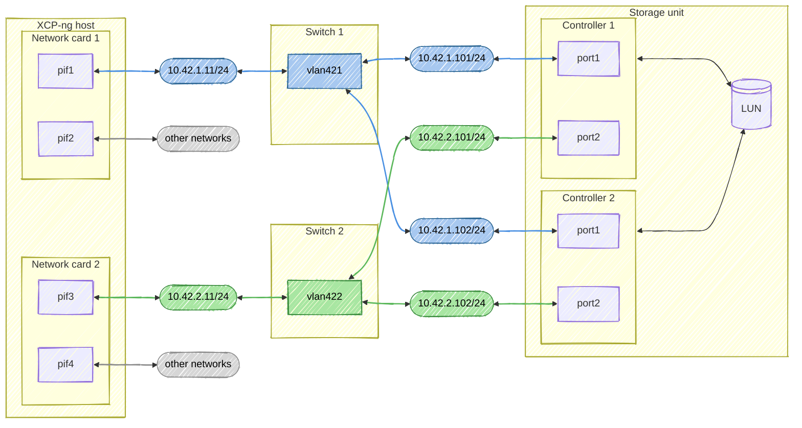
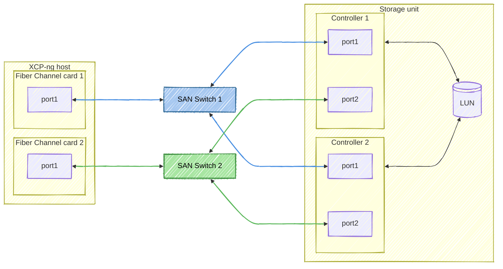

# Multipathing

How to properly setup storage multipathing with Xen Orchestra and XCP-ng.

## iSCSI

### Requirements
* Two different network cards (It can be the same model)
* Dedicated network interfaces without VLAN tagging on XCP-ng host and storage unit
* Two different switches (not stacked)
* Two VLANs **without L3 routing**
* Two IPv4 subnets **without L3 routing**
* Multiple targets per LUN on your storage unit
* iSCSI target ports are operating in portal mode

:::info
It is recommended to configure the network interfaces of XCP-ng host servers, switch interfaces, and storage array interfaces with Jumbo frames (MTU 9000).

If your switch cannot handle Jumbo frames, you can leave the default values (MTU 1500). But make sure that all elements are set to MTU 1500.
:::

:::warning
1. Make sure you do not use bond-type network interfaces on the host and on the storage unit for iSCSI interfaces.
2. Make sure you do not configure network routes on iSCSI interfaces.
:::

### Target architecture

#### Configuration example
| Path | Vlan | Subnet | Host PIF address | Storage Controller 1 address | Storage Controller 2 address |
| :---: | :---: | :---: | :---: | :---: | :---: |
| 🔵 | 421 | 10.42.1.0/24 | 10.42.1.11 | 10.42.1.101 | 10.42.1.102 |
| 🟢 | 422 | 10.42.2.0/24 | 10.42.2.11 | 10.42.2.101 | 10.42.2.102 |

#### Target architecture diagram

```mermaid
---
config:
  look: handDrawn
  theme: default
---
flowchart LR
  classDef blueNode fill:#A7C8F0,stroke:#2C6693,color:#000000;
  classDef greenNode fill:#A8E6A2,stroke:#3E8E41,color:#000000;
  classDef grayNode fill:#D6D6D6,stroke:#8C8C8C,color:#000000;

  subgraph server[XCP-ng host]
    direction LR
    subgraph Card2[Network card 2]
        direction RL
        card2pif1[pif4]
        card2pif2[pif3]
    end
    subgraph Card1[Network card 1]
        direction RL
        card1pif1[pif1]
        card1pif2[pif2]
    end
  end
  subgraph Switch 2
    vlan422[vlan422]:::greenNode
  end
  subgraph Switch 1
    vlan421[vlan421]:::blueNode
  end
  subgraph storage[Storage unit]
  direction LR
    subgraph ctrl2[Controller 2]
        direction RL
        ctrl2-port1[port1]
        ctrl2-port2[port2]
    end
    subgraph ctrl1[Controller 1]
        direction RL
        ctrl1-port1[port1]
        ctrl1-port2[port2]
    end
    lun1@{ shape: lin-cyl, label: "LUN" }

  end

  card1-pif1-ip([10.42.1.11/24]):::blueNode
  card1-pif2-ip([other networks]):::grayNode
  card2-pif2-ip([10.42.2.11/24]):::greenNode
  card2-pif1-ip([other networks]):::grayNode
  ctrl1-port1-ip([10.42.1.101/24]):::blueNode
  ctrl1-port2-ip([10.42.2.101/24]):::greenNode
  ctrl2-port1-ip([10.42.1.102/24]):::blueNode
  ctrl2-port2-ip([10.42.2.102/24]):::greenNode

  card1pif1<-->card1-pif1-ip
  card1-pif1-ip<-->vlan421
  vlan421<-->ctrl1-port1-ip
  ctrl1-port1-ip<-->ctrl1-port1
  vlan421<-->ctrl2-port1-ip
  ctrl2-port1-ip<-->ctrl2-port1

  card2pif2<-->card2-pif2-ip
  card2-pif2-ip<-->vlan422
  vlan422<-->ctrl1-port2-ip
  ctrl1-port2-ip<-->ctrl1-port2
  vlan422<-->ctrl2-port2-ip
  ctrl2-port2-ip<-->ctrl2-port2

  card1pif2<-->card1-pif2-ip
  card2pif1<-->card2-pif1-ip
  ctrl1 <----> lun1
  ctrl2 <----> lun1

linkStyle 0 stroke:#4A90E2,stroke-width:2px;
linkStyle 1 stroke:#4A90E2,stroke-width:2px;
linkStyle 2 stroke:#4A90E2,stroke-width:2px;
linkStyle 3 stroke:#4A90E2,stroke-width:2px;
linkStyle 4 stroke:#4A90E2,stroke-width:2px;
linkStyle 5 stroke:#4A90E2,stroke-width:2px;

linkStyle 6 stroke:#5CB85C,stroke-width:2px;
linkStyle 7 stroke:#5CB85C,stroke-width:2px;
linkStyle 8 stroke:#5CB85C,stroke-width:2px;
linkStyle 9 stroke:#5CB85C,stroke-width:2px;
linkStyle 10 stroke:#5CB85C,stroke-width:2px;
linkStyle 11 stroke:#5CB85C,stroke-width:2px;

linkStyle 12 stroke:#8C8C8C,stroke-width:2px;
linkStyle 13 stroke:#8C8C8C,stroke-width:2px;
```

### Operating procedure

#### 1. Prepare XCP-ng hosts
1. On one of the host servers, make sure that the multipath.conf configuration includes your storage equipment.
   
   This can be found in the file `/etc/multipath.xenserver/multipath.conf`
2. If your equipment is not present, ask the manufacturer for the multipath configuration for GNU/Linux
   
   Add it to the file ```/etc/multipath/conf.d/custom.conf```

   :::info
   In this case, the configuration will be kept after updates.
   :::
   
3. If necessary, migrate the VMs active on the XCP-ng host in question to another one
4. Reboot the current XCP-ng host on the affected pool
5. Do the same for all servers in the pool

#### 2. Prepare the pool
Make sure that multipathing is enabled on the pool. To do this, go to the advanced configuration of the pool

If this is not the case:
1. Make sure there are **no VMs running** on an iSCSI and/or HBA SR in the pool
2. Activate "Enable multipathing for all hosts"

#### 3. Configure the SR
Proceed with the iSCSI SR configuration as indicated in the [storage documentation](../../storage/#iscsi).

## Fiber Channel (HBA)
### Requirements
* Check that the Fiber Channel cards model(s) is supported via the HCL
* Two different Fiber Channel cards (It can be the same model)
* Two different SAN switches
* Multiple targets per LUN on your storage unit
* Zoning performed

:::warning
Make sure not to mix Fiber Channel speeds.
:::

### Target architecture
#### Target architecture diagram

```mermaid
---
config:
  look: handDrawn
  theme: default
---
flowchart LR
  classDef blueNode fill:#A7C8F0,stroke:#2C6693,color:#000000;
  classDef greenNode fill:#A8E6A2,stroke:#3E8E41,color:#000000;
  classDef grayNode fill:#D6D6D6,stroke:#8C8C8C,color:#000000;

  subgraph server[XCP-ng host]
    direction LR
    subgraph Card2[Fiber Channel card 2]
        direction RL
        card2port1[port1]
    end
    subgraph Card1[Fiber Channel card 1]
        direction RL
        card1port1[port1]
    end
  end

  subgraph storage[Storage unit]
  direction LR
    subgraph ctrl2[Controller 2]
        direction RL
        ctrl2-port1[port1]
        ctrl2-port2[port2]
    end
    subgraph ctrl1[Controller 1]
        direction RL
        ctrl1-port1[port1]
        ctrl1-port2[port2]
    end
    lun1@{ shape: lin-cyl, label: "LUN" }

  end

  vlan421[SAN Switch 1]:::blueNode
  vlan422[SAN Switch 2]:::greenNode

  card1port1<---->vlan421
  vlan421<---->ctrl1-port1
  vlan421<---->ctrl2-port1

  card2port1<---->vlan422
  vlan422<---->ctrl1-port2
  vlan422<---->ctrl2-port2

  ctrl1 <----> lun1
  ctrl2 <----> lun1

linkStyle 0 stroke:#4A90E2,stroke-width:2px;
linkStyle 1 stroke:#4A90E2,stroke-width:2px;
linkStyle 2 stroke:#4A90E2,stroke-width:2px;
linkStyle 3 stroke:#5CB85C,stroke-width:2px;
linkStyle 4 stroke:#5CB85C,stroke-width:2px;
linkStyle 5 stroke:#5CB85C,stroke-width:2px;
```
### Operating procedure

#### 1. Prepare XCP-ng hosts
1. On one of the host servers, make sure that the multipath.conf configuration includes your storage equipment.
   
   This can be found in the file `/etc/multipath.xenserver/multipath.conf`
2. If your equipment is not present, ask the manufacturer for the multipath configuration for GNU/Linux
   
   Add it to the file ```/etc/multipath/conf.d/custom.conf```

   :::info
   In this case, the configuration will be kept after updates.
   :::
   
3. If necessary, migrate the VMs active on the XCP-ng host in question to another one
4. Reboot the current XCP-ng host on the affected pool
5. Do the same for all servers in the pool

#### 2. Prepare the pool
Make sure that multipathing is enabled on the pool. To do this, go to the advanced configuration of the pool

If this is not the case:
1. Make sure there are **no VMs running** on an iSCSI and/or HBA SR in the pool
2. Activate "Enable multipathing for all hosts"

#### 3. Configure the SR
Proceed with the HBA SR configuration as indicated in the [storage documentation](../../storage/#hba).