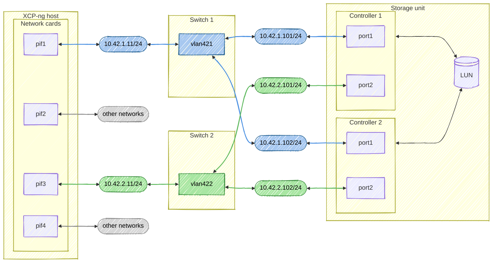
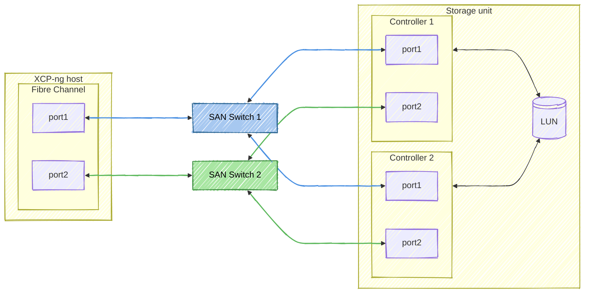

# Multipathing

How to properly setup a new SR with multipathing on Xen Orchestra and XCP-ng.

:::warning
Do not attempt to enable multipathing on a production pool with existing and active iSCSI and/or HBA and/or FC SRs.

You can activate it on the "fly", per XCP-ng host (Advanced tab), but it is recommended to do so with XCP-ng hosts that have no VMs running.
:::

## iSCSI

### Requirements
* Two different network interfaces.
* Two different switches.
* Multiple targets per LUN on your storage unit.
* iSCSI target ports are operating in portal mode.

:::info
If the storage vendor recommends using Jumbo Frames, you will need to implement them.

Since each architecture is unique, feel free to check with the storage vendor if it’s possible to stay with an MTU of 1500 (e.g., using storage dedicated PIF at 10Gb/s or 25Gb/s).
:::

:::warning
1. We recommend that you do not use bonded network interfaces on the XCP-ng host and on the storage unit for iSCSI interfaces.
2. We recommend that you do not configure network routes on iSCSI interfaces.

This could have an impact on expected performance.
:::


### Target architecture

#### Configuration example
| Path | Vlan | Subnet | XCP-ng Host PIF address | Storage Controller 1 address | Storage Controller 2 address |
| :---: | :---: | :---: | :---: | :---: | :---: |
| 🔵 | 421 | 10.42.1.0/24 | 10.42.1.11 | 10.42.1.101 | 10.42.1.102 |
| 🟢 | 422 | 10.42.2.0/24 | 10.42.2.11 | 10.42.2.101 | 10.42.2.102 |

#### Target architecture diagram


### Operating procedure

#### 1. Prepare XCP-ng hosts
1. On one of the XCP-ng hosts, make sure that the `multipath.conf` configuration includes your storage equipment.

   This can be found in the file `/etc/multipath.xenserver/multipath.conf`

   :::warning
   Do not modify `/etc/multipath.xenserver/multipath.conf` directly, as any changes may be overwritten by future system updates
   :::
2. If your equipment is not present, ask the manufacturer for the multipath configuration for GNU/Linux otherwise move on to the [next step (Prepare the pool)](../../storage/multipathing/#2-prepare-the-pool).

   Add it to the file ```/etc/multipath/conf.d/custom.conf```

   For example:
   ```
   devices {

     # Configuration for ACME CORP UltraSAN
     # This is an example of syntax; do not use it in production.
     device {
        vendor  "ACME"
        product "UltraSAN"
        path_selector "service-time 0"
        path_grouping_policy group_by_prio
        prio alua
        features "1 queue_if_no_path"
        hardware_handler "1 alua"
        failback immediate
        rr_weight uniform
        rr_min_io 100
        no_path_retry 10
     }
   }
   ```

   :::info
   In this case, the configuration will be kept after updates.
   :::

3. If necessary, migrate the VMs active on the XCP-ng host in question to another one.
4. Reboot the XCP-ng host.
5. Do the same for all XCP-ng hosts in the pool (step 2. to 4.).

#### 2. Prepare the pool
Make sure that multipathing is enabled on the pool. To do this, go to the advanced configuration of the pool.

If this is not the case:
1. Make sure there are **no VMs running** on an iSCSI and/or HBA SR in the pool.
2. Activate "Enable multipathing for all XCP-ng hosts.

#### 3. Configure the SR
Proceed with the iSCSI SR configuration as indicated in the [storage documentation](../../storage/#iscsi).

## Fibre Channel (HBA)
### Requirements
* Check that the Fibre Channel cards model(s) is supported via the [HCL](../../installation/hardware/#-hardware-compatibility-list-hcl).
* Two different Fibre Channel ports.
* Two different SAN switches.
* Multiple targets per LUN on your storage unit.
* Zoning performed.

:::warning
Make sure not to mix Fibre Channel speeds.
:::

### Target architecture
#### Target architecture diagram

### Operating procedure

#### 1. Prepare XCP-ng hosts
1. On one of the XCP-ng hosts, make sure that the multipath.conf configuration includes your storage equipment.

   This can be found in the file `/etc/multipath.xenserver/multipath.conf`.

   :::warning
   Do not modify `/etc/multipath.xenserver/multipath.conf` directly, as any changes may be overwritten by future system updates.
   :::
2. If your equipment is not present, ask the manufacturer for the multipath configuration for GNU/Linux otherwise move on to the [next step (Prepare the pool)](../../storage/multipathing/#2-prepare-the-pool-1).

   Add it to the file ```/etc/multipath/conf.d/custom.conf```

   For example:
   ```
   devices {

     # Configuration for ACME CORP UltraSAN
     # This is an example of syntax; do not use it in production.
     device {
        vendor  "ACME"
        product "UltraSAN"
        path_selector "service-time 0"
        path_grouping_policy group_by_prio
        prio alua
        features "1 queue_if_no_path"
        hardware_handler "1 alua"
        failback immediate
        rr_weight uniform
        rr_min_io 100
        no_path_retry 10
     }
   }
   ```

   :::info
   In this case, the configuration will be kept after updates.
   :::

3. If necessary, migrate the VMs active on the XCP-ng host in question to another one.
4. Reboot the XCP-ng host.
5. Do the same for all XCP-ng hosts in the pool (step 2. to 4.).

#### 2. Prepare the pool
Make sure that multipathing is enabled on the pool. To do this, go to the advanced configuration of the pool.

If this is not the case:
1. Make sure there are **no VMs running** on an iSCSI and/or HBA SR in the pool.
2. Activate "Enable multipathing for all XCP-ng hosts.

#### 3. Configure the SR
Proceed with the HBA SR configuration as indicated in the [storage documentation](../../storage/#hba).


## Maintenance operations
### Add a new XCP-ng host to an existing multipathing pool

:::warning
Do not add the new XCP-ng host to the pool without completing these steps.
:::

1. Prepare the XCP-ng host as specified in this [operating procedure for iSCSI](../../storage/multipathing/#operating-procedure) or this [operating procedure for FC](../../storage/multipathing/#operating-procedure-1).
2. Ensure that the iSCSI PIF configuration is completed if you are using iSCSI.
3. Add the new XCP-ng host to the pool.

## Troubleshooting

### Verify multipathing
You can use the command ```multipath -ll``` to check if multipathing is active.

```
3600a098765432100000123456789abcd dm-3 ACME,UltraSAN
size=500G features='1 queue_if_no_path' hwhandler='1 alua' wp=rw
|-+- policy='service-time 0' prio=50 status=active
| |- 8:0:0:1  sdb  8:16   active ready running
| |- 8:0:1:1  sdd  8:48   active ready running
|-+- policy='service-time 0' prio=10 status=enabled
  |- 8:0:2:1  sdf  8:80   active ready running
  |- 8:0:3:1  sdh  8:112  active ready running
```
:::info
In this example, we have four active paths: our multipathing is working correctly.
:::

### iSCSI
#### Verify iSCSI sessions
You can use the command ```iscsiadm -m session``` to check if iSCSI session is active.

```
tcp: [1] 10.42.1.101:3260,1 iqn.2024-02.com.acme:ultrasan.lun01 (non-flash)
tcp: [2] 10.42.1.102:3260,1 iqn.2024-02.com.acme:ultrasan.lun01 (non-flash)
tcp: [3] 10.42.2.101:3260,2 iqn.2024-02.com.acme:ultrasan.lun01 (non-flash)
tcp: [4] 10.42.2.102:3260,2 iqn.2024-02.com.acme:ultrasan.lun01 (non-flash)
```
:::info
In this example, we have four iSCSI sessions with one LUN.
:::

#### iSCSI: Verify Jumbo Frame configuration
To check the Jumbo Frames configuration, connect to a XCP-ng host and try pinging all IP addresses involved in your iSCSI storage (target and initiator) using this command.

```
ping -M do -s 8972 <REMOTE_IP_ADDRESS>
```
:::warning
If you get an error, usually ```ping: sendmsg: Message too long```, your MTU settings are incorrect, and you need to fix your network configuration.
:::

:::tip
If your storage vendor allows it, feel free to use "1500" for MTU.
:::
