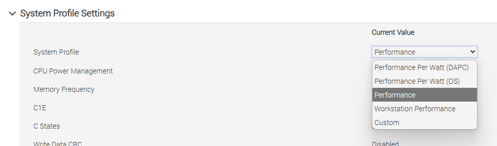

# Windows PV Tools

Common issues with Windows PV tools.

## Windows Management Agent failed to install

### Cause
There was an issue with the installing of the drivers certificate, so the drivers did not load silently.

### Solution
Resolved with version 8.2.2.200-RC1 and newer.

***

## PV-Drivers missing in the Device Manager

### Cause

If despite running the Windows tools installer, there's no devices visible in the device manager, it's likely because there's some leftovers from old Citrix XenServer Client Tools.

### Solutions

#### Leftovers from old Citrix XenServer Client Tools.

See the [XenClean guide](#completely-removing-existing-xen-pv-drivers-with-xenclean) below for instructions.

## Network PV drivers aren't working.

### Cause

If the tools are installed, while XCP-ng Center says that I/O is optimized, but the network card is not correctly installed and the Management Agent is also not working. There was an issue with the installing of the drivers certificate, so the drivers did not load silently.

### Possible Solutions

* Resolved with version 8.2.2.200-RC1 and newer.

* Clean your system from `Citrix Client Tools` _AND_ `XCP-ng Client Tools` to create a clean state.
* Then install the Client Tools from scratch.

See the [XenClean guide](#completely-removing-existing-xen-pv-drivers-with-xenclean) below for instructions.

## Not all PV drivers are correctly installed


### Cause

It's possible that some antivirus blocks the end of the installation of the PV drivers. We've seen this happening with SentinelOne AV already (see [this thread](https://xcp-ng.org/forum/post/76098)).

### Solution

Simply pausing the agent and rebooting will allow the PV drivers to install successfully.
After a successful installation, enabling the SentinelOne agent again is possible without any other issues regarding the tools or drivers.

## Low storage performance on Windows

### Cause

Virtual disks on Windows VMs may perform poorly if the system power profile is not set to Performance.

### Workaround

As reported by [nesting4lyfe2024](https://xcp-ng.org/forum/user/nesting4lyfe2024), [marcoi](https://xcp-ng.org/forum/user/marcoi) and [wiseowl](https://xcp-ng.org/forum/user/wiseowl) on the XCP-ng forum ([link](https://xcp-ng.org/forum/topic/10375/slow-windows-11-guest-vm-virtual-disk-performance-on-r730-w-h730-controller-but-all-other-oses-are-fast-normal)).

Set your BIOS power profile to "Performance" or "Performance Per Watt (OS)".
Consult your motherboard manual for details; for example, on Dell systems with iDRAC Enterprise, this setting may be found at Configuration - BIOS Settings - System Profile Settings - System Profile:

<div style={{textAlign: 'center'}}>

</div>

## Fully removing Xen PV drivers with XenClean

XenClean is an utility for cleanly removing Xen PV drivers and management agents of the following products:

* XCP-ng Windows PV Tools, versions 8.2 and 9.1
* XenServer VM Tools for Windows, versions 9.3 and 9.4
* Other Xen drivers

It is included in the installation package of XCP-ng Windows PV Tools 9.1 and above.
[See the newest releases here.](https://github.com/xcp-ng/win-pv-drivers/releases)

:::note
Before running XenClean:

* Take a snapshot of your VM.
* You should always use the latest version of XenClean regardless of your Windows PV driver version. The same applies to XenBootFix.
* You should disable the "Manage Citrix PV drivers via Windows Update" option on your VM. Otherwise, Windows may reinstall PV drivers from Windows Update after rebooting.
* If you downloaded XenClean from the internet, you may need to unblock the script file before running it. This can be done by right-clicking the file, then choosing **Properties** - **Unblock** - **OK**.
:::

To use XenClean, simply run the `Invoke-XenClean.ps1` script **as Administrator**. Your system will automatically reboot.

:::tip
XenClean leaves its log files at the current directory and at `%TEMP%\xenclean-<time>`. Please provide these logs in case of uninstallation failure.
:::

## Windows fails to boot (hanging at boot or BSOD with Stop code `INACCESSIBLE_BOOT_DEVICE`)

In some situations (failed uninstallation, major Windows version upgrades), Xen PV drivers (whether Citrix or XCP-ng) may cause Windows to fail to start (hanging at boot, BSOD with Stop code `INACCESSIBLE_BOOT_DEVICE`).
The XenBootFix utility included with XCP-ng Windows PV Tools 9.1 and above helps you disable any active Xen PV drivers and get your system to a bootable state before running XenClean.

:::note
The utility only runs in Windows Preinstallation Environment (PE) or Windows Recovery Environment (RE). It will not run from Safe Mode.
:::

Below is a procedure for using XenBootFix to recover a non-booting VM:

1. Take a snapshot of your VM in case uninstallation fails.
2. Disable the "Manage Citrix PV drivers via Windows Update" option on your VM if it's enabled.
3. Boot into Windows PE or Windows RE in command line-only mode. There are a few ways to accomplish this:
  * If your Windows installation BSODs on boot multiple times, it will automatically boot into Windows RE. Choose **Troubleshoot** - **Command Prompt**.
  * When running Windows Server, press **F8** before Windows starts, then choose **Repair Your Computer**. Choose **Troubleshoot** - **Command Prompt**.
  * Boot your VM using a Windows Setup or Windows PE CD image. If you don't see a command line, press **Shift+F10**.
4. Identify your Windows installation drive letter.
  * Use the `dir` command to list files in a given drive letter. For example: `dir C:\` (the backslash is required)
  * In some cases, your Windows partition should already be mounted. Try the first few letters (`C:`, `D:`, `E:`).
  * If you cannot find your Windows drive letter, you may need to assign a new drive letter with Diskpart.
    * Type `diskpart` at the command line. The command prompt should change to `DISKPART>`
    * Type `list vol` then make a note of your Windows partition and its drive letter (if any).
    * If your Windows partition does not have a drive letter, type `sel vol N` where `N` is the volume number shown in Diskpart, then type `assign letter=W`. Your Windows partition will be assigned the drive letter `W:`.
    * Finally, at the `DISKPART>` prompt, type `exit` to exit Diskpart.
5. Obtain XenBootFix.
  * If you're using XCP-ng Windows PV Tools 9.1 or later, it is located at `W:\Program Files\XCP-ng\Windows PV Drivers\XenBootFix\XenBootFix.exe` where `W:` is your Windows drive letter.
  * If you have PowerShell, run the following command: `Invoke-WebRequest https://<download path of XenBootFix.exe> -OutFile XenBootFix.exe`
  * Failing all that, you can create a new ISO image containing XenBootFix using WinCDEmu, ImgBurn or a similar tool, then attach it to your VM.
  * **Note**: If using Windows PE, do not remove its CD image when it's running. You may encounter unexpected errors otherwise.
6. Run the command `<path to XenBootFix.exe> W:\Windows` where `W:` is your Windows drive letter.
  * **Note**: Make sure the drive letter belongs to your actual Windows installation and not Windows PE/RE. By default, Windows PE/RE use the drive letter **X:**.
7. Type `exit` to close Command Prompt. If using Windows RE, choose **Continue** to boot into Windows. Windows should now start normally.
8. **You must immediately run XenClean from within Windows to remove the remaining Xen drivers**. See instructions above.

## Connecting to guests using serial console

In some situations, you might want to expose a VM's serial console to network for troubleshooting purposes (e.g. Windows kernel debugging).
You can use the following procedure:

* Shut down the VM.
* On your host, run the following command: `xe vm-param-set uuid=<uuid> platform:hvm_serial=tcp::<port>,server,nodelay,nowait` where `<uuid>` is the VM's UUID and `<port>` is the TCP port on the host that exposes the VM's serial port, e.g. 7001.
* You need to open the selected port on the host's firewall: `/etc/xapi.d/plugins/firewall-port open 7001`
  * Note that any host running the VM will need this command.
* Connecting to port 7001 on the host will connect to your VM's serial port. You can use Telnet, PuTTY or any similar tools.
* To configure kernel debugging on Windows, disable Secure Boot and BitLocker then run the following commands within the VM:
  ```
  bcdedit /debug on
  bcdedit /dbgsettings serial debugport:1 baudrate:115200
  ```
  Connect using [WinDbg](https://learn.microsoft.com/en-us/windows-hardware/drivers/debugger/) using the `Attach to kernel` option with a connection string: `com:ipport=7001,port=<host IP>`
* To undo the changes and remove the serial setting, use `xe vm-param-remove uuid=<uuid> param-name=platform param-key=hvm_serial`

## Windows bug check 0x3B (SYSTEM_SERVICE_EXCEPTION) on systems with newer Intel CPUs

### Cause

Intel CPUs codenamed Rocket Lake, Sapphire Rapids and newer provide the **Architectural LBR** feature, which Windows depends on.
Xen's support of this CPU feature is incomplete, which causes Windows to crash when using certain applications (e.g. Blue Iris: [forum link](https://xcp-ng.org/forum/topic/8873/windows-blue-iris-xcp-ng-8-3), [GitHub issue](https://github.com/xcp-ng/xcp/issues/565)).

### Workaround

Stop the VM, run the following command on the host then restart the VM:

```
xe vm-param-add uuid=<VM's UUID> param-name=platform msr-relaxed=true
```

## Windows fails to boot, keeps exiting to Startup Repair/recovery menu after updating

### Cause

This is often caused by the Windows boot loader failing to find the Windows partition.

### Workaround

From the recovery menu, open Command Prompt, then use `diskpart` to assign drive letters to the EFI system partition:

```
list vol
sel vol N  # N = number of volume with info = "System"
assign letter=S
exit
```

After exiting Diskpart, use the following commands:

```bat
bcdedit /store S:\EFI\Microsoft\Boot /set {default} device=partition=C:
bcdedit /store S:\EFI\Microsoft\Boot /set {default} osdevice=partition=C:
```

After exiting to Windows, your system should boot successfully.
