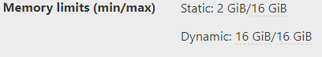
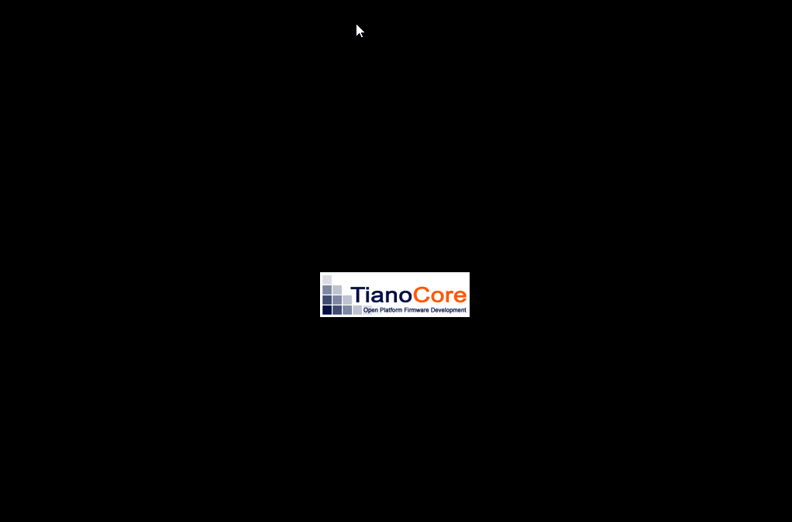
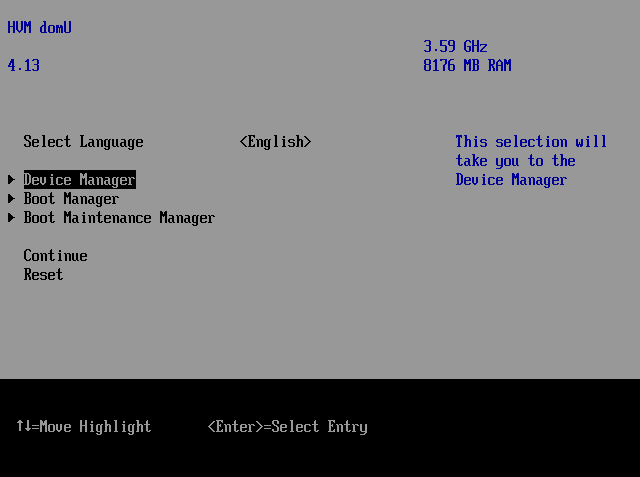
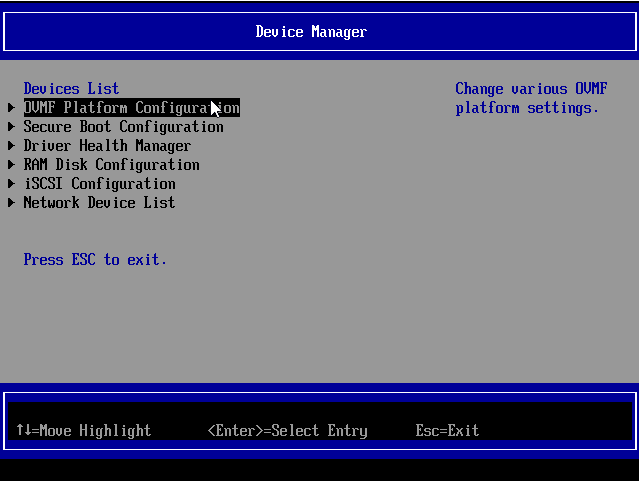
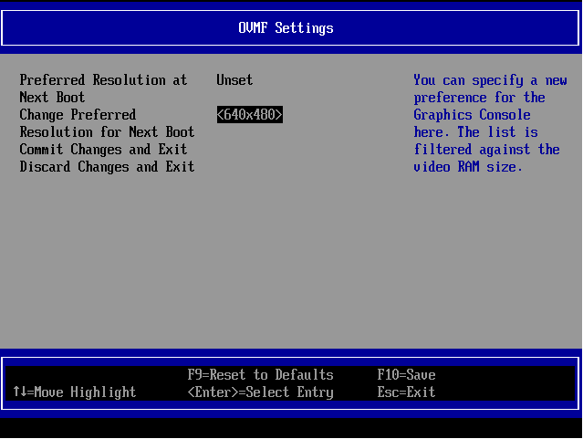

# Virtual Machines (VMs)

## 🛠️ Guest Tools

XCP-ng needs guest tools to be installed in the VMs in order to communicate with the guest operating system. This brings better performance and is required for various features.

In short: *always install the guest tools to your VMs*.

The tools are made of two main components:
* kernel drivers for the OS
* a management agent

Linux: see [Linux Guest Tools](#linux-guest-tools) \
Windows: see [Windows Guest Tools](#windows-guest-tools) \
FreeBSD, OpenBSD and some appliances based on them: see [*BSD Guest Tools](#bsd-guest-tools)

## 🏘️ All VMs

### Dynamic Memory

Using Dynamic Memory Control (DMC) can be a good way to reduce your memory consumption, but you have to be careful: during live migration of a VM, XCP-ng will automatically reduce the VM memory to it's minimal settings and this can cause VM crash if it's not ready to function with this smaller amount of RAM.

We recommand you check your VM settings to verify if dynamic memory has been enabled.
In Xen Orchestra, the *Advanced* tab of your VM will display the memory limits, in the "VM limits" section:



If dynamic min is equal to dynamic max - as displayed in the screenshot - then dynamic memory is disabled.
If dynamic min < dynamic max, then make sure your VM is able to fully function with as little RAM as defined in *dynamic min*.

### Secure Boot

How Secure Boot can be enabled in VMs is described in a [dedicated guide](../guides/guest-UEFI-Secure-Boot/).

### Use a VNC client

1. Connect to a XCP-ng server using SSH, then execute this command with the VM UUID to join:

```
xe vm-list params=dom-id,resident-on uuid=<VM_UUID>
```

For example:

```
xe vm-list params=dom-id,resident-on uuid=b2632c6a-8c0c-2fcc-4f1f-5b872733f58c
resident-on ( RO)    : 888254e8-da05-4f86-ad37-979b8d6bad04
         dom-id ( RO): 2
```

2. Then, check you are on the host where the VM is currently running using the host UUID:

```
xe pif-list management=true params=IP host-uuid=888254e8-da05-4f86-ad37-979b8d6bad04
IP ( RO)    : 172.16.210.15
```

If not, use this IP to create an SSH connection to the right host.

3. Ensure `socat` is installed and execute this command with the DOM ID got earlier and a free TCP port:

```
socat TCP-LISTEN:<TCP_PORT_TO_USE> UNIX-CONNECT:/var/run/xen/vnc-<DOM_ID>
```

What have we done? We exposed a UNIX domain socket (which allows us to connect to the VM using VNC) directly over TCP.

4. Fine, now open a new shell, and on your local machine create an SSH tunnel with a free TCP port:

```
ssh -L <LOCAL_PORT>:localhost:<REMOTE_PORT> root@<HOST_IP>
```

5. Finally, start the client, for example `vncviewer`:

```
vncviewer localhost:<LOCAL_PORT>
```

### Disk WWID

Certain applications, such as Oracle ASM, require a unique identifier for disk drives known as a WWID (World Wide Identifier). In a Linux environment, this can be achieved by utilizing the `ID_PART_ENTRY_UUID` or `ID_PART_ENTRY_NAME` variables. These identifiers can be set in the udev rules file located at `/etc/udev/rules.d/99-asm.rules`. For detailed instructions on configuring disk devices manually for Oracle ASM using WWID, refer to [this guide](https://alexzy.blogspot.com/2018/02/configuring-disk-devices-manually-for.html).


## 🪟 Windows VMs

### Windows Guest Tools

Windows guests need both the device drivers and the management agent.
* The **device drivers** bring optimized I/O performances.
* The **management agent** brings more manageability of the VM from XCP-ng, and guest metrics reporting to the host.

#### XCP-ng vs XenServer tools

There are two sets of Windows guest tools compatible with XCP-ng: **XCP-ng Windows Guest Tools** and **Citrix XenServer VM Tools for Windows**.

We recommend using the XCP-ng Windows Guest Tools.
However, both sets of guest tools remain supported for Windows guests running on XCP-ng.

#### XCP-ng Windows Guest Tools

The XCP-ng driver package contains the drivers and guest agents for Windows VMs running on XCP-ng.
It supports the following operating systems:

- Windows 10 1607 and later
- Windows Server 2016 and later

**Download**: [https://github.com/xcp-ng/win-pv-drivers/releases](https://github.com/xcp-ng/win-pv-drivers/releases)

##### Prerequisite: Disable "Manage Citrix PV drivers via Windows Update"
The first step before installing XCP-ng Windows Guest Tools — before the VM creation and first start — is to make sure that Windows Update is not going to install Citrix tools automatically at first boot.
This behaviour is governed by the **Manage Citrix PV drivers via Windows Update** parameter in a VM's Advanced view. Make sure it is off, or installation of the XCP-ng Windows Guest Tools will be blocked.

Before creating the VM:
* Make sure you are not creating it from a custom template than has the "Manage Citrix PV drivers via Windows Update" option enabled.
* :warning: Do not create it from XCP-ng Center. XCP-ng Center automatically enables that option when the license allows it (and in XCP-ng the license always allows it...). This behaviour may be modified in the future.

Before starting the VM:
* Check the value of "Manage Citrix PV drivers via Windows Update" in the Advanced tab of your VM in Xen Orchestra. Must be off.

If you already started the VM with the option on, then the Citrix drivers have been installed automatically. Restart from scratch or go to [Fully removing Xen PV drivers with XenClean](#fully-removing-xen-pv-drivers-with-xenclean).

Tip: you can also check the value of the parameter from the command line.
```
xe vm-param-get param-name=has-vendor-device uuid={VM-UUID}
```
`True` means that it's active, `False` that it isn't. It needs to be `False`.

##### Install the XCP-ng tools
1. Snapshot your VM before installing.
2. Check the above prerequisite about the "Manage Citrix PV drivers via Windows Update" option.
3. Unpack the ZIP file.
4. Start the installation MSI.
5. Follow the install wizard.

#### Using the Citrix XenServer VM Tools for Windows

##### Management agent + device drivers
When using the Citrix XenServer VM Tools for Windows, the only way to get the management agent is from XenServer directly.
Get it from the [XenServer download page](https://www.xenserver.com/downloads).
The installer will install both the management agent and the device drivers.

:::tip
You will also find present and past releases of the tools at: [https://support.citrix.com/article/CTX235403](https://support.citrix.com/article/CTX235403), but this may require a Citrix account.

For security reasons, we do not recommend using past releases. However, it may prove useful for old, unsupported Windows releases.
:::

##### Automated installation via Windows Update: device drivers alone (XenServer VM Tools only)
In Xen Orchestra, Go to the **Advanced** tab of the VM view to switch on the parameter called **Manage Citrix PV drivers via Windows Update**.\
This will install the device drivers automatically at next reboot.

:::warning
This procedure will **not** install the management agent. You will need to install them using the XenServer tools installer.
:::

The **Manage Citrix PV drivers via Windows Update** option is therefore not a complete solution if you need the guest metrics from the management agent. However, it may be a convenient way to get future driver updates if you wish so.

:::warning
If the **Manage Citrix PV drivers via Windows Update** option is enabled, the XenServer VM Tools package may defer driver installation to Windows Update instead.
Make sure to check **Install I/O Drivers Now** during tools installation if you want to explicitly update the current drivers.
:::

#### Switching from XCP-ng tools to Citrix tools, or vice versa
If your VM already has Xen PV drivers from one vendor and you wish to switch to another, perform a clean-up as described in [Fully removing Xen PV drivers with XenClean](#fully-removing-xen-pv-drivers-with-xenclean).

#### How to know if tools are already installed and working

The VM needs to be running for this test.

##### From Xen Orchestra
You can see this information in the General tab of the VM view.
* Device drivers: XO displays "Hardware virtualization with paravirtualization drivers enabled (PVHVM)" on the General tab
* Management agent: XO displays "Management agent detected" or "Management agent version \{version\} detected"

More detailed information can also be found in the Advanced tab.

##### From command line
* Device drivers: `xe vm-param-get param-name=PV-drivers-detected uuid={VM-UUID}`
* Management agent: `xe vm-param-get param-name=PV-drivers-version uuid={VM-UUID}` (ok if not empty)

#### Fully removing Xen PV drivers with XenClean

XenClean is an utility for cleanly removing Xen PV drivers and management agents of the following products:

* XCP-ng Windows Guest Tools, versions 8.2 to 9.1
* XenServer VM Tools for Windows, versions 7.1 to 9.4
* Other Xen drivers

It is included in the installation ISO of XCP-ng Windows Guest Tools 9.0 and above.
You'll find the ISO download in the Assets section.
[See the newest releases here.](https://github.com/xcp-ng/win-pv-drivers/releases)

:::note
Before running XenClean:

* Take a snapshot of your VM..
* You should always use the latest version of XenClean regardless of your Windows PV driver version. The same applies to XenBootFix.
* You should disable the "Manage Citrix PV drivers via Windows Update" option on your VM. Otherwise, Windows may reinstall PV drivers from Windows Update after rebooting.
* If you downloaded XenClean from the internet, you may need to unblock the script file before running it. This can be done by right-clicking the file, then choosing **Properties** - **Unblock** - **OK**.
* There is no need to uninstall the tools manually, as XenClean will also take care of that.
:::

To use XenClean, simply run the `Invoke-XenClean.ps1` script **as Administrator**. Your system will automatically reboot.

:::tip
XenClean leaves its log files at the current directory and at `%TEMP%\xenclean-<time>`. Please provide these logs in case of uninstallation failure.
:::

### Windows Guest Tools security
This section serves as a persistent and updated reference for known guest tools vulnerabilities.

#### XSA-468 multiple Windows PV driver vulnerabilities
Original announcement: https://xcp-ng.org/blog/2025/05/27/xsa-468-windows-pv-driver-vulnerabilities

##### Summary
Multiple vulnerabilities have been discovered in all existing Xen PV drivers for Windows from all vendors (XCP-ng, XenServer, etc.) published prior to the disclosure, on May 2025.

These vulnerabilities allow unprivileged users to gain system privileges inside Windows guests.

These issues have the following identifiers:

* [CVE-2025-27462](https://www.cve.org/CVERecord?id=CVE-2025-27462)
* [CVE-2025-27463](https://www.cve.org/CVERecord?id=CVE-2025-27463)
* [CVE-2025-27464](https://www.cve.org/CVERecord?id=CVE-2025-27464)

##### Am I affected?
Windows guests running vulnerable versions of Xen PV drivers are affected. Other guest OSes are not affected.

To check if you are affected, verify the version of Xen PV drivers inside every Windows VM.

:::note
Driver version numbers are independent from Xen PV tools package versions.
**Use the methods below to check the precise driver versions.**
:::

The following drivers are affected:

* *XCP-ng PV Bus*, *XCP-ng Interface* and *XCP-ng PV Console* older than 9.0.9065;
* *XenServer/Citrix PV Bus* older than 9.1.11.115; *PV Interface* older than 9.1.12.94;
* Other Xen PV drivers for Windows are also likely affected. If you are using these drivers, verify each vendor's security bulletins for more details.

You can check for this vulnerability from within the Windows VMs themselves (most precise, recommended) but also from outside the VMs, using tools we built for this purpose.

:::note
If you are reading this article shortly after its publication, it's likely that **all of your Windows VMs are vulnerable**.
Once patched, follow these instructions to verify that your VMs are no longer vulnerable.
:::

###### Check a Windows VM for vulnerability
This is the most precise way, but needs to be done per VM.

* Verify the version numbers in Device Manager.
* Use the [mitigation script published in the XSA-468 advisory](https://xenbits.xen.org/xsa/advisory-468.html) in `-Scan` mode (will only report the vulnerability, not version numbers). See the script for documentation.

###### Detect vulnerable VMs at the pool level

This method requires the latest XCP-ng updates to be applied, in XCP-ng 8.2 and 8.3.

We developed two features to help you handle these vulnerabilities.

* A [host-side detection script](https://github.com/xcp-ng/win-pv-drivers/blob/xcp-ng-9.1/extras/detect_xsa468.py), that you can run in dom0. It will list affected Windows VMs based on their PV driver versions. See the script for documentation.
* A warning :warning: sign next to affected VMs and a `vulnerable?` filter in Xen Orchestra. These features are available in Xen Orchestra 5.107.0 (latest channel) and 5.106.4 (stable channel).

:::note
This detection depends on XAPI accurately reporting PV driver versions. Prior to the XCP-ng 8.2 and 8.3 updates released in May 2025, this was not the case. As a result, the detection tools cannot assess VMs that have not been run since the updates were applied. If no driver information is available, a warning will be displayed.
:::

:::warning
Only virtual machines (VMs) created using a Windows template—or from templates or VMs originally derived from one—can be detected by these tools. They are designed to help users identify vulnerable VMs that may have been overlooked, forgotten during patching, or restored from backups taken before vulnerability fixes were applied. These tools are not intended to serve as comprehensive detection solutions, so do not rely on them exclusively.
:::

##### How to patch my VMs?

:::warning
First, create backups and snapshot your VMs before updating.

**Users of Windows 8.1/Server 2012 R2 and older**: The latest PV drivers from XCP-ng or XenServer only support Windows 10/Server 2016 or later.
Refer to the [I can't patch now, what should I do?](#i-cant-patch-now-what-should-i-do) section for an alternative solution.
:::

If you're using **XCP-ng Windows PV Tools** 8.2.x:
1. Use [XenClean](#fully-removing-xen-pv-drivers-with-xenclean) to remove the existing drivers.
2. Install [XCP-ng Windows Guest Tools 9.0.9137 or later](https://github.com/xcp-ng/win-pv-drivers/releases) or [XenServer VM Tools 9.4.1 or later](https://www.xenserver.com/downloads).

If you're already using **XCP-ng Windows Guest Tools 9.0**, install XCP-ng driver version 9.0.9137 or later.

If you're using *XenServer Windows PV drivers*: Upgrade to *XenServer VM Tools* 9.4.1 or later.

If you have enabled the option *Manage Citrix PV drivers via Windows Update*: Install new drivers via Windows Update, or install *XenServer VM Tools* 9.4.1 or later with the option **Install I/O Drivers Now** selected.

Follow Citrix's guidance in [CTX678047](https://support.citrix.com/s/article/CTX678047-static-ip-loss-when-updating-to-vm-tools-for-windows-933-or-earlier) to avoid losing your static IP settings during an upgrade.

:::tip
Follow our guide [Updating Windows PV drivers automatically with Group Policy](/guides/winpv-update.md) to automate your driver update process.
:::

##### I can't patch now, what should I do?
We encourage you to apply the latest updates as soon as possible.

If you absolutely cannot update, apply the mitigation script provided by Vates and the Xen Project, available at https://xenbits.xen.org/xsa/advisory-468.html (Windows 10 1607/Server 2016 and later only).

For older operating systems (Windows 7 up to Windows 8.1/Server 2012 R2), use our [legacy mitigation script](https://github.com/xcp-ng/win-pv-drivers/blob/xcp-ng-9.1/extras/Install-XSA468Workaround-Win7.ps1) instead.

Note that this mitigation script only covers vulnerabilities in the *Xen PV Interface* driver.

You should run the mitigation script in Scan mode afterwards to make sure the vulnerability is effectively mitigated.

:::tip
The mitigation script will not remove the vulnerability alert from Xen Orchestra.
Once you have ensured that the mitigation was successful, you can set the `HIDE_XSA468` VM tag in Xen Orchestra (5.107.2 and later) to hide the alert.
:::

##### How is Vates helping to fix this vulnerability?
This issue was discovered by Vates as part of our investment into upstream Xen development. Vates VMS provides multiple facilities to help users affected by the issue:

* We developed fixes for these vulnerabilities, which have been integrated upstream.
* We provided a mitigation script for those who cannot install the update.
* We have added detection logic in Xen Orchestra to alert on vulnerable Windows VMs. We also updated XCP-ng 8.2 and 8.3 so that PV driver versions are reported to Xen Orchestra for it to detect vulnerable Windows VMs. See "Am I affected?" above.
* We have developed a script that can be run in dom0 to perform the same detection, in case Xen Orchestra's detection logic is not yet available to you. See "Am I affected?" above.
* We are publishing an alert about the vulnerability inside all Xen Orchestra appliances.
* We alert about this vulnerability at the beginning of our latest newsletter.

##### Related links
* Xen Project announcement: https://xenbits.xen.org/xsa/advisory-468.html
* XenServer Security Bulletin: https://support.citrix.com/article/CTX692748


### Enabling Viridian extensions

Viridian is a codename for [Hyper-V](https://learn.microsoft.com/en-us/windows-server/virtualization/hyper-v/hyper-v-overview), a native hypervisor developed by Microsoft that allows the creation of virtual machines on x86-64 systems running Windows.

Viridian extensions —referred to as "Viridian enlightenments" by Microsoft— are used by any "recent" Windows OS to work properly. Make sure they are enabled for your VM.

:::warning

Viridian enlightenments are enabled by default on Windows VM templates included with XCP-ng.

To enable Viridian enlightenments for other non-Windows VM templates, simply run the following command:

```
xe vm-param-set uuid=<vm-uuid> platform:device_id=0002 platform:viridian=true platform:viridian_time_ref_count=true platform:viridian_reference_tsc=true platform:viridian_apic_assist=true platform:viridian_crash_ctl=true platform:viridian_stimer=true
```

:::warning
Do not set the device ID on VMs with Xen PV drivers installed. Changing the device ID may cause old Xen PV drivers to fail booting.
:::

:::

### Manage screen resolution

#### Bios VM

For a Bios VM, screen resolution can be managed directly through the OS:
- Right click on the desktop
- Display settings
- Choose resolution

#### UEFI VM

For a UEFI VM, you will need to set up your resolution in the UEFI settings of the VM.
For that you first will need to enter the VM UEFI setup:
- At VM start, during Tiano firmware logo display, press ESC.



- You will enter the UEFI firmware management interface. Navigating with keyboard arrows, select *Device Manager* and press Enter.



- In  the next screen select *OVMF platform configuration*.



- In the OVMF settings, select *Change Preferred* then the resolution you want.



- Press F10 and save the changes.
- Restart your VM by sending a CTRL+ALT+DEL.
- After reboot your VM will display the selected resolution.

### Booting a live Linux ISO on a Windows VM

When a VM is created from a Windows template, it might not be possible to boot a Linux system on it. This can be useful when one wants to modify the disk partitioning using a gparted ISO image for example.

The issue is due to a parameter value which is specific to Windows VMs and prevents the loading of the `xen-platform-pci` driver under Linux.

First, get the UUID of the Windows VM (visible in Xen Orchestra, or in the output of `xe vm-list`) and make sure it is powered off.

Open an ssh session to the XCP-ng host of the concerned VM and enter the following command:
```bash
$ xe vm-param-set uuid=VM-UUID platform:device_id=0001
```
Where `VM-UUID` is the uuid of the Windows VM.

You should be able to boot the VM on any Linux ISO disk.

Once done with Linux, shut down the VM and restore the parameter to its original value with:
```bash
$ xe vm-param-set uuid=VM-UUID platform:device_id=0002
```

## 🐧 Linux VMs

### Linux Guest Tools

Xen guest drivers have been built-in in the Linux kernel for many years. All currently supported Linux distributions include them.

So all we need is to install the management agent, which comes either as a systemd or as a sysvinit service, depending on the Linux distribution. The service is usually named `xe-linux-distribution`.

Those guest tools can be installed:
* from the target distribution's online repositories if available
* from the Guest Tools ISO image that can be attached to any VM in XCP-ng

#### Install from the distro's online repositories

Distros may provide guest tools for XCP-ng and Citrix Hypervisor in their own repositories. When they don't, or when the packages are outdated, we enjoin you to contact them to ask for new packages. Upstream sources are available at https://github.com/xenserver/xe-guest-utilities.

Distros often have policies that forbid enabling new services by default, so most of the time the steps are:
* enable the appropriate repository
* install the package from it
* enable the service

##### CentOS and Fedora
Enable the EPEL repository in the VM, then:
```
yum install xe-guest-utilities-latest
```
The service is not enabled by default, so enable it and start it:
```
systemctl enable xe-linux-distribution
systemctl start xe-linux-distribution
```

##### Alpine
Enable the `community` repository in `/etc/apk/repositories`, then:
```
apk add xe-guest-utilities
```
The service is not enabled by default, so enable it and start it:
```
rc-update add xe-guest-utilities
rc-service xe-guest-utilities start
```

##### Ubuntu

```
apt install xe-guest-utilities
```

Some older versions of Ubuntu, now EOL, may not have this package available in their repositories. Known such releases are 20.10 to 21.10. The best solution is to upgrade to a supported release. If this is really not possible, you may install the tools from the guest tools ISO.

*Feel free to add other distros to the above list if they provide the tools in their repositories.*

#### Install from the guest tools ISO

##### "Supported" Linux distributions

For distros that are supported by the `install.sh` script (Debian, CentOS, RHEL, SLES, Ubuntu...), the process is:
* Attach the guest tools ISO to the guest from Xen Orchestra or using `xe`.
* Then inside the VM, as root:
```
mount /dev/cdrom /mnt
bash /mnt/Linux/install.sh
umount /dev/cdrom
```
* No need to reboot the VM even if the script asks to. That's an old message from back when it was needed to install a kernel module in addition to the management agent. We'll get rid of it at some point.
* Eject the guest tools ISO

##### Derived Linux distributions

If your Linux distribution is not recognized by the installation script but derives from one that is supported by the script, you can override the detection and force the tools to install by using:
```
bash /mnt/Linux/install.sh -d $DISTRO -m $MAJOR_VERSION
```
Examples:
```
## derived from debian 10
bash /mnt/Linux/install.sh -d debian -m 10
## derived from RHEL or CentOS 8
bash /mnt/Linux/install.sh -d rhel -m 8
```

The likeliness for the installation to work correctly will depend on how much those distros differ from their "parent".

##### Other Linux distributions

For the remaining Linux distributions, mount the guest tools ISO as described above, then look for the `xe-guest-utilities_*_all.tgz` archive. Copy its contents on the system in `/etc` and `/usr`. It contains a System V init script by default but there's also a systemd unit file available on the ISO (`xe-linux-distribution.service`).

##### Specific cases

###### openSUSE Leap 15.2 with transactional-update

For the xe-daemon to start it is necessary that insserv is installed on the system. To make sure that is the case run
```
sudo transactional-uptdate pkg install insserv-compat
```
and as good measure reboot if they weren't already installed.

To install the guest tools open up the chroot environment with
```
sudo transactional-update shell
```
and mount the ISO like with every other derived distro
```
mount /dev/cdrom /mnt
bash /mnt/Linux/install.sh -d sles -m 15
umount /dev/cdrom
```
To exit the chroot cleanly you have to kill the `xe-daemon` process that may have been automatically started. Otherwise you end up with a corrupted snapshot and transactional-update will fail.

And again reboot the system to go to your newest snapshot.

After the reboot enable the service and start it with
```
systemctl enable xe-linux-distribution.service
systemctl start xe-linux-distribution.service
```

#### Update the guest tools

It's a good habit, and may be even required in some cases (that would then be described in the [Release Notes](../releases#xcp-ng-release-history), to update the guest tools to their latest version when your XCP-ng hosts are updated.

Depending on the situation, just update from your distribution's online repositories, or follow the above installation process again.

### Performance drop after live migration for RHEL 8-like VMs

On some RHEL 8-like systems, running kernels prior to v4.20, and using XFS as default root file system, performance issues have been observed after a live migration under heavy disk activity.

XFS seems to have better performances with recent kernels but for older ones we recommend to use another journaled file system like EXT4.

### Distorted display console on Ubuntu UEFI VMs

This only concerns `UEFI` VMs running `Ubuntu` distributions. Also note that a default `Ubuntu` installation works just fine.

The default Ubuntu installation includes a package named `linux-modules-extra` containing the only driver (`bochs`) suitable for the VGA cards emulated by Qemu for the Xen Orchestra console. Removing this package leads to a scrambled display in the console so please don't do so.

For more details, the problem comes from `Ubuntu` kernels that don't have the `efi-framebuffer` driver compiled in. This driver should be used if the `bochs` driver isn't present and it is just not selected in the `Ubuntu` kernel build config. To be more precise, `Ubuntu` kernels try to use a driver called `simple-framebuffer` for which there seems to be an incompatibility with the way the OVMF UEFI bios initializes the VGA card, causing the distorted display.

## 😈 *BSD VMs

### *BSD Guest Tools

We have split this section into several, see below.

### FreeBSD Guest Tools

FreeBSD is a 30+ year-old operating system. It is widely used to run all sorts of systems and has served as the basis for multiple OSes, such as: MacOS, pfSense/OPNsense and FreeNAS → TrueNAS → zVault (see appliances further below). The Xen kernel modules are built and distributed in the GENERIC kernel, so if you haven't customised or recompiled your kernel, the drivers will be present.

To communicate with the hypervisor, you need to install two [ports](https://www.freebsd.org/ports/):
* [sysutils/xe-guest-utilities](https://www.freshports.org/sysutils/xe-guest-utilities/)
* [sysutils/xen-guest-tools](https://www.freshports.org/sysutils/xen-guest-tools/)

The `install.sh` script on the guest tools ISO does not yet support FreeBSD, so there is no point in mounting the guest tools ISO on a FreeBSD VM.

To manually [install xe-guest-utilities from a package](https://www.freebsd.org/doc/en_US.ISO8859-1/books/handbook/pkgng-intro.html) you can run:
```
pkg install xen-guest-tools xe-guest-utilities
service xenguest start
```

By default the `xe-daemon` will run if FreeBSD detects the Xen hypervisor at boot. If that autodetection fails for some reason, you can force it to try by putting `xenguest_enable=YES` in your `rc.conf` file: `sysrc xenguest_enable=YES`.

Run `service xenguest [stop|start|restart]` to respectively stop, start, or restart the `xe-daemon`.

### OpenBSD Guest Tools

On OpenBSD, the xen drivers are also already part of the kernel. The `install.sh` script doesn't support OpenBSD, but there are ways to install the management agent anyway.

:::tip
For OpenBSD search [the forum](https://xcp-ng.org/forum). See for example [this thread](https://xcp-ng.org/forum/topic/2582/guest-tools-for-openbsd).
:::

### FreeBSD-based appliances

#### pfSense/OPNsense Guest Tools

See [this section](../guides/pfsense/#2-install-guest-utilities) in the dedicated guide.

#### FreeNAS/TrueNAS Guest Tools

Note: iXsystems' TrueNAS Legacy 13.3 is the [final release](https://www.truenas.com/docs/core/13.3/gettingstarted/corereleasenotes/#133-u12-changelog) of their FreeBSD based line. It is in (some) [maintenance](https://www.truenas.com/blog/truenas-core-13-3-plans/)-only mode, but limited by EoL of FreeBSD 13.x on [April 30, 2026](https://www.freebsd.org/security/#sup). Please don't confuse with TrueNAS CORE Enterprise, which has a [different EoL](https://www.truenas.com/docs/core/13.0/gettingstarted/corereleasenotes/), but since it is tied to hardware, it is irrelevant to virtualization.

Since versions 12.0-U1 of this OS, the package is preinstalled by default (see this [comment](https://github.com/xcp-ng/xcp/issues/446#issuecomment-720632737)). In more recent releases, the necessary daemon starts automatically when the system boots, so everything works out of the box. In case of older (but since 12.0-U1) releases, just create the rc.conf item `xenguest_enable` and set it to YES (see the [TrueNAS documentation](https://www.truenas.com/docs/core/13.3/coretutorials/systemconfiguration/configuringtunables/)) - then reboot or, if you do not plan to reboot the VM now, you can start the daemon manually by running the command `/usr/local/sbin/xe-daemon -p /var/run/xe-daemon.pid &`). After, you'll see a FreeBSD icon in your VM list on Xen Orchestra. Then, you can properly restart or shut down the VM from the XO (Lite) Web UI, among other actions.

For older releases, you will find more insights and options in [this issue](https://github.com/xcp-ng/xcp/issues/172#issuecomment-548181589) or [this issue](https://github.com/xcp-ng/xcp/issues/446).

#### zVault
A [fork](https://zvault.io/) of TrueNAS CORE (formerly FreeNAS), created when development stopped on TrueNAS CORE.

Since zVault started as a fork of TrueNAS Legacy 13.x, everything works out of the box, as stated in the FreeNAS/TrueNAS section above. This probably won't change, even in upcoming major releases.
